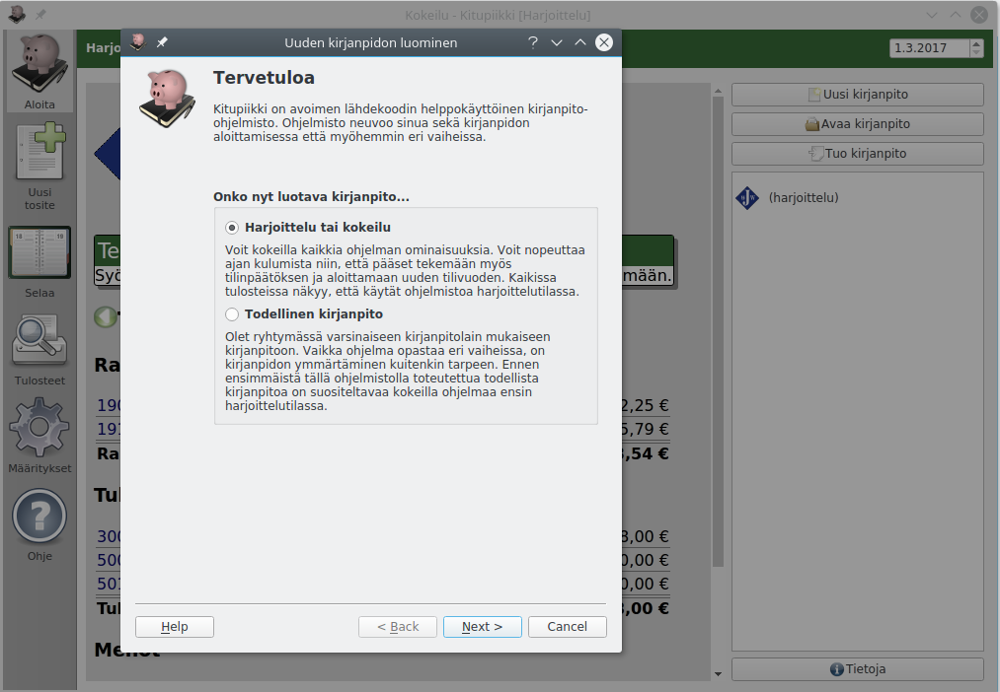

# Kirjanpidon aloittaminen

## Ennen kuin aloitat

- mieti tilikartta
- toiminnot
- tositteet
- kannattaa ensin kokeilla

!!! tip "Kokeile ensin"
    Ennen varsinaisen kirjanpidon aloittamista, kannattaa Kitupiikkiä kokeilla harjoittelutilassa. Harjoittelutilassa voit nopeuttaa ajan kulumista, joten voit harjoitella myös tilinpäätöksen tekemistä ja uuden tilikauden aloittamista.

## Uuden kirjanpidon aloittaminen

## Kirjanpidon tuominen Tilittimestä
