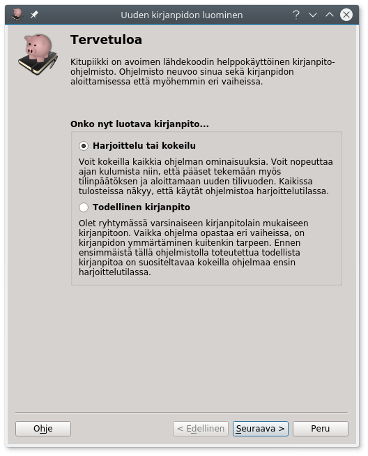
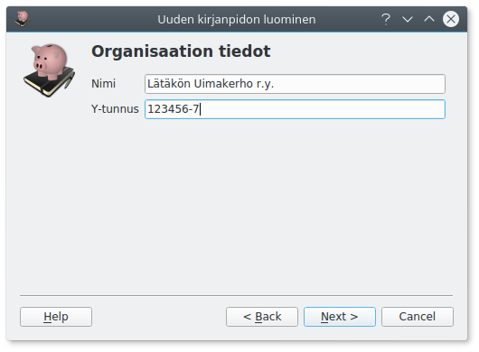
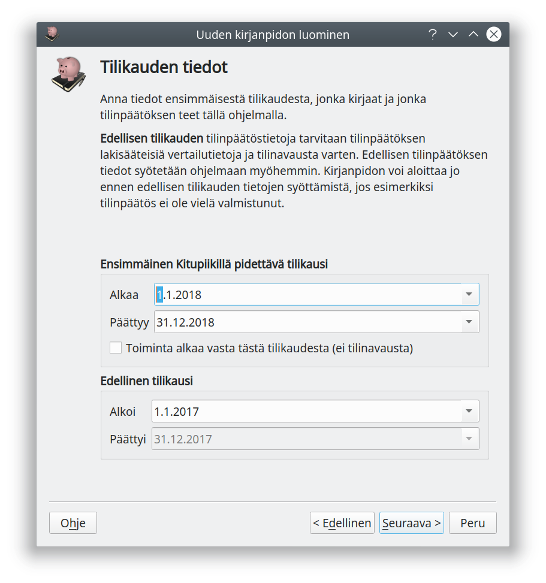
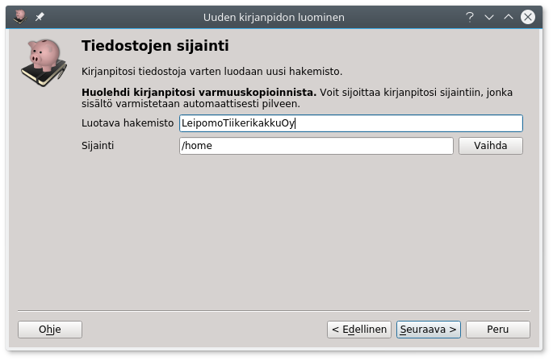
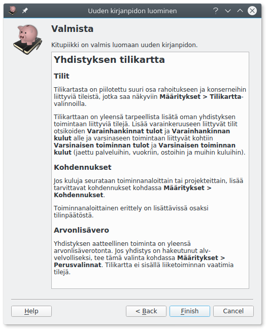

# Kirjanpidon aloittaminen

## Aloittaminen

Uusi kirjanpito aloitetaan **Aloita**-välilehden **Uusi kirjanpito**-napista.

## Harjoitus vai todellinen?

Ensimmäisellä näytöllä valitset, oletko aloittamassa harjoittelukirjanpitoa vai
todellista kirjanpitoa.

!!! tip "Kokeile ensin"
    Ennen varsinaisen kirjanpidon aloittamista kannattaa Kitupiikkiä kokeilla harjoittelutilassa. Harjoittelutilassa voit nopeuttaa ajan kulumista, joten voit harjoitella myös tilinpäätöksen tekemistä ja uuden tilikauden aloittamista.

## Tilikartta

Toisessa ruudussa valitaan tilikartta. Tilikartta määrittää käytettävien tilien lisäksi
myös käytössä olevat raportit eli esimerkiksi tuloslaskelman rakenteen sekä
tilinpäätöksen pohjan.

Tilikartan nimi   | Kuvaus
------------------|-------------------------
Elinkeintotoiminta  | Tilikartta yritystoimintaa varten. Yritysmuotoina elinkeinonharjoittaja, avoin yhtiö, kommandiittiyhtiö, osuuskunta, osakeyhtiö ja julkinen osakeyhtiö. Tilikartta on yhteensopiva [Tilitin](http://helineva.net/tilitin)-ohjelman elinkeinotoiminnan tilikartan kanssa. 869 tiliä.
Yhdistys | Tilikartta aatteelliselle yhdistykselle ja säätiölle. Tuloslaskelma on yhdistyskaavan mukainen. 214 tiliä, kirjanpitoa aloitettaessa valitaan tilikartan laajuus (käytössä olevat tilit) yhdistyksen tarpeiden mukaisesti.

!!! note "Kiinteistöyhtiön tilikartta"
    Kiinteistöyhtiön tilikartan voi [ladata erikseen](https://raw.githubusercontent.com/artoh/kitupiikki/master/kitupiikki/tilikartat/kiinteisto.kpk). *Kiinteistöyhtiön tilikartta on puutteellisesti testattu, eikä siinä ole käytössä kaikkia ominaisuuksia.*

Voit valita ohjelman mukana tulevan tilikartan tai **Lataa tilikartta tiedostosta**-napilla
erilliseen tiedostoon tallennetun tilikartan.

Voit myöhemmin lisätä, muokata ja poistaa käytössä olevia tilejä samoin kuin
raporttien ja tilinpäätöksen malleja.

## Perustiedot

Seuraavassa ruudussa syötetään organisaation nimi ja Y-tunnus. Näitä voi muokata
myöhemmin [perusmäärityksissä](/maaritykset/perusvalinnat/).

Lisäksi voit syöttää pankkitilin (ensisijainen käyttötili) tilinumeron. Tilinumero tulostuu laskuille ja
sitä käytetään myös maksujen ja tiliotteiden kohdistamiseen. Tilinumeron voi syöttää myöhemmin
tilin tietoihin [tilikartassa](/maaritykset/tilikartta).

Elinkeinotoiminnan tilikartoissa valitaan **yritysmuoto**, mikä määritelee käytössä olevia tilejä. Yhdistystilikartassa valitaan vastaavasti **tilikartan laajuus**. Laajaa elinkeintoiminnan tilikarttaa tarvitset vain, jos yhdistys harjoittaa sellaista elinkeinotoimintaa, josta maksetaan arvonlisäveroa.

## Tilikausi

Anna tiedot ensimmäisestä Kitupiikillä pidettävästä tilikaudesta. Koska tilinpäätökseen tulostetaan vertailutiedot myös edellisestä tilikaudesta, anna myös edellisen tilikauden
päivämäärät.

Edellisen tilikauden tiedot syötetään viimeisimmän tilinpäätöksen tilikohtaisesta
tase-erittelystä sekä tuloslaskelman erittelystä. Voit aloittaa kirjanpidon ja myös tehdä
uusia kirjauksia, vaikka tilinavausta ei olisikaan tehty.

Valitse **Toiminta alkaa vasta tästä tilikaudesta** vain, jos yritys perustetaan vasta tällä tilikaudella eikä tilinavausta tehdä lainkaan.

## Kirjaamisperuste

Osalla tilikarttoja voit valita pääasiallisen [kirjaamisperusteen](/kirjanpito/#kirjaamisperusteet). Valinta vaikuttaa kirjaamisen oletusvastatileihin ja laskutuksen valintoihin.

!!! note "Suoriteperuste on ensisijainen"
    Mikroyhdistyksiä ja -säätiöitä lukuun ottamatta kirjanpito on oikaistava tilinpäätöstä varten aina suoritusperusteiseksi.

## Tiedostojen sijainti

Valitse tiedostonnimi ja sijainti, minne kirjanpito tallennetaan. Tähän tiedostoon tallennetaan koko kirjanpito kaikkine liitteineen niin, että kirjanpidon voi siirtää tai varmuuskopioida kopioimalla tämän yhden tiedoston.

Kirjanpitotiedoston lisäksi samaan hakemistoon luodaan myöhemmin .arkisto-päätteinen hakemisto, jonne kirjanpidon sähköinen arkisto tallennetaan.

!!! warning "Huolehdi varmuuskopioinnista"
    Huolehdi kirjanpitosi varmuuskopioinnista! Kirjanpidosta tulisi olla aina
    varmuuskopio toisella tietovälineellä!

!!! tip "Kirjanpito pilvessä"
    Voit tallettaa kirjanpidon sellaiseen hakemistoon, joka synkronoidaan
    automaattisesti pilvipalveluun, kuten Dropbox. Näin tiedostot ovat aina
    turvassa tietokoneesi rikkoutumiselta. Varminta on kuitenkin, jos tiedot
    varmuuskopioidaan säännöllisesti myös muulle tietovälineelle.

## Valmista tuli!

Kaikki valinnat on tehty, ja sinulle näytetään valitsemaasi tililuetteloon liittyvä ohje. Kun olet vielä vahvistanut valintasi, luodaan uusi kirjanpito.

## Viimeistele vielä määritykset

Ennen kuin aloitat kirjausten tekemisen, kannattaa vielä tarkistaa joukko
määrityksiä. Ne kaikki on selostettu seuraavassa luvussa.

Jos käytät **harjoittelutilaa**, on ikkunan ylälaidassa vihreä **Harjoittelutila käytössä**-palkki,
ja vaihtamalla oikeassa yläkulmassa olevaa päivämäärää voit "matkustaa ajassa" eli määrätä, mikä päivä
on menossa, ja siten kokeilla vaikkapa tilinpäätöksen tekemistä, alv-tilitystä tai uuden tilikauden aloittamista.
