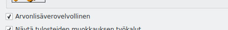
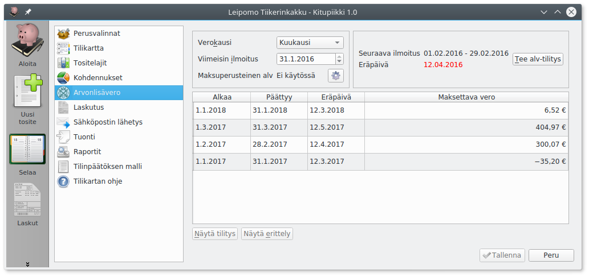
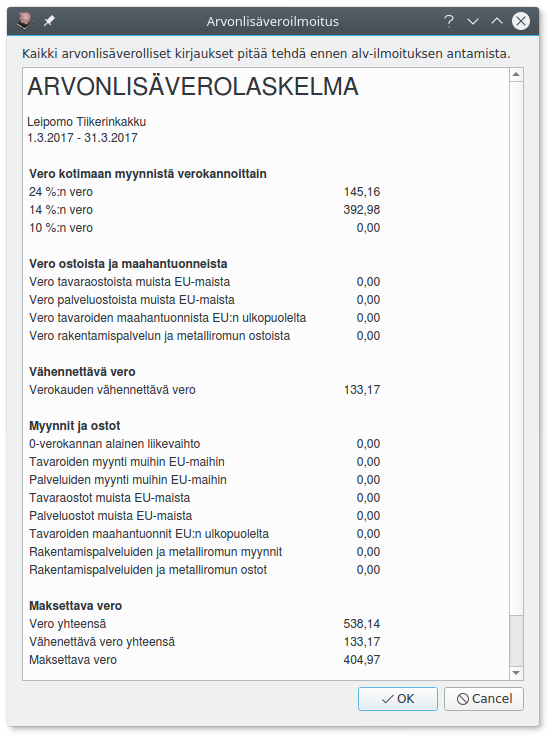
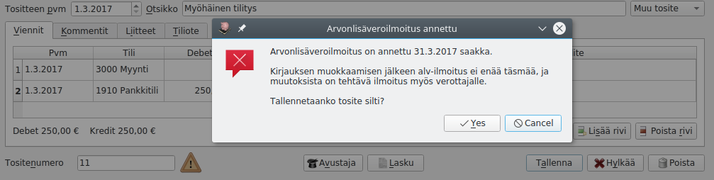

# Arvonlisävero

!!! note ""
    [Verohallinnon ohje arvonlisäverotuksesta](https://www.vero.fi/yritykset-ja-yhteisot/tietoa-yritysverotuksesta/arvonlisaverotus/)

!!! tip "Arvonlisäverovelvollisuus"
    Arvonlisäverovelvolliseksi on hakeuduttava, jos tilikauden liikevaihto voi ylittää 10 000 euroa. Alarajahuojennukset takia hakeutuminen kannattaa yleensä pienemmälläkin liikevaihdolla. Yleishyödyllinen toiminta on arvonlisäverotonta, eli useimpien yhdistysten tarvitsee maksaa arvonlisäveroa vain, jos ne harjoittavat huomattavaa liiketoimintaa.

## Määritykset

Kirjanpitovelvollinen määritellään arvonlisäverovelvolliseksi **Perusvalinnoista**. Jos yritys ei ole alv-velvollinen, ei arvonlisäveroon liittyviä valintoja näytetä kirjauksissa eikä määrityksissä.

**Verokausi** on pääasiallisesti kuukausi. [Verohallinnon ohje](https://www.vero.fi/yritykset-ja-yhteisot/ilmoittaminen-ja-maksaminen/omaaloitteiset-verot/hakeutuminen_valinnaiseen_verokautee/) selvittää, milloin ja miten yritys voi hakeutus neljännesvuoden tai vuoden verokauteen.

**Viimeisin ilmoitus**-kohtaan merkitään se päivämäärä, johon asti arvonlisäveroilmoitukset on annettu.

Tällä sivulla voit myös tehdä uuden alv-tilityksen (**Tee alv-tilitys**) tai tarkastella jo tehtyjä tilityksiä (**Näytä tilitys** ja **Näytä erittely**)

## Arvonlisävero kirjaamisessa

Kitupiikki käsittelee arvonlisäveroa ohjaustietojen avulla, eli samalla kirjanpitotilille voi kirjata erilaisen alv-kohtelun kirjauksia. Kirjaamisen helpottamiseksi voit toki luoda eri kirjanpitotilit esimerkiksi elintarvikkeiden myynnille (alv 14%) ja muulle myynnille.

Kitupiikissä on seuraavat alv-kirjaustyypit

* **Veroton**: Myynnistä ei makseta veroa / menosta ei tehdä alv-vähennystä. Tämä merkitään myös kaikille niille menotileille, jotka eivät ole alv-vähennyskelpoisia.
* **Verollinen myynti/osto (netto)**: Verollinen kotimaan myynti/osto. Heti kirjauksen yhteydessä myynti- tai ostotilille kirjataan veroton määrä, ja alv-veron tai vähennyksen osuus kirjataan alv-velkojen tai -saatavien tilille.
* **Verollinen myynti/osto (brutto)**: Verollinen kotimaan myynti/osto. Verollinen bruttosumma kirjataan tilille, ja vero erotetaan tililtä arvonlisäveroilmoitusta laadittaessa.
* **Nollaverokannan alainen myynti**: [Erikseen määritellyt tilanteet](https://www.edilex.fi/verohallinnon_ohjeet/2014_0627.html#4.2 Nollaverokannan alaiset myynnit ja yritysj%C3%A4rjestelyt), joissa myynnistä ei suorita veroa, mutta hankinnoista saa vähentää arvonlisäveron.
* **Tavaroiden ja palveluiden yhteisömyynti**: [Verohallinnon ohje](https://www.vero.fi/yritykset-ja-yhteisot/tietoa-yritysverotuksesta/arvonlisaverotus/ulkomaankaupan_arvonlisaverotus/).  Kirjauksen voi tehdä Avustajalla.
* **Tavaroiden maahantuonti EU:n ulkopuolelta**: [Maahantuonnin arvonlisävero](https://www.vero.fi/yritykset-ja-yhteisot/tietoa-yritysverotuksesta/arvonlisaverotus/ulkomaankaupan_arvonlisaverotus/maahantuonnin-arvonlisavero/) ilmoitetaan kausiveroilmoituksessa. Tällaista kirjausta ei voi tehdä Avustajalla, vaan veron määrä on kirjattava käsin tälle alv-kirjaustyypille.
* **Rakennuspalveluiden myynti tai osto**: [Rakennuspalveluiden arvonlisäveron suorittaa ostaja](https://www.vero.fi/yritykset-ja-yhteisot/tietoa-yritysverotuksesta/arvonlisaverotus/rakennusalan_kaannetty_arvonlisaverovelvollisuus/) käänteisen verovelvollisuuden mukaisesti. Kirjauksen voi tehdä Avustajalla ja Kitupiikillä voi myös laatia laskun (mainittava ostajan Y-tunnus tai VAT-tunnus).

### Kirjaaminen Avustajalla

Arvonlisäverolliset kirjaukset on helpointa tehdä Avustajalla, joka jakaa myös nettokirjaukset tulos- ja alv-tileille. Myös laskutuksessa alv-kirjautuu automaattisesti valinnan mukaan.

### Kirjaaminen ilman avustajaa

Ilman avustajaa kirjattaessa verolaji -prosentti on valittava erikseen.

* **Veronalainen määrä** tarkoittaa arvonlisäveron perustetta. Bruttokirjauksessa summa kirjataan alv-tiedolla *Verollinen myynti(brutto)* ja *veronalainen määrä*. Nettokirjauksessa tähän kirjataan veroton (netto)summa.
* **Veron määrä** tarkoittaa maksettavaa arvonlisäveroa: Nettokirjauksessa tähän kirjataan maksettava vero eli brutto- ja nettosummien erotus.
* **Vähennettävä määrä** tarkoittaa ostojen kirjauksessa arvonlisäverosta vähennettävää määrää.

## Arvonlisäverolaskelma

Kitupiikki muistuttaa alotusikkunassa, kun arvonlisäveroilmoituksen eräpäivä lähestyy

Kun kaikki tälle ilmoituskaudelle tehdyt verolliset kirjaukset on tehty, paina *Määritysten* *Arvonlisävero*-sivulla **Tee alv-tilitys**-nappia.

Kitupiikki esittää Alv-laskelman, jossa on kausiveroilmoituksessa arvolisäveron osalta tarvittavat tiedot. Vahvista laskelma painamalla **Ok**.

Laskelman pohjalta tehdään kirjaus, jossa alv-velka ja alv-saatava yhdistetään ja kirjataan **Verovelat**-tilille. Kun arvonlisävero maksetaan, tulee maksu kohdistaa tälle tase-erälle.

Erittely, jossa kirjauksia voi seurata aina tositteisiin saakka, avautuu alv-sivun **Näytä erittely**-napista. Se tallentuu myös liitteeksi alv-tilitysvientiin ja siten myös sähköiseen arkistoon.

## Varoitus myöhässä kirjaamisesta

Kun alv-ilmoitus on annettu, ei alv:n alaisia kirjauksia enää pitäisi tehdä. Merkkinä tästä on varoituskolmio kirjausikkunan alalaidassa. Avustaja ei suostu kirjaamaan enää alv-ilmoituksen jälkeen verollisia kirjauksia, ja käsin kirjaamisesta annetaan varoitus.
