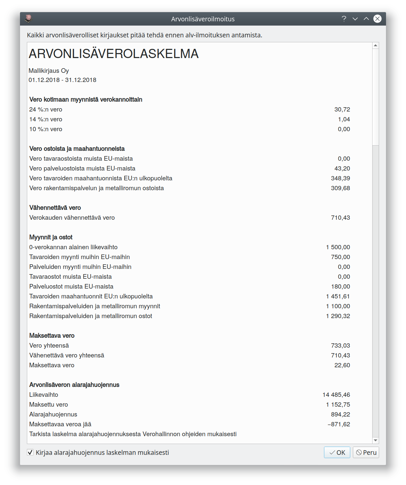
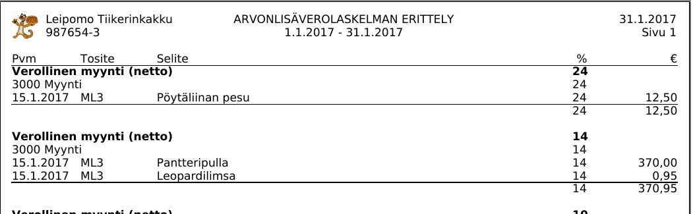

# Arvonlisäveroilmoitus

Kitupiikki muistuttaa aloitusikkunassa, kun arvonlisäveroilmoituksen eräpäivä lähestyy

Kun kaikki tälle ilmoituskaudelle tehdyt verolliset kirjaukset on tehty, paina *ALV*-sivulla **Tee alv-tilitys**-nappia.

Kitupiikki esittää Alv-laskelman, jossa on kausiveroilmoituksessa arvolisäveron osalta tarvittavat tiedot. Vahvista laskelma painamalla **OK**.

Laskelman pohjalta tehdään kirjaus, jossa alv-velka ja alv-saatava yhdistetään ja kirjataan **Verovelat**-tilille. Samalle tilille tulee kirjata myös muut oma-aloitteisesti maksettavat verot, kuten ennakonpidätys ja työnantajamaksut.

Kitupiikissä ei ole koneellista tietojen siirtoa. Tarkista Kitupiikin laatima verolaskelma ja tee ilmoitus [OmaVero](https://www.vero.fi/sahkoiset-asiointipalvelut/omavero/)-palvelussa.

!!! note "Verovelat-tili"
    Verovelat-tilille kirjataan kaikki oma-aloitteiset verot, jotka on ilmoitettu verottajalle mutta ei vielä maksettu. Näin Verovelat-tilin saldon pitäisi aina vastata OmaVeron maksamattomien verojen saldoa. Jos tulossa on veronpalautusta, kirjataan se Verosaamiset-tilille.

Erittely, jossa kirjauksia voi seurata aina tositteisiin saakka, avautuu alv-sivun **Näytä erittely**-napista. Se tallentuu myös liitteeksi alv-tilitysvientiin ja siten myös sähköiseen arkistoon.

!!! tip "Arvonlisäverolaskelma kesken kauden"
    Tulosteet-välilehdeltä voit tulostaa Alv-erittelyn haluamaltasi aikaväliltä.

## Arvonlisäveron alarajahuojennus

Arvonlisäverosta saa [alarajahuojennusta](https://www.vero.fi/yritykset-ja-yhteisot/tietoa-yritysverotuksesta/arvonlisaverotus/arvonlisaveron_alarajahuojennu/), jos vuoden liikevaihto ilman alv:tä on alle 30 000 euroa. Kitupiikki tekee tilikauden tai vuoden viimeiseen arvonlisäveroilmoituksen myös laskelman alarajahuojennuksesta.

!!! note "Alarajahuojennuksen erityistapaukset"
    Alarajahuojennukseen liittyy erityssääntöjä esimerkiksi metsätalouteen ja vapaaehtoiseen kiinteistön vuokrauksesta arvonlisäverovelvolliseksi hakeutumiseen. Tutustu Verohallinnon ohjeisiin ja laske tarvittaessa itse alarajahuojennuksen määrä.
