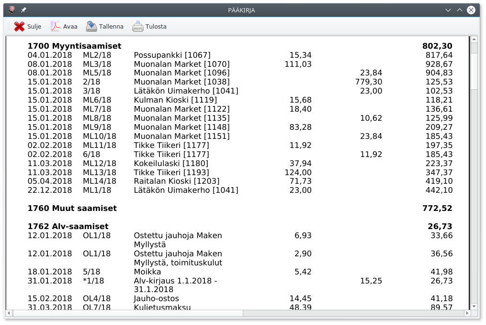
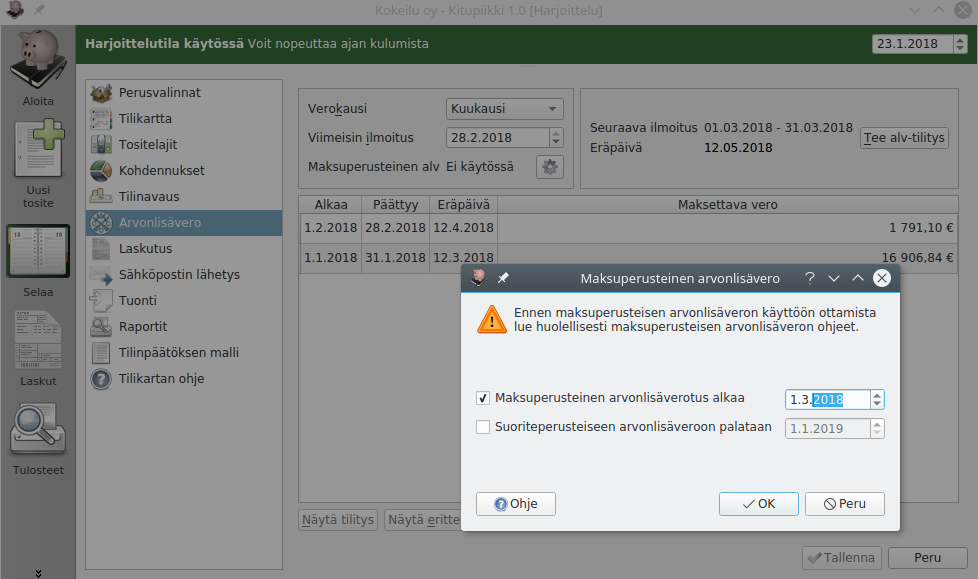
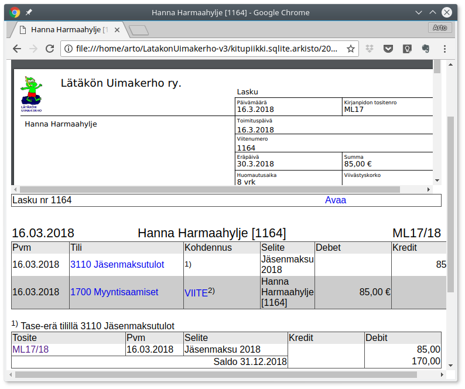
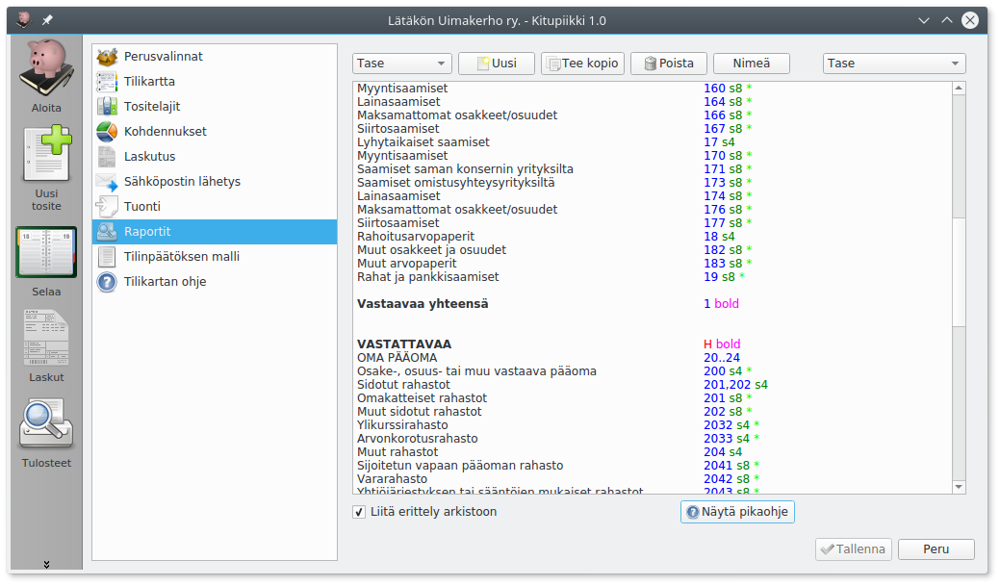
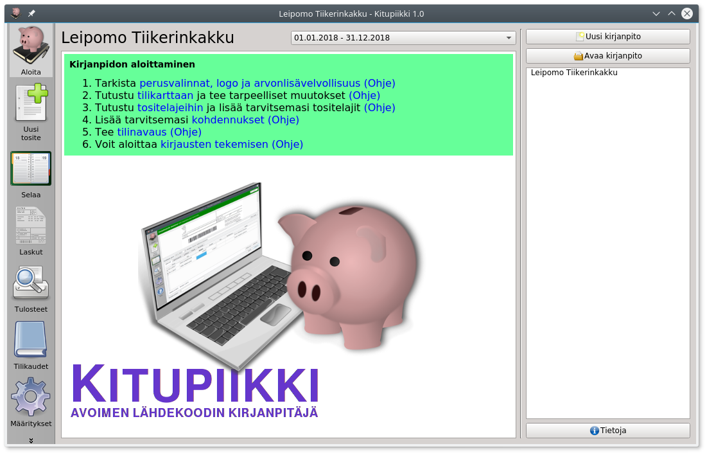
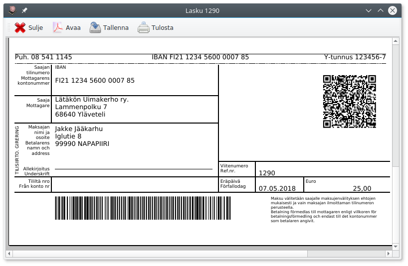
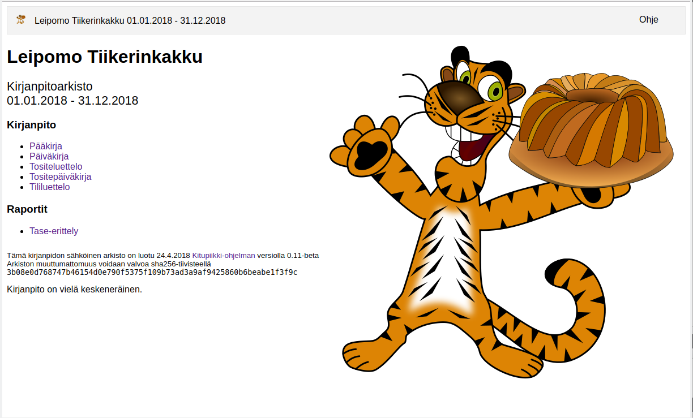

# Kitupiikki <small>Avoimen lähdekoodin kirjanpitäjä</small>

 
  
Avoimen lähdekoodin kirjanpitäjä

 

  
  
Kitupiikki tallentaa pdf-muotoiset liitteet

 

 

  
  
Pääkirja

 

 

  
  
Kitupiikkiin sisältyy myös laskutus

 

 

  
  
Kitupiikki tukee maksuperusteista arvonlisäveroa

 

 

  
  
Kirjanpidosta muodostetaan sähköinen arkisto

 

 

  
  
Tulosteet ovat täysin muokattavissa

 

 

  
  
Kitupiikki vinkkaa ja neuvoo

 

 

  
  
Laskuissa pankkiviivakoodi ja QR-koodi

 

 

  
  
Sähköisen arkiston etusivu

 

 

  
  
Sähköisen arkiston etusivu

 

 

  
  
Kirjauksia voi kohdentaa toiminnoille, projekteille jne.

 

Kitupiikki on ilmainen suomalainen kirjanpito-ohjelma. Kitupiikki käsittelee ja arkistoi skannatut tositteet. Ohjelma on alunperin suunniteltu yhdistyksille, mutta Kitupiikin avulla hoidat vaivattomasti myös pienehkön yrityksen kirjanpidon.

<h3>Kitupiikki 0.10.1 (beta) julkaistu 17.4.2018</h3>
Uutena kohdennusmahdollisuus tasetileillä ja kokeellinen TITO-tiliotteiden tuominen

<a href="asennus" style="color:white;"> Lataa Kitupiikki  </a>

