# Kitupiikki <small>Avoimen lähdekoodin kirjanpitäjä</small>

 

  
  
Kitupiikki tallentaa pdf-muotoiset liitteet

 

 

  
  
Pääkirja

 

 

  
  
Kitupiikkiin sisältyy myös laskutus

 

 

  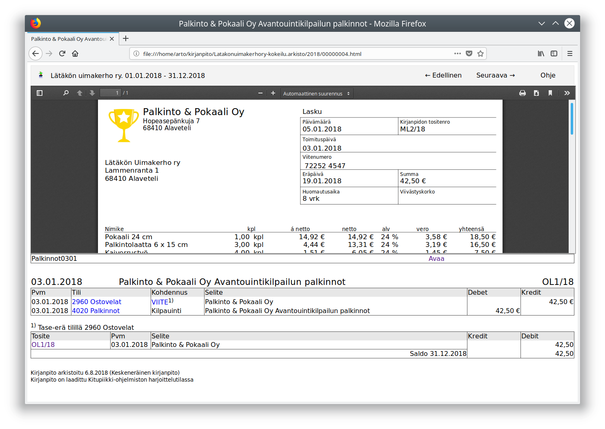
  
Kirjanpidosta muodostetaan sähköinen arkisto

 

 

  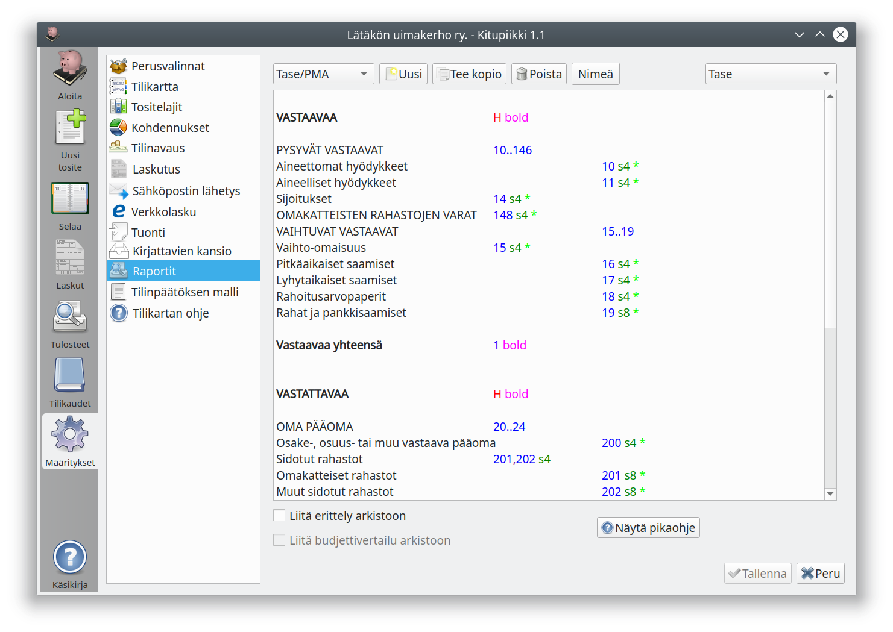
  
Tulosteet ovat täysin muokattavissa

 

 

  
  
Kitupiikki vinkkaa ja neuvoo

 

 

  
  
Laskuissa pankkiviivakoodi ja QR-koodi

 

 

  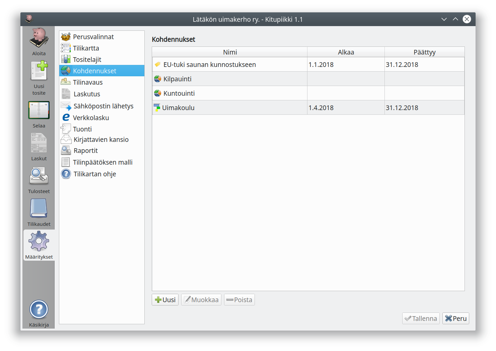
  
Kirjauksia voi kohdentaa toiminnoille, projekteille jne.

 

 

  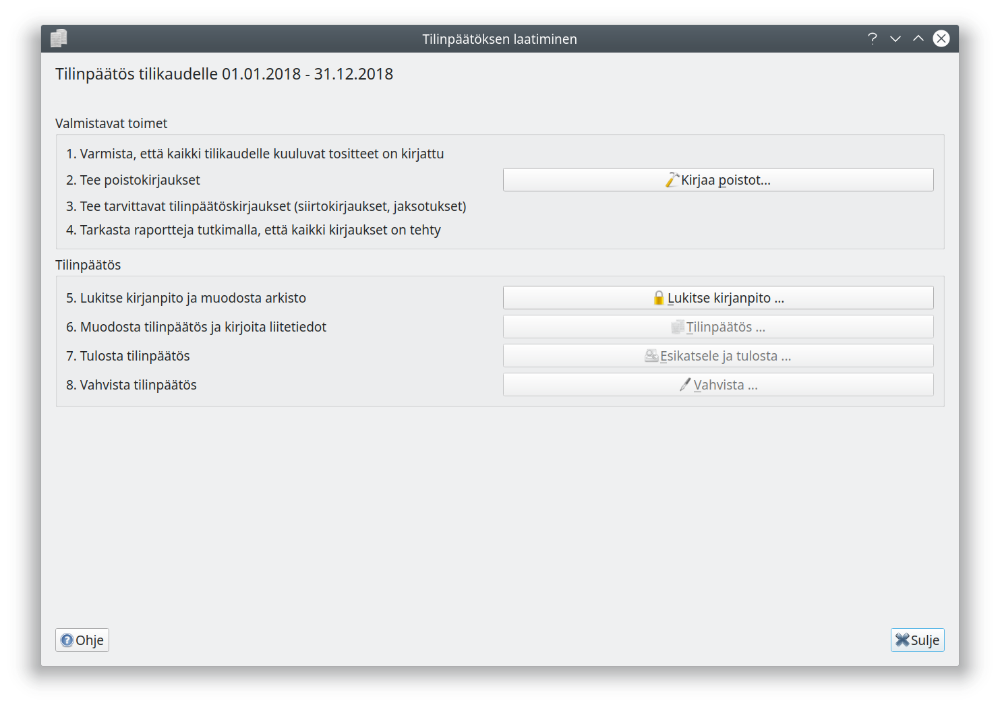
  
Kitupiikillä muodostat tilinpäätöksen näppärästi

 

 

   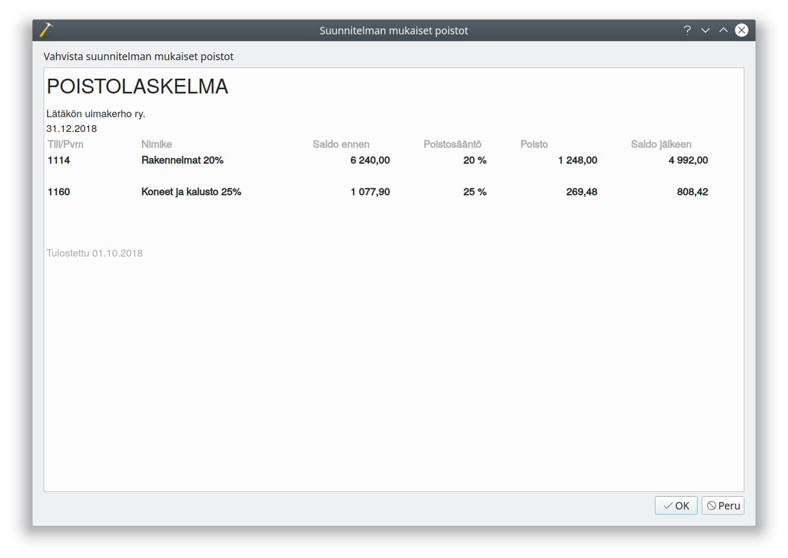
   
Kitupiikki laskee tasaerä- ja menojäännöspoistot

 

 

   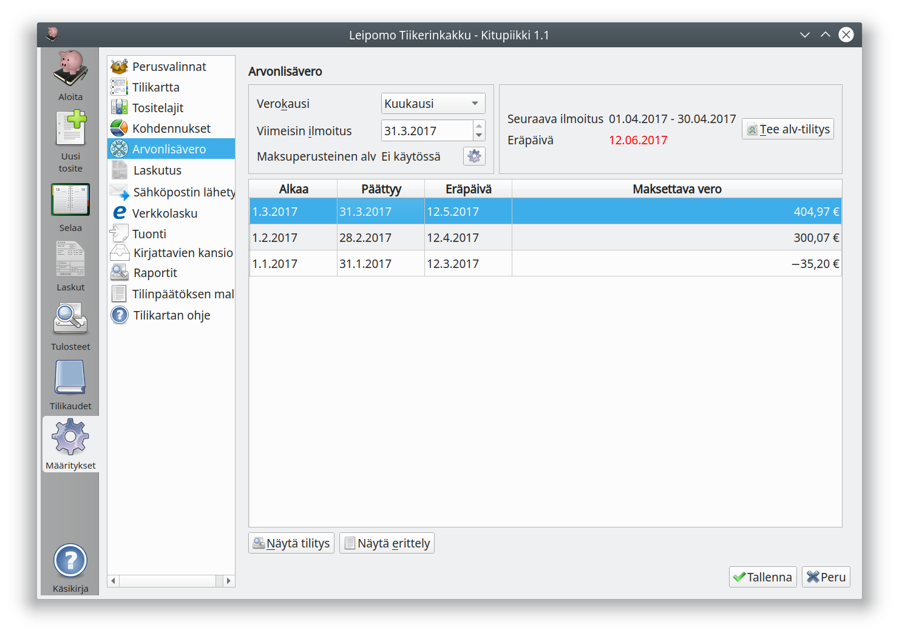
   
Kitupiikki laskee alv-ilmoituksen tiedot

 

 

   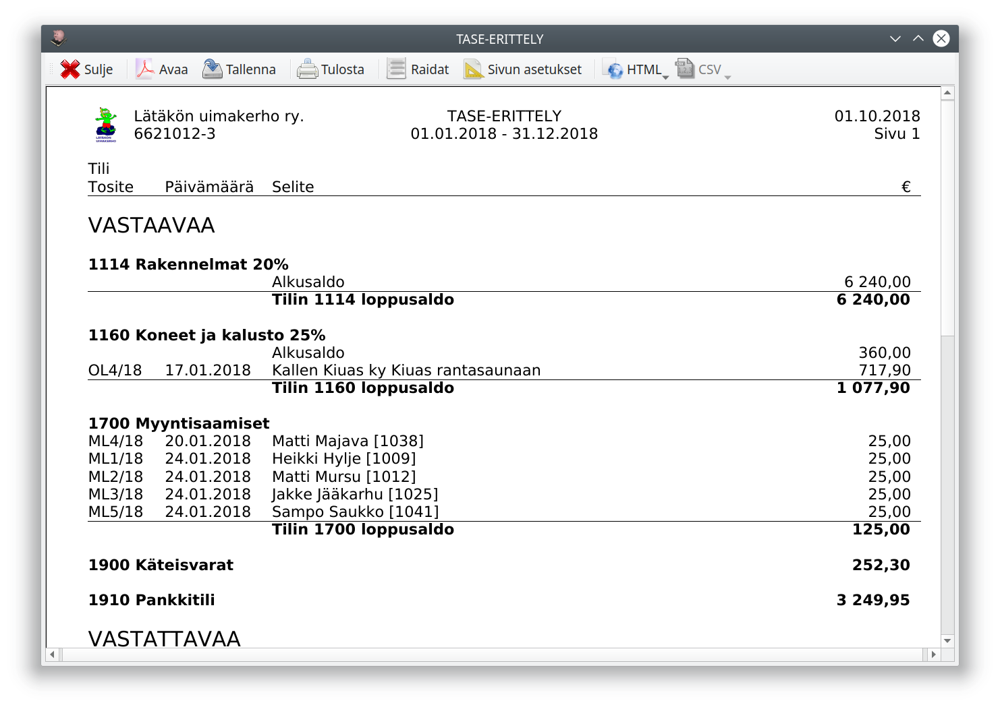
   
Kitupiikki muodostaa tase-erittelyn

 

 

   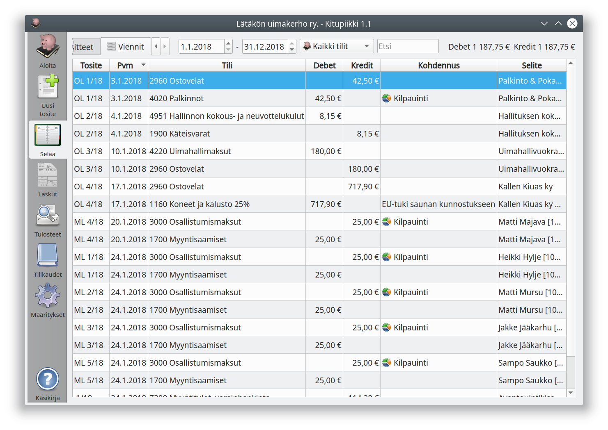
   
Kirjausten selaaminen

 
  
 

   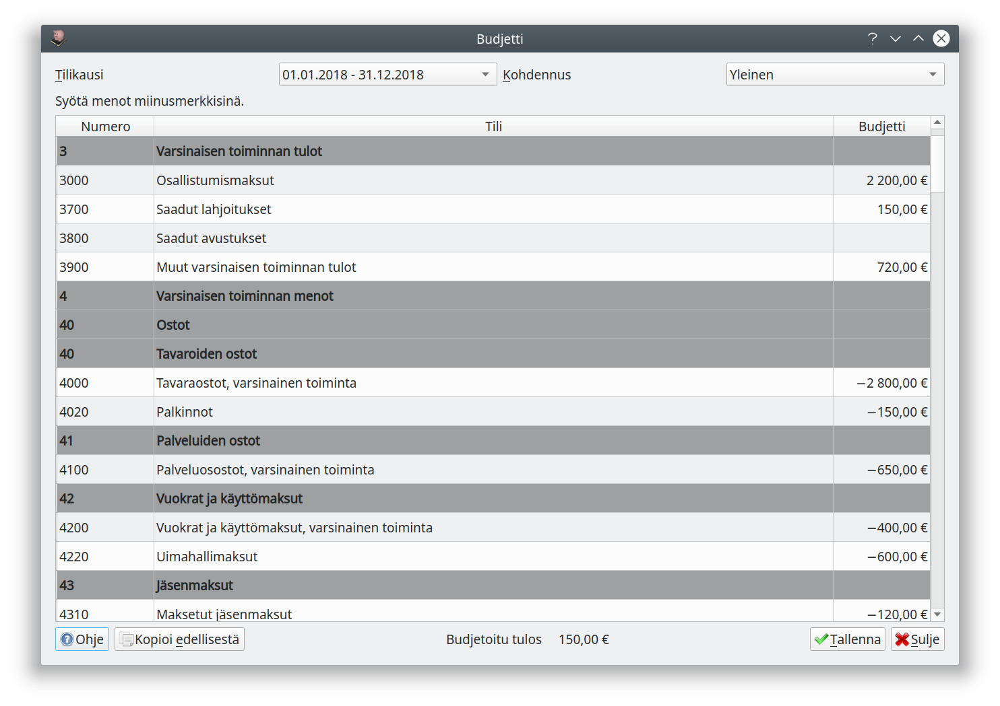
   
Kitupiikissä on budjetin laadinta ja seuranta

 
   
 

   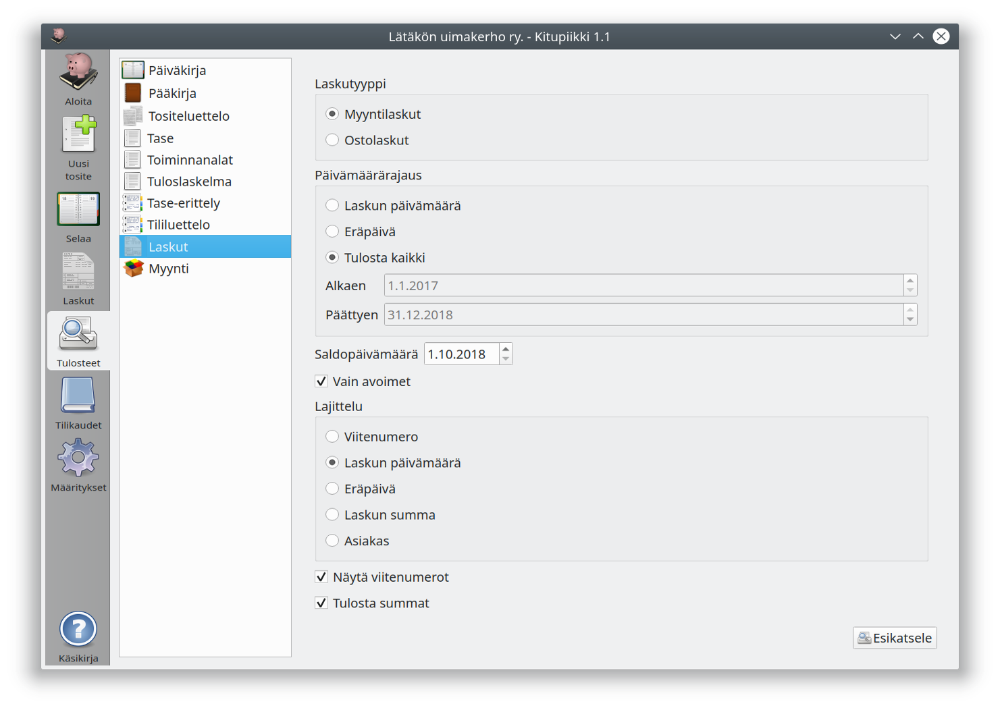
   
Kitupiikissä on monipuolinen raportointi

 
   
 

   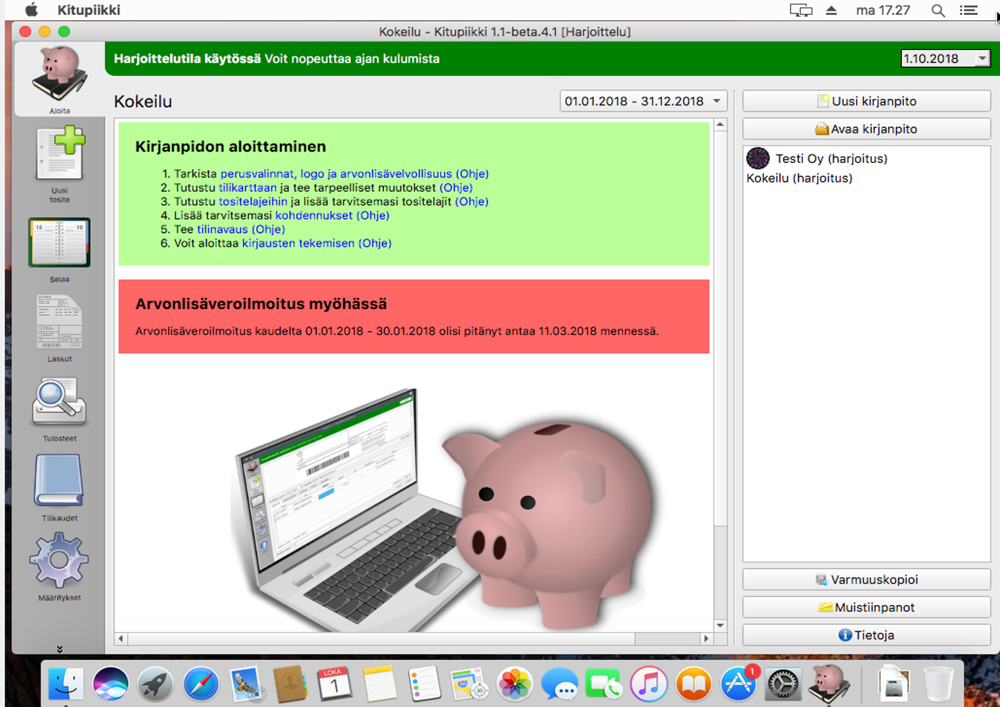
   
Saatavilla Windowsille, Macille ja Linuxille

 
     

Kitupiikki on ilmainen suomalainen kirjanpito-ohjelma. Kitupiikki käsittelee ja arkistoi skannatut tositteet. Ohjelma on alunperin suunniteltu yhdistyksille, mutta Kitupiikin avulla hoidat vaivattomasti myös pienehkön yrityksen kirjanpidon.

<h3>Kitupiikki 1.4.6 julkaistu 18.3.2020</h3>

<a href="asennus" style="color:white;"> Lataa Kitupiikki    </a>

Tutustu myös Kitupiikin tulevaisuuteen! Tulossa kahdenkertaista kirjanpitoa entistä yksinkertaisemmin. Betaversio ladattavissa <a href="https://kitsas.fi">kitsas.fi</a>. Tilaa uutiskirje kuullaksesi uuden version valmistumisesta.

 <iframe width="540" height="450" src="https://1c6e51a2.sibforms.com/serve/MUIEAOnkVq4mTA6N08WymW3S6eTovCpHEXXGJH2avZMG4L6eJRS_OHxbRq1EwUzBd_V2uHhoocL_EqQWUm69cTAfWGpEc41xyEWUTgIgRJkArXJuUPMGaKijAcLsJ3mbMFeHpJB7UwGAZ54CPbbAxmi8pBT5jmEMJk7V6HTIB1qmjra7nPQECPmVF-X7DsFXuXP0-PNpIfeskaoe" frameborder="0" scrolling="auto" allowfullscreen style="display: block;margin-left: auto;margin-right: auto;max-width: 100%;"></iframe>

<!-- Googlen jäsenneltyjen tietojen merkintäapurin luomat JSON-LD-merkinnät. -->

