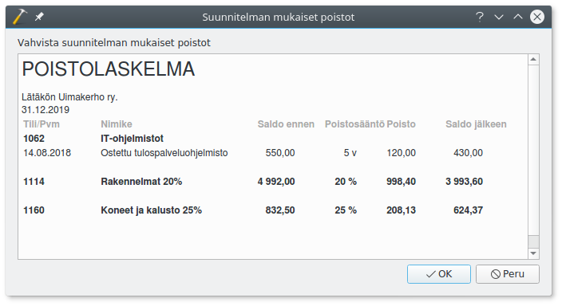

# Kitupiikki <small>Avoimen lähdekoodin kirjanpitäjä</small>

 
  
Avoimen lähdekoodin kirjanpitäjä

 

  
  
Kitupiikki tallentaa pdf-muotoiset liitteet

 

 

  
  
Pääkirja

 

 

  
  
Kitupiikkiin sisältyy myös laskutus

 

 

  
  
Kitupiikki tukee maksuperusteista arvonlisäveroa

 

 

  
  
Kirjanpidosta muodostetaan sähköinen arkisto

 

 

  
  
Tulosteet ovat täysin muokattavissa

 

 

  
  
Kitupiikki vinkkaa ja neuvoo

 

 

  
  
Laskuissa pankkiviivakoodi ja QR-koodi

 

 

  
  
Sähköisen arkiston etusivu

 

 

  
  
Kirjauksia voi kohdentaa toiminnoille, projekteille jne.

 

 

   
   
Kitupiikki laskee tasaerä- ja menojäännöspoistot.

 

Kitupiikki on ilmainen suomalainen kirjanpito-ohjelma. Kitupiikki käsittelee ja arkistoi skannatut tositteet. Ohjelma on alunperin suunniteltu yhdistyksille, mutta Kitupiikin avulla hoidat vaivattomasti myös pienehkön yrityksen kirjanpidon.

<h3>Kitupiikki 1.0 RC julkaistu 25.7.2018</h3>
Yhteensopiva version 1.1 uusien toimintojen kanssa.

<a href="asennus" style="color:white;"> Lataa Kitupiikki  </a>

<!-- Googlen jäsenneltyjen tietojen merkintäapurin luomat JSON-LD-merkinnät. -->

