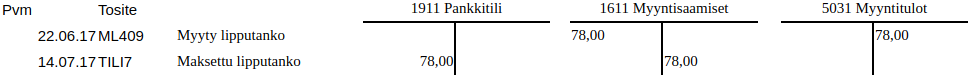
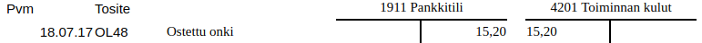

# Kirjanpidosta lyhyesti

[Kirjanpitolaissa](http://www.finlex.fi/fi/laki/ajantasa/1997/19971336) säädetään, että kaikenlaiset yhtiöt ja yhdistykset ovat velvollisia pitämään lain mukaista kirjanpitoa taloudellisesta toiminnastaan. Myös yksityiset ammatinharjoittajat ovat kirjanpitovelvollisia liike- ja ammattitoiminnastaan.

Kirjanpidolla seurataan tulojen ja kulujen muodostamaa taloudellista tuottoa (*tuloslaskelma*) sekä varojen ja velkojen muodostamaa varallisuutta (*tase*). Kirjanpito toimii myös yritysten verotuksen perusteena.

Kirjanpidossa on noudatettava "hyvää kirjanpitotapaa" eli noudatettava lainsäädäntöä, ohjeita ja vakiintuneita käytäntöjä.[^1] Kirjanpidon laiminlyömisestä tai virheellisten tietojen merkitsemisestä kirjanpitoon voidaan rangaista sakolla tai vankeudella.[^2]

Pienet yritykset ja yhteisöt saavat noudattaa joissain asioissa hieman yksinkertaisempia sääntöjä etenkin tilinpäätöksen osalta.[^3]

!!! note "Pienten puolella"
    Kitupiikki ohjeineen on suunniteltu erityisesti pienehköille yrityksille ja yhteisöille (alle 50 työntekijää, liikevaihto alle 12 milj. euroa). Kitupiikin laatima tilinpäätös on pien- ja mikroyritysasetuksen mukainen[^4].

[^1]: Kirjanpitolaki 3 §. Kirjanpitolain ja [-asetuksen](http://www.finlex.fi/fi/laki/ajantasa/1997/19971339) lisäksi
    [kirjanpitolautakunta](http://tem.fi/kirjanpitolautakunta) antaa kirjanpitoa koskevia
    ratkaisuja ja ohjeita.
[^2]: Rikoslaki 30 luku 9 §, kirjanpitolaki 8. luku 4 §
[^3]: Kevyimmät säännöt ovat mikroyrityksellä. Se tarkoittaa kirjanpitovelvollista, jolla sekä päättyneellä että sitä välittömästi edeltäneellä tilikaudella ylittyy enintään yksi seuraavista kolmesta raja-arvosta tilinpäätöspäivänä: taseen loppusumma 350 000 euroa; liikevaihto 700 000 euroa; tilikauden aikana palveluksessa keskimäärin 10 henkilöä. Pienyrityksellä saa puolestaan ylittyä enintään yksi seuraavista: taseen loppusumma 6 milj. euroa, liikevaihto 12 milj. euroa, henkilökunta keskimäärin 50. (Kirjanpitolaki 4b §)
[^4]: [Valtioneuvoston asetus
pien- ja mikroyrityksen tilinpäätöksessä esitettävistä tiedoista](http://www.finlex.fi/fi/laki/alkup/2015/20151753)

## Tilikausi

Kirjanpito laaditaan tilikausittain. Normaali tilikausi on 12 kuukautta, yleisimmin kalenterivuosi.

**Tilinavauksessa** edellisen tilikauden päättävä tase siirretään uuden tilikauden pohjaksi.

Tilikauden aikana kaikki menot, tulot ja rahoitustapahtumat **kirjataan tositteiden mukaan kirjanpitoon**. Tätä kutsutaan "juoksevaksi" kirjanpidoksi.

Tilikauden päätyttyä tehdään **tilinpäätös**. Tilinpäätös on laadittava neljän kuukauden kuluessa tilikauden päättymisestä. Ensiksi tehdään tarpeelliset tilinpäätöskirjaukset: avoinna olevia maksuja merkitään saataviksi tai veloiksi ja käyttö-omaisuudesta tehdään poistoja. Tämän jälkeen laaditaan tilinpäätösasiakirjat: tuloslaskelma ja tase liitetietoineen.

Tapahtumien kirjaamisessa ei nykyisessä laissa ole muuta määräaikaa kuin se, että tarpeelliset ilmoitukset (esim. arvonlisäveroa varten) ehditään antaa ja yrityksen tai yhdistyksen päättäjillä on riittävä tieto taloudellisesta tilanteesta. Tilinpäätöksen vahvistamisen jälkeen kirjanpitoa ei enää saa muokata. Aivan pienen yhdistyksen olisi laillista laatia kirjanpito kerran vuodessa jälkikäteen, kunhan kaikki tositteet on säilytetty huolellisesti. Kaikki käteisellä rahalla suoritetut maksut on kuitenkin kirjattava viipymättä.

Kirjanpitoaineistoja pitää säilyttää 10 vuotta ja tositteita 6 vuotta tilikauden päättymisvuoden lopusta.

!!! tip "Kirjanpito-ohjelmisto automatisoi"
    Kitupiikki tekee tilinavaukset automaattisesti. Ohjelma tulostaa kirjanpitotietojen
    mukaisesti esimerkiksi tilinpäätöksessä tarvittavan tuloslaskelman ja taseen. Arkistointia varten ohjelma muodostaa sähköisen arkiston kirjanpidosta ja digitaalisessa muodossa olevista tositteista.

## Tositteet ja juokseva kirjanpito

Kaikkien kirjausten on perustuttava päivättyihin ja numeroituihin tositteisiin. Tositteita ovat esimerkiksi laskut, kuitit, tiliotteet ja palkkalistat. Tosite voi joissain tapauksissa olla itse laadittu (esim. myynnistä kirjoitetun kuitin kopio tai tilinpäätöserästä laadittu muistiotosite).

Juokseva kirjanpito tarkoittaa näiden tositteiden tallentamista ja merkitsemistä kirjanpitoon. Tositteen yksilöivä numero pitää merkitä paperisessa muodossa säilytettävään tositteeseen.

!!! note "Kirjausketju"
    Kirjausketju tarkoittaa, että tositteiden ja kirjausten yhteys kirjanpitoon ja tilinpäätökseen pitää olla vaikeuksitta todennettavissa molempiin suuntiin. Kitupiikki huolehtii tästäkin automaattisesti kunhan kirjaukset on tehty asianmukaisesti.

## Kaksinkertainen kirjanpito ja tilit

**Yksinkertaiseen kirjanpitoon** merkitään tulot ja menot aikajärjestyksessä. Yksityinen ammatinharjoittaja voi yleensä pitää kirjanpitonsa yksinkertaisena.

> Yksinkertaisessa kirjanpidossa vasemmalle kirjataan tulot ja oikealle menot

!!! tip "Yksinkertaisesti taulukkolaskennalla"
    Yksinkertainen kirjanpito on helppo tehdä taulukkolaskentaohjelmalla. Kaksinkertainen kirjanpito antaa kuitenkin paljon enemmän tietoa tuloista, menoista ja taloudellisesta tilanteesta. Kitupiikki on kaksinkertaisen kirjanpidon ohjelma, joka noudattaa suomalaista kirjanpidon säännöstöä.

**Kaksinkertaisessa kirjanpidossa** jokainen tapahtuma kirjataan aina vähintään kahdelle tilille. *Rahatilejä* ovat pankkitilit ja käteiskassa: niillä seurataan rahan todellista liikennettä. *Tulotilit* ja *menotilit* osoittavat, mistä raha on tullut ja mihin sitä on käytetty. *Pääomatilit* seuraavat omaisuutta ja velkoja.

Kaikessa yhtiömuotoisessa liiketoiminnassa ja yhdistyksissä pitää käyttää kaksinkertaista kirjanpitoa.

Perinteisessä tilikirjassa jokaista tiliä kohti on kaksi saraketta: vasemmalla *debet*-puolelle kirjataan mihin raha menee ja oikelle puolelle *kredit*-sarakkeelle mistä raha tulee. Jokaisen kirjauksen pitää täsmätä, eli tilien debet- ja kredit-sarakkeille kirjataan yhtä suuri määrä.

> Ostot vähentävät pankkitiliä (kredit) ja merkitään menotilit debet-puolelle.
> Myyntitulot puolestaan kasvattavat pankkitiliä (debet) ja merkitään tulotilin kredit-puolelle.
>
> Lainanlyhennyksessä pankkitilin saldo vähenee, mutta myös saatavatilin (Pankkilaina) saldo vähenee. Pankkilainan korot ovat menotili.

Kaksinkertaisessa kirjanpidossa seurataan myös rahatilien välistä liikennettä

Käytettävistä tileistä ja niiden sisällöstä pitää olla *tililuettelo* (*tilikartta*). Eri yritysmuodoille ja yhdistyksille on valmiita mallitilikarttoja, joihin tarvittaessa lisätään omaa kirjanpitoa varten joitain tarkempia tilejä.

!!! tip "Apuri auttaa"
    Kitupiikin Apuri sijoittaa menojen ja tulojen kirjaukset oikein tilien debet- ja kredit-puolille.

## Kirjaamisperusteet

**Suoriteperusteisessa** kirjanpidossa tapahtumat kirjataan sille päivälle, jolloin tavara tai palvelu luovutetaan tai vastaanotetaan.

> Kun lipputanko on myydään 22.6. jää ostaja velkaa myyjälle, joten tulo kirjataan myyntituloihin (tulotili, kredit) ja myyntisaataviin (saatavatili, debet). Kun lasku maksetaan 14.7. kirjataan hinta myyntisaatavista (kredit) pankkitilille (debet).

**Laskuperusteisessa** kirjanpidossa tapahtumat kirjoitetaan vastaavalla tavalla laskun päivämäärän mukaisesti.

> Kalastuskerho ostaa ongen juhannusaattona, mutta lasku kirjoitetaan vasta 28.6. Onki kirjataan ensin kuluksi (debet) ja ostovelaksi (kredit), ja kun lasku aikanaan maksetaan kirjataan se pankkitililtä (kredit) ostovelkoihin (debit).

**Maksuperusteisessa** kirjanpidossa tapahtumat kirjataan vasta sitten, kun lasku on maksettu.

> Vaikka onki on ostettu jo juhannuksena, merkitään se kirjanpitoon yhdellä kirjauksella vasta kun lasku on maksettu.

Jos menot ja tulot kirjataan maksuperusteisesti, on ostovelat ja myyntisaamiset voitava jatkuvasti selvittää muulla tavoin (esimerkiksi säilyttämällä maksamattomia laskuja mapissa, josta ne voi tarkistaa). Pientä yhdistystä lukuun ottamatta on lasku- tai maksuperusteinen kirjanpito oikaistava ja täydennettävä suoriteperusteiseksi ennen tilinpäätöksen laatimista, mikäli maksuperusteen vaikutus on olennainen.

## Poistot

Investoitaessa eli hankittaessa rakennuksia, koneita, kalusteita tms. joita käytetään pidemmällä aikavälillä, ei niitä kirjata välittömästä menoiksi vaan hankinta kirjataan taseeseen, josta sitä poistetaan suunnitelman mukaisesti (*sumu-poistot*). Merkitykseltään vähäisiä hankintoja voidaan kuitenkin käsitellä menokirjauksina, vaikka niitä käytettäisiinkin pidemmän aikaa.

> Hankitaan tietokoneohjelmisto, joka aineettomana oikeutena pitää poistaa tasapoistoina. Arvioidaan käyttöajaksi viisi vuotta, jolloin poisto on 200 euroa vuodessa. Ensimmäisenä vuonna poistetaan puolen vuoden käyttöajasta 100 euroa, jolloin poistamatta jää 900 euroa. Toisen vuoden jälkeen poistamatta on vielä 700 euroa.

Aineellisesta omaisuudesta poistot tehdään yleensä menojäännöspoistoina, eli vuosittain poistetaan tietty prosenttiosuus poistamatta jääneestä osuudesta (esim. kalustossa 25%). Tällöin lisähankinnat merkitään lisäyksenä kalustotilille ja aina vuoden lopussa poistetaan 25% kalustotilin saldosta.

Jos tällaista omaisuutta myytäisiin, kirjattaisiin myynnistä saatava raha kalustotilille.[^5] Tasapoistoja käytettäessä kalustotilille kirjataan suunnitelman mukaiset poistot myyntipäivään saakka ja mahdollinen ylijäämä kirjataan myyntivoitoksi.

[^5]: Jos myyntitulo ylittää koko kalustotilin saldon, kirjataan ylijäämä myyntivoitoksi.

!!! tip "Kitupiikki poistaa"
    Kitupiikki tekee tilikauden lopun poistokirjaukset, kunhan hankinnat on kirjattu ohjeen mukaisesti.

## Tilinpäätös

Kun tilikauden kaikki tositteet on saatu kirjattua, tilit *täsmäytetään* eli tarkastetaan, että esimerksi pankkitilin saldo täsmää kirjanpidon kanssa. Sitten tehdään *poistokirjaukset* sekä *siirtokirjaukset*, jossa kirjanpito oikaistaan *suoriteperusteiseksi*, jossa varmistetaan että kyseiselle tilikaudelle on kirjattu kaikki sellaiset tulot ja menot, jotka sinne kuuluvat - ja toisaalta tulevan tilikauden tulot ja menot on siirretty oikealle tilikaudelle.

!!! note "Yhdistyksen maksuperusteinen tilinpäätös"
    Pieni yhdistys saa laatia myös tilinpäätöksen maksuperusteisesti, kunhan liitetiedoissa on selvitetty menettelyn olennainen vaikutus taloudelliseen tilanteeseen.

Lopuksi valmistellaan tilinpäätösasiakirjat, tarvittaessa suoritetaan tilin- tai toiminnantarkastus ja tilinpäätös vahvistetaan. Tilinpäätösasiakirjoihin kuuluu *tase*, *tuloslaskelma* ja *tilinpäätöksen liitetiedot*. Tilinpäätöstä varmentamaan on lisäksi laadittava *tase-erittelyt*. Suuret yritykset laativat lisäksi *rahoituslaskelman* ja määrämuotoisen *toimintakertomuksen*.

**Tuloslaskema** selvittää tilikauden tuloksen eli voiton tai tappion, joka löytyy tuloslaskelman viimeiseltä riviltä. Laskelman kaavat on määritelty tilinpäätösasetuksessa, ja ne poikkeavat hieman erityyppisillä yhtiöillä ja yhteisöillä.

**Taseesta** näkyy taloudellinen tilanne. *Vastaavaa*-puolelle merkitään omaisuus ja saamiset. *Vastattavaa*-puolella on *oma pääoma* (kuten osakepääoma sekä edellisten tilikausien voiton kertymä) sekä *vieras pääoma* eli velat. Tuloslaskeman osoittama tilikauden tulos siirretään taseeseen omaan pääomaan.

Tase laaditaan kirjanpitoasetuksen kaavan mukaisesti. Pienet yhtiöt saavat laatia taseen muita lyhyemmän kaavan mukaisesti.

**Liitetiedoissa** annetaan lukuisia tilinpäätöstä ja tasetta täydentäviä ja täsmentäviä tietoja. Liitetiedoista on tarkemmat määräyksen kirjanpitoasetuksessa.[^6]

[^6]: Liitetiedoissa tulee antaa erikseen lueteltujen kohtien lisäksi myös tiedot sellaisista muista seikoista, jotka tarvitaan oikean ja riittävän kuvan saamiseksi. Poikkeuksena tästä mikroyritykselle riittää aina, että liitetietoina annetaan erillisessä pien- ja mikroyritysasetuksessa erityisesti luetellut seikat.

!!! tip "Kitupiikin tilinpäätöstyökalut"
    Kitupiikki laatii kirjanpidon mukaan taseen ja tuloslaskelman sekä ainakin suurimmalta osalta myös taseen erittelyt. Ohjelmassa on työkalu myös liitetietojen laatimiseen, ja yksinkertaisimmissa tapauksissa liitetiedot voi laatia ohjelman fraasikokoelman avulla. Lopuksi ohjelma muodostaa html-muotoisen sähköisen arkiston, jossa kirjausketjun mukaisesti pääsee tuloslaskelman ja taseen erittelyistä porautumaan aina tositteisiin saakka.

## Lisää luettavaa

!!! warning "Lait muuttuvat"
    Kirjanpitolain viimeisin merkittävä muutos on vuodelta 2016, ja laki muuttuu varmasti myös jatkossa. Vaikka vanhoissa kirjoissa osa yksityiskohdista on jo vanhentunut, ovat kaksinkertaisen kirjanpidon perusteet pysyneet toki samoina.

- Kaupallisen alan oppikirjat
- Antti-Juhani Kaijanahon erinomainen [blogikirjoitus pienen yhdistyksen kirjanpidosta ja tilinpäätöksestä](http://antti-juhani.kaijanaho.fi/newblog/archives/788)
- [Tilintarkastus.fi](http://tilintarkastus.fi) sisältää malleja erilaisten yhteisöjen tilinpäätöksistä
- Taloushallintoliiton [Kirjanpidon ABC](https://taloushallintoliitto.fi/kirjanpidon-abc)
- Tilisanomien [Kirjanpitokoulu](http://tilisanomat.fi/artikkeli/kirjanpitokoulu-osa-1-tilinpaatoksen-laatiminen)
