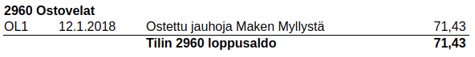

# Kirjausapuri

Useimmat tavanomaiset kirjaukset kuten ostot, myynnit, nostot pankkitililtä jne. kirjaat helpoiten käyttämällä Kirjausapuria.

!!! tip ""
    [ Katso video ostolaskun kirjaamisesta](https://www.youtube.com/watch?v=JiM0y-HHoCI)

1. Käynnistä Kirjausapuri joko **Kirjausapuri**-napista tai painamalla <kbd>F9</kbd>. Heti tositalajin valittuasi voit käynnistää Apurin myös painamalla <kbd>Enter</kbd>
2. Valitse välilehdeltä, mitä kirjaat: **Tulo**, **meno** vai **siirto**.
3. Valitse tili. Voit joko kirjoittaa suoraan tilinumeron tai alkaa kirjoittaa tilin nimeä, jolloin pääset valitsemaan tilin luettelosta. Painamalla välilyöntiä pääset kaikkien tilien luetteloon.
4. Syötä määrä ja varmista, että **vastatili**, **vientipäivä**, **selite**, **alv-laji** ja **alv-prosentti** ovat oikein. Valitse tarvittaessa **kohdennus**. Kirjattaessa siirto tasetililtä toiselle valittavina ovat **debet-tili** (minne siirretään) ja **kredit-tili** (mistä siirretään). **Merkkaukset** valitaan *Merkkaukset*-kentässä hiiren oikeasta painikkeesta avautuvasta valikosta.
5. Varmista Apurin ikkunassa alinpana olevasta ruudusta, että kirjaus menee oikein, ja paina **Ok** (tai <kbd>Enter</kbd>)
6. Kirjauksen tiedot tulevat **Viennit**-välilehdelle. Jos tositteella on useampia vientejä, käynnistä Apuri uudelleen.

## Osto- ja myyntilaskun lisätiedot

Kirjattaessa **Ostovelat**-tilille voi Kirjausapurissa täyttää myös ostolaskun lisätiedot. Näitä tietoja käytetään kohdennettaessa tiliotteelta tuotava suoritus oikealle laskulle. Kitupiikki pyrkii lisäämään nämä tiedot automaattisesti pdf-muotoiselta laskulta.

Vastaavasti **Myyntisaamiset**-tilille kirjattaessa voi täyttää tietoja, joiden perusteella saapuva maksu kohdistetaan oikealle myyntilaskulle.

## Tase-erät

Tase-erien avulla voidaan tasetileille laatia kirjanpitolain vaatima tase-erittely. Eriteltävät tilit valitaan [tilikartan määrityksistä](/maaritykset/tilikartta/#tase-erittely-ja-tase-erat).

Jos olet kirjaamassa tositteelle useampaa riviä samalle vastatilille (joudut esimerkiksi jakamaan saman ostolaskun eri veroprosenteille), tarjoaa Kitupiikki valintaa **Yhdistä aiempaan vientiin**, jolloin vastatilille kirjataan vain yksi vienti.

### Velat ja saatavat

Aiemmassa esimerkissä jauho-ostokset on kirjattu ostovelat-tilille, ja laskusta on muodostettu uusi tase-erä. Laskun kirjaamisen jälkeen tämän tase-erän saldo on 71,43€ ja lasku näkyy tase-erittelyssä

Kun lasku maksetaan eräpäivänä, kohdennetaan kirjaus laskun tase-erälle. Näin tase-erän saldo menee nollaksi, eikä lasku tulostu ostovelkojen tase-erittelyssä.

### Investoinnit

Pitkäaikainen investointi (koneet, kalusto, rakennukset, it-ohjelmistot) kirjataan taseeseen, ja kulut [poistetaan](/kirjanpito#poistot) usean tilikauden aikana.

Kirjattaessa hankintaa tasaerin poistettavalle tilille, muodostetaan uusi tase-erä ja määritetään tämän hankinnan poistoaika.
