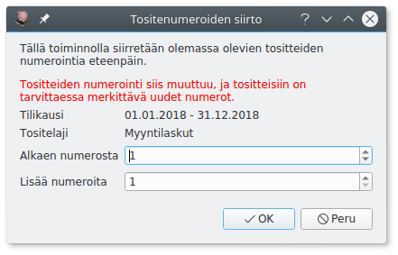

# Kirjaaminen

1. Jos tosite on tietokoneella (pdf- tai jpg-tiedostona) tuo se joko raahaamalla se **Sähköinen tosite**-kohtaan tai **Valitse tiedosto**-napilla (tai <kbd>CTRL</kbd>+<kbd>O</kbd>).
    Kitupiikki pyrkii poimimaan pdf-tiedostolta osan kirjauksen tiedoista, katso [tuonti](tuonti).
2. Täytä tositteen **päivämäärä** <kbd>Enter</kbd> ja **otsikko** <kbd>Enter</kbd>.
3. Valitse **tositelaji**.
4. Kirjaa viennit joko [Kirjausapurilla](apuri) <kbd>F9</kbd> tai [käsin](kasin) <kbd>F11</kbd>.
   Koska kirjaukseen voi sisältyä paljon erilaisia ohjaustietoja, on suositeltavaa tehdä kirjaukset Kirjausapurilla aina, kun se suinkin on mahdollista.
5. Lisää tarvittaessa vielä **Kommentit**-välilehdelle tarkemmat selvitykset.
6. Jos kirjaus perustuu paperitositteeseen, merkitse **Tositenumero** paperiseen tositteeseen.
7. Tallenna kirjaus painamalla **Tallenna** tai <kbd>F12</kbd>.

!!! note "Mikä päivämäärä?"
    Kirjanpito voidaan tehdä suorite-, maksu- tai laskuperusteisesti, katso [Lyhyesti kirjanpidosta](/kirjanpito)

## Tositteen kommentit

Kommentit-välilehdelle kirjoitetaan tarkemmat tiedot tositteesta. Hankinnasta voidaan esimerkiksi kertoa, mitä varten se on tehty ja mihin päätökseen se perustuu (esim. yhdistyksessä viittaus hallituksen pöytäkirjaan).

Muistiotositteessa selitys voidaan kirjoittaa Kommentti-välilehdelle, jolloin tositteeseen ei tule liitettä (esimerkiksi tilinpäätösviennin perusteluina).

## Liitteet

Tositteeseen voi liittää pdf- tai jpg-tiedostoja. Kuvatiedostot muunnetaan arkistoa varten pdf-muotoon.

Ensimmäisen liitteen (sähköinen tosite) voit liittää suoraan **Sähköinen tosite**-kohdassa raahaamalla tiedoston tai **Valitse tiedosto**-napista.

Voit lisätä enemmän tiedostoja **Liitteet**-välilehdeltä **Lisää**-napista. Voit myös poistaa liitteitä, muuttaa liitteen nimeä (kaksoisnapsauttamalla nimeä) tai avata liitteen pdf-katseluohjelmaan tulostamista varten.

Lisäliite voi olla esimerkiksi hankintapäätös, tarjouspyyntö, lähetyslista tai muu tarpeellinen asiakirja.

Voit myös tehdä tositteen, jossa on liite ja mahdollisesti kommentteja ilman yhtään vientiä, jos jokin asiakirja on tarpeen liittää sähköiseen arkistoon. Tällainen voi olla tarpeen esimerkiksi todennettaessa tilinpäätöksen liitetietoja liitetietotositteella.

## Tiliotteen kirjaaminen

**Tiliote**-välilehdeltä voit merkitä, että tosite on tiliote. Tällöin sähköinen arkisto lisää tilille tällä ajanjaksolla tehtyihin kirjauksiin linkin tiliotteeseen. Tiliotemerkintä tehdään automaattisesti, jos tiliote on määritelty tositelajin asetuksissa.

## Tositenumero

Kitupiikki numeroi tositteet juoksevalla numerolla tositelajeittain ja tilikausittain. Jos haluat numeroida tositteita itse, syötä numero Tositenumero-ruutuun. Punainen numero tarkoittaa, että kyseinen tositenumero on jo käytössä. **Siirrä numeroita**-painikkeellä pääset siirtämään numerointia eteenpäin niin, että voit lisätä uuden tositteen olemassa olevien väliin.

## Lisää toimintoja

Kirjausikkunan oikean alakulman valikosta löytyvät

* **Siirry tositteeseen** <kbd>Ctrl</kbd>+<kbd>G</kbd> Nopea tositteeseen siirtyminen tositenumeron perusteella
* **Tulosta tosite** <kbd>Ctrl</kbd>+<kbd>P</kbd>
* **Kopioi uuden pohjaksi** <kbd>Ctrl</kbd>+<kbd>T</kbd> Luo uuden tositteen, johon kopioidaan näkyvissä olevan tositteen tiedot, uudella päivämäärällä ja otsikolla
* **Poista tosite**
