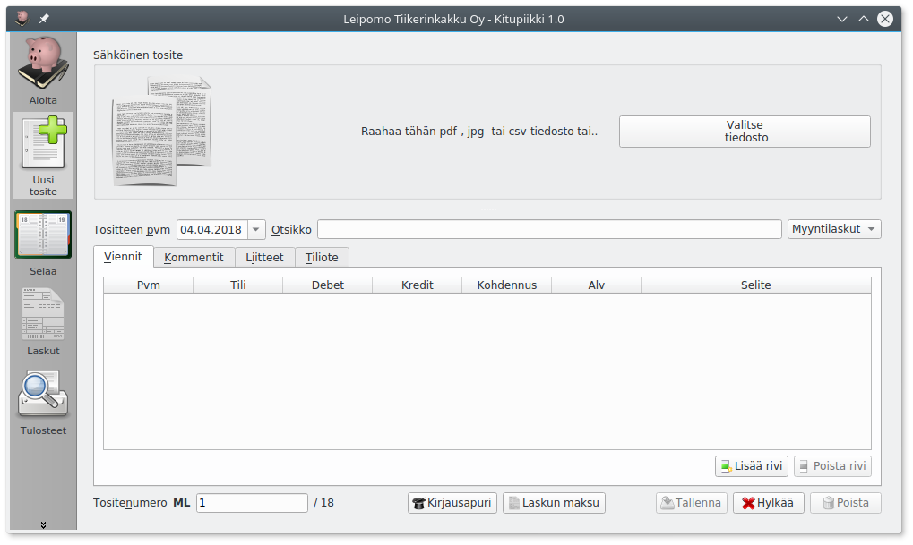
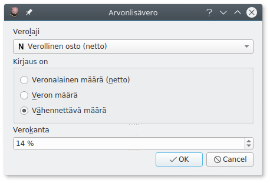
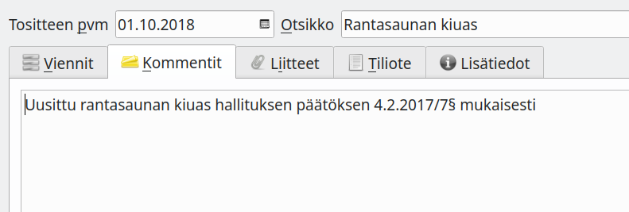
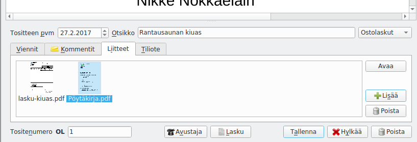
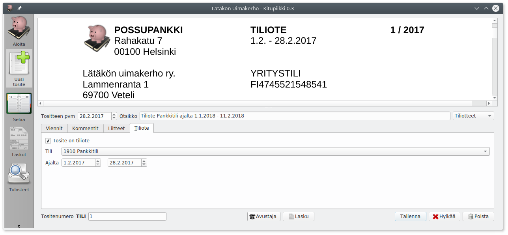

# Kirjaaminen

## Kirjaaminen Avustajalla

Useimmat tavanomaiset kirjaukset kuten ostot, myynnit, nostot pankkitililtä jne. kirjaat helpoiten käyttämällä Avustajaa.

1. Jos tosite on tietokoneella (pdf- tai jpg-tiedostona) tuo se joko raahaamalla se **Sähköinen tosite**-kohtaan tai **Valitse tiedosto**-napilla.
    
2. Täytä tositteen **päivämäärä** ja **otsikko**.
3. Valitse **tositelaji**.
4. Käynnistä Avustaja joko **Avustaja**-napista tai painamalla **F9**.
   
5. Valitse välilehdeltä, mitä kirjaat: **Tulo**, **meno** vai **siirto**.
6. Valitse tili. Voit joko kirjoittaa suoraan tilinumeron tai aloittaa kirjoittamalla tilin nimeä, jolloin pääset valitsemaan tilin luettelosta. Painamalla välilyöntiä pääset kaikkien tilien luetteloon.
6. Syötä määrä ja varmista, että **vastatili**, **vientipäivä**, **selite**, **alv-laji** ja **alv-prosentti** on oikein. Valitse tarvittaessa **kohdennus**. Kirjattaessa siirto tasetililtä toiselle valittavina on **debet-tili** (minne siirretään) ja **kredit-tili** (mistä siirretään).
7. Varmista Apurin ikkunassa alinpana olevasta ruudusta, että kirjaus menee oikein, ja paina **Ok** (tai Enter)
8. Kirjauksen tiedot tulevat **Viennit**-välilehdelle. Jos tositteella on useampia vientejä, käynnistä Avustaja uudelleen.
9. Lisää tarvittaessa vielä **Kommentit**-välilehdelle tarkemmat selvitykset.
10. Jos kirjaus perustuu paperitositteeseen, merkitse **Tositenumero** paperiseen tositteeseen.
11. Tallenna kirjaus painamalla **Tallenna** tai **F12**.

!!! note "Mikä päivämäärä?"
    Kirjanpito voidaan tehdä suorite-, maksu- tai laskuperusteisesti, katso [Lyhyesti kirjanpidosta](/kirjanpito)

## Kirjaaminen ilman Avustajaa

Voit tehdä kirjauksen myös ilman Avustajaa valitsemalla **Viennit**-välilehdellä **Lisää rivi** (tai painamalla **F11**).

Sarakkeeseen **Tili** voit syöttää tilinumeron tai kirjoittaa tilin nimen alkua. Meno ja tulotileillä voit valita **kohdennuksen**. Jos kirjaat tasetilille, jossa on käytettävissä tase-erittely, pääset kohdennus-saraketta napsauttamalla valitsemaan kirjaukselle tase-erän.

Arvonlisäveron tietoja pääset muokkaamaan napsauttamalla Alv-saraketta, josta avautuu valintaikkuna

Katso tarkemmin lukua [Arvonlisävero](/alv).

!!! tip "Monimutkaisille kirjauksille"
    Ilman apuria kannattaa kirjata monimutkaisemmat kirjaukset, joissa debet- ja kredit- rivejä on eri määrät (esimerkiksi palkkayhteenvedon kirjaus, jossa erilaisia palkkoja, sosiaalikuluja ja veroja kirjataan yhtä pankkitilivientiä vasten). Samoin sisäisen laskennan kirjaukset menotilien eri kustannuspaikoille on tarpeen kirjata ilman avustajaa.

!!! warning "Ole huolellinen verojen kanssa"
    Ilman apuria kirjattaessa on turvallisinta käyttää bruttokirjauksia (joissa arvonlisävero sisälyy kirjaukseen ja erotetaan siitä vasta verokauden lopussa alv-kirjauksessa), sillä nettokirjauksessa verot on laskettava itse.

## Tositteen kommentit

Kommentit-välilehdelle kirjoitetaan tarkemmat tiedot tositteesta. Hankinnasta voidaan esimerkiksi kertoa, mitä varten se on tehty ja mihin päätökseen se perustuu (esim. yhdistyksessä viittaus hallituksen pöytäkirjaan).

Muistiotositteessa selitys voidaan kirjoittaa Kommentti-välilehdelle, jolloin tositteeseen ei tule liitettä (esimerkiksi tilinpäätösviennin perusteluina).

## Liitteet

Tositteeseen voi liittää pdf- tai jpg-tiedostoja. Kuvatiedostot muunnetaan arkistoa varten pdf-muotoon.

Ensimmäisen liitteen (sähköinen tosite) voit liittää suoraan **Sähköinen tosite**-kohdassa raahaamalla tiedoston tai **Valitse tiedosto**-napista.

Voit lisätä enemmän tiedostoja **Liitteet**-välilehdeltä **Lisää**-napista. Voit myös poistaa liitteitä, muuttaa liitteen nimeä (kaksoisnapsauttamalla nimeä) tai avata liitteen pdf-katseluohjelmaan tulostamista varten.

Lisäliite voi olla esimerkiksi hankintapäätös, tarjouspyyntö, lähetyslista tai muu tarpeellinen asiakirja.

Voit myös tehdä tositteen, jossa on liite ja mahdollisesti kommentteja ilman yhtään vientiä, jos jokin asiakirja on tarpeen liittää sähköiseen arkistoon. Tällainen voi olla tarpeen esimerkiksi todennettaessa tilinpäätöksen liitetietoja liitetietotositteella.

## Tiliotteen kirjaaminen

**Tiliote**-välilehdeltä voit merkitä, että tosite on tiliote. Tällöin sähköinen arkisto lisää tilille tällä ajanjaksolla tehtyihin kirjauksiin linkin tiliotteeseen. Tiliotemerkintä tehdään automaattisesti, jos tiliote on määritelty tositelajin asetuksissa.

## Tase-erät

Tase-erien avulla voidaan tasetileille laatia kirjanpitolain vaatima tase-erittely. Eriteltävät tilit valitaan [tilikartan määrityksistä](/maaritykset/tilikartta/#tase-erittely-ja-tase-erat).

### Velat ja saatavat

Aiemmassa esimerkissä jauho-ostokset on kirjattu ostovelat-tilille, ja laskusta on muodostettu uusi tase-erä. Laskun kirjaamisen jälkeen tämän tase-erän saldo on 71,43€ ja lasku näkyy tase-erittelyssä

Kun lasku maksetaan eräpäivänä, kohdennetaan kirjaus laskun tase-erälle. Näin tase-erän saldo menee nollaksi, eikä lasku tulostu ostovelkojen tase-erittelyssä.

### Investoinnit
