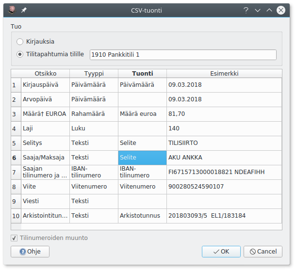
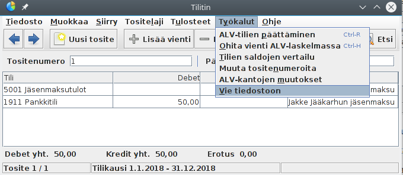

# Tuonti

## Pdf-tiedostojen tuonti

Kun kirjausikkunassa lisätään pdf-muotoinen tosite, pyrkii Kitupiikki poimimaan siitä tietoja kirjauksien pohjaksi.

Toiminto edellyttää, että pdf-tiedostossa teksti on upotettuna. Näin on yleensä, kun pdf-tiedosto on ollut koko ajan sähköisessä muodossa (välitetty sähköpostilla tai haettu verkkopankista). Skannattu tiedosto pitää käsitellä erikseen OCR- eli tekstintunnistusohjelmalla. Lisäksi pdf-tiedostojen tuonti pitää olla otettuna [tuonnin määrityksistä](/maaritykset/tuonti) käyttöön.

### Ostolaskut


Pdf-ostolaskun pohjalta Kitupiikki tekee valmiiksi **Ostovelat**-tilin kirjauksen. Valitsemalla **Apuri** tai **F9** pääset kirjaamaan Apurilla laskun oikealle menotilille.

Lisäksi ostolaskulle tallennetaan lisätiedot (saajan pankkitili ja viite), joiden avulla maksu on kohdennettavissa tiliotteelta.

!!! info "Ostolaskujen muoto"
    Kitupiikki pyrkii etsimään laskun tietoja tiettyjen laskulla olevien sanojen avulla. Parhaiten ostolaskun tiedot löytyvät, jos laskun alareunassa on tilisiirtolomake, josta tiedot saa poimittua.

### Tiliotteet

!!! tip "Eikö toimi?"
    Pdf-tiliotteen tuonti on kokeellinen toiminto. Jos se toimii väärin oman pankkisi tiliotteiden kanssa, ota se pois käytöstä [tuonnin määrityksistä](/maaritykset/tuonti).

!!! tip ""
    [<span class="fa fa-youtube"></span> Katso video tiliotteen kirjaamisesta](https://www.youtube.com/watch?v=0uR19M1-Aao)    

Tiliotteen perusteella Kitupiikki tekee valmiit pankkitilin kirjaukset. Jos tiliotteella olevan tapahtuman IBAN- ja viitenumerot täsmäävät avoinna olevaan myynti- tai ostolaskuun, osaa Kitupiikki kohdentaa suorituksen ja tekee koko kirjauksen valmiiksi. Verohallinnon oma-aloitteisten verojen maksutilille tehdyt suoritukset kohdistetaan verovelkatilille.

Tiliotteen kirjaaminen edellyttää, että tilin IBAN-numero on määritelty kyseisen tilin [määrityksissä](/maaritykset/tilikartta).


## TITO-tiliotteiden tuonti

Kitupiikki laatii viennit konekielisten TITO-tiliotteiden tilitapahtumista (ascii-muoto). Tilin IBAN-numeron pitää olla määriteltynä kyseisen tilin [määrityksissä](/maaritykset/tilikartta). Lisää tiliotetiedosto raahaamalla se **Sähköinen tosite**-laatikkoon tai **Lisää tiedosto**-painikkeella.

## Palkat palkka.fi-palvelusta

[Palkka.fi](https://palkka.fi) on Verohallinnon ylläpitämä ilmainen palvelu palkan laskemiseen ja kaikkien palkanmaksuun liittyvien viranomaisilmoitusten hoitamiseen.

!!! tip ""
    [<span class="fa fa-youtube"></span> Katso video palkkatositteen tuomisesta](https://www.youtube.com/watch?v=7o0L5SQBXuk)

1. Kun olet tehnyt palkka.fi-palvelussa kuukauden palkat, valitse Palkanlaskennat tulosteet -kohdasta Tee uusi tuloste. Valitse tulostetyypiksi **Kirjanpidon tosite (CSV)**. Syötä kausi ja valitse **Tee tuloste**. Lataa tekemäsi tuloste.
   
2. Tee Kitupiikissä **Uusi tosite** ja liitä lataamasi *kirjanpito_csv.txt* tuloste tositteelle. Kitupiikki laatii palkanmaksun kirjauksen.
   
3. Näen palkanmaksuun liittyvät maksut viitteinen palkka.fi-palvelun **Maksut**-kohdasta. Työnatajamaksut tulevat näkyviin vasta, kun ilmoitukset on annettu - joko automaattisesti seuraavan kuukauden alettua tai tekemällä ilmoitus heti.
   

## CSV-tiedostojen tuonti

CSV-tiedosto on tekstitiedosto, jossa eri tietokentät on eroteltu toisistaan pilkulla. Voit tuoda Kitupiikkiin tällä toiminnolla esimerkiksi [Tilitin-kirjanpito-ohjelman](http://helineva.net/tilitin) kirjauksia tai verkkopankin tilitapahtumia. Kitupiikin kirjauksia voit tuoda csv-muotoisesta [Päiväkirja-raportista](/tulosteet#paivakirja).

Voit tuoda kirjanpitoon csv-tiedoston lisäämällä **.csv**-päätteisen tiedoston kirjaukseen (raahaamalla **Sähköinen tosite**-laatikkoon tai **Lisää tiedosto**-painikkeella). Saat ikkunan, jossa valitaan, mitä tietoja csv-tiedoston eri sarakkeista tuodaan.



Jos tuot **tilitietoja**, valitse lisäksi tili, jolle tiedot kirjataan. Tilitiedot käsitellään ja kohdennetaan samalla tavalla kuin pdf-tiliotteelta.

**Kirjauksia** tuotaessa saat **Muunna tilinumerot**-valinnalla vielä erillisen valintaikkunan, jossa määrittelet tilinumeroiden muuttamisen tuotaessa käytössäsi olevan tilikartan tileiksi. Vasemmanpuoleisessa sarakkeessa ovat csv-tiedoston tilinumerot ja oikeanpuolimmaisesta voit valita, mille Kitupiikin tilille kirjaus tuodaan.


Kaikki csv-tiedoston kirjaukset tulevat samalle tuontitositteelle ja alkuperäinen tositetunniste tulee selitteen alkuun.

### Kirjausten tuonti Tilittimestä

1. Vie Tilittimen kirjanpito csv-tiedostoksi **Työkalut | Vie tiedostoon** -valinnalla
   
2. Avaa tai luo Kitupiikillä kirjanpito, johon haluat tuoda Tilittimen kirjaukset
3. Varmista, että Kitupiikissä on kaikki ne tilikaudet, joille kirjauksia tuodaan.
4. Muokkaa tarvittaessa Kitupiikin tilikarttaa.
5. Tuo Tilittimen CSV-tiedosto yllä olevien ohjeiden mukaisesti. Käytä tilinumeron muuntoa ja varmista jokaisen tuotavan tilin kohdalta, että kirjaukset kohdistuvat oikealle tilille.

!!! note "Alv-ohjaustietoja ei tuoda"
    Tilitin käsittelee arvonlisäveroa tilikohtaisesti ja Kitupiikki kirjauksen ohjaustietojen mukaan. Tuoduissa kirjauksissa ei ole arvonlisäveron ohjaustietoja, joten jokaista verollista kirjausta täytyy muokata käsin, jos niiden perusteella on tarpeen luoda Kitupiikillä alv-ilmoitus.

### CSV-tiedoston muoto

CSV-tiedostossa erottimena saa olla pilkku, puolipiste tai tabulaattori. Päivämäärät voivat olla suomalaisessa (31.12.2018) tai ISO-muodossa (2018-12-31). Tiedostossa pitää olla otsikkorivi, mutta otsikoiden nimet voivat olla mitä tahansa - sarakkeiden sisältö valitaan aina tuotaessa.

Esimerkki tuotavista tilitapahtumista
```
Kirjauspäivä;Arvopäivä;Määrä EUROA;Laji;Selitys;Saaja/Maksaja;Saajan tilinumero ja pankin BIC;Viite;Viesti;Arkistointitunnus
04.03.2018;04.03.2018;-50,00;160;TILISIIRTO;;Korkeasaaren ystävät ry;FI1415723000369314 NDEAFIHH;00000000000000001025;70306392900369580
05.03.2018;05.03.2018;+25,00;130;TILISIIRTO;Muonalan Market ky;;1009;;170307392900363378

```

Esimerkki tuotavista kirjauksista
```
Tosite,Päivämäärä,Nro,Tili,Debet,Kredit,Selite
1,18.11.2016,1911,Pankkitili,"50,00",,Jullen jäsenmaksu
1,18.11.2016,5001,Jäsenmaksutulot,,"50,00",Jullen jäsenmaksu
2,18.11.2016,4201,Toiminnan kulut,"15,00",,Ostettu suklaata
2,18.11.2016,1911,Pankkitili,,"15,00",Ostettu suklaata
3,18.11.2016,1911,Pankkitili,,"10,00",Käteisnosto
3,18.11.2016,1901,Käteisvarat,"10,00",,Käteisnosto
```
