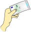
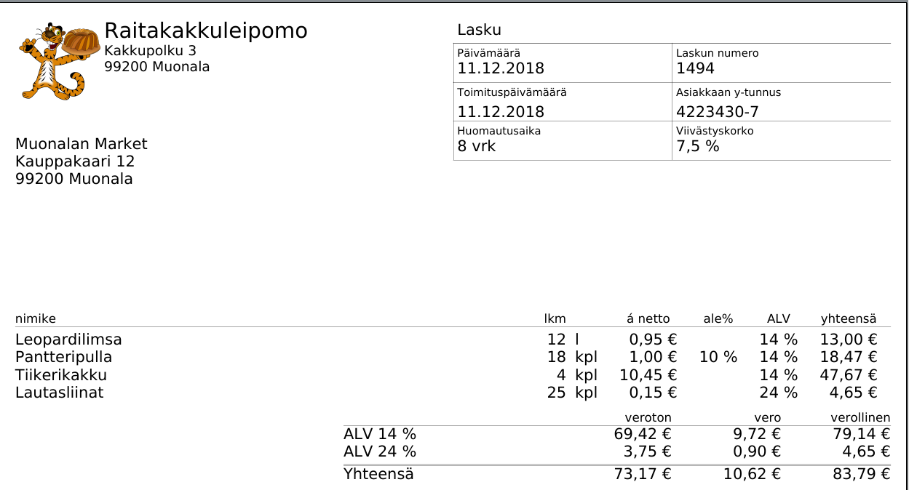
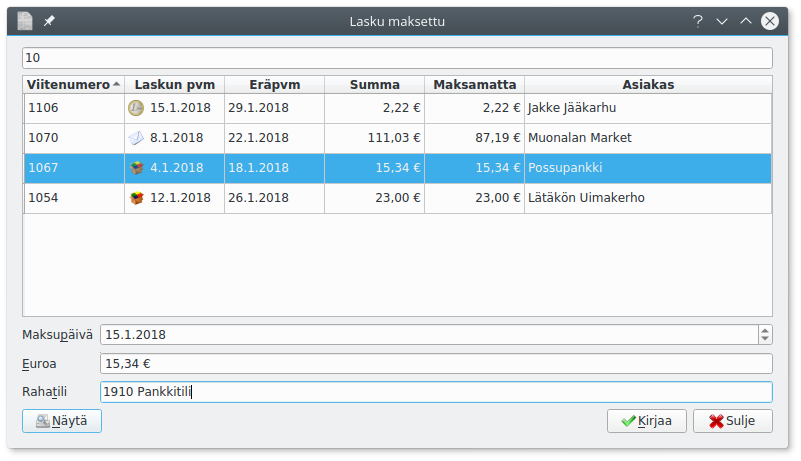

**Laskut**-välilehdellä voit selata laskuja sekä tehdä uusia. Voit tarkistella laskuja myös asiakkaiden ja toimittajien mukaan (myynti- ja ostoreskontra.)

!!! note "Ostoreskontra perustuu ostovelakirjauksiin"
    Ostolaskuista näkyvät vain velaksi tehdyt ostolaskukirjaukset - ei siis suoraan käteis- tai pankkitililtä kirjattuja.

Ylälaidassa valitset näytettäväksi *Myyntilaskut* tai *ostolaskut* taikka tarkastella laskuja *asiakkaiden* tai *toimittajien* mukaan.

Alempana valitaan näytettäväksi *kaikki laskut*, maksamattomat eli *avoimet* tai *erääntyneet* eli myöhässä olevat laskut. Laskuja voi rajata laskun päivämäärän mukaan. Voit myös hakea asiakkaan nimellä tai viitenumeron alkuosalla.

Laskun päiväyksen vieressä oleva kuvake esittää laskun tyypin

tunnus     | Nimi   | Selitys
-----------|--------|------------
 | Suoriteperusteinen lasku | Kirjataan toimituspäivälle
 | Laskuperusteinen lasku | Kirjataan maksun päivämäärälle
 | Maksuperusteinen lasku | Kirjataan kirjanpitoon vasta, kun maksettu. Vaatii erityistä käsittelyä kirjanpidossa ja siksi maksuperusteisella laskulla ei ole käytössä aivan kaikkia toimintoja, kuten maksetuksi merkitsemistä tilitapahtumia tuotaessa.
 | Käteislasku | Maksu on suoritettu käteisellä
 | Hyvityslasku | Hyvitetään jo annettua laskua
 | Maksumuistutus | Punainen kuori eräpäivän vieressä tarkoittaa, että laskusta on laadittu maksumuistutus.

* **Näytä**-painike avaa nähtäväksi valitsemasi laskun
* **Muokkaa**-painikkella pääset muokkaamaan jo tehtyä laskua. Jo asiakkaalle toimitettua laskua ei pääsääntöisesti kuitenkaan pitäisi enää muokata, vaan lähettää hyvityslasku.
* **Tosite** avaa laskuun liittyvän kirjanpitotositteen
* **Poista** poistaa laskun.
* **Hyvityslasku** laatii laskulle hyvityslaskun.
* **Maksumuistutus** (näkyvissä vain, jos lasku erääntynyt) laatii maksumuistuksen
* **Uusi lasku**-painikkeesta pääset tekemään [uuden laskun](uusi). Jos olet valinnut asiakkaan, laaditaan lasku tälle asiakkaalle.
* **Ryhmälasku**-painikkeella lähetät samansisältöisen [ryhmälaskun](ryhma) usealle asiakkaalle.

## Laskun maksaminen

Laskut kirjataan maksetuksi yleensä tiliotteen perusteella niin, että tiliotteesta tulee maksun todentava tosite. Kirjattaessa tiliotetta paina kirjausikkunan alareunan **Lasku**-painiketta.

Saat avointen laskujen luettelon, josta laskua voi etsiä viitenumerolla tai asiakkaan numerolla. Valitse lasku ja paina **Kirjaa**.

Jos lasku on maksettu vain osaksi, muuta euromäärä vastaamaan maksua. Lasku jää edelleen maksamattomalta osaltaan avoimeksi samalla viitenumerolla.

Myös tilitapahtumien [tuonti](/kirjaus/tuonti) merkitsee laskuja maksetuiksi viitenumeron perusteella.

!!! note "Maksuperusteisen laskun maksaminen"
    Maksuperusteisen laskun tositteessa on kaksi riviä ilman tiliöintiä. Näitä käytetään laskujen seuraamisen laskujen luetteloilla, eikä niitä saa poistaa. Rivit eivät tulostu kirjanpidon tulosteilla.

    Maksuperusteista laskua ei kirjata maksetuksi tilitapahtumia tuotaessa.
