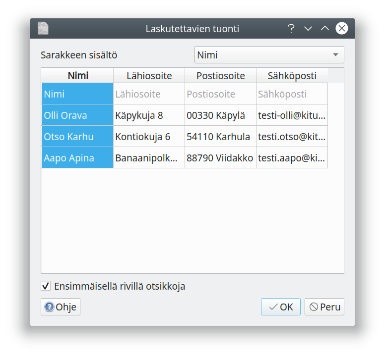
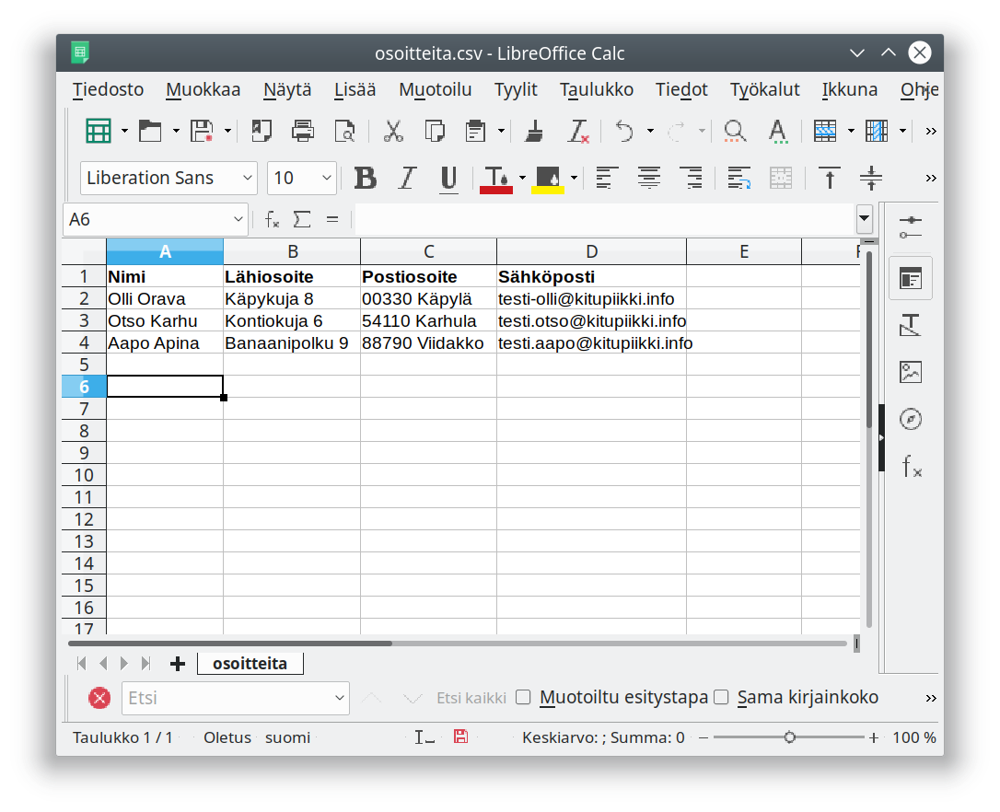

#Ryhmälasku  <span class=ver>1.1<span class=selite>Kitupiikin versiosta 1.1 lähtien</span></span>


Ryhmälasku-toiminnolla voit lähettää saman sisältöisen laskulle kerralla useammalle asiakkaalle.

Täytä **Rivit**-välilehdelle laskutettavien tuotteiden tiedot ja **Lisätiedot**-välilehdelle laskulle tulostuvat lisätiedot.

Valitse laskun saajat **Laskutettavat**-välilehdeltä. Voit lisätä yksittäisiä laskutettavia **Lisää**-napista, jo asiakasrekisterissä olevia vasemmasta olevassa asiakasluettelossa nimeä napsauttamalla tai tuoda csv-tiedostosta kerralla useamman asiakkaan **Tuo luettelo**-painikkeesta.

Lähettääksesi tai tulostaaksesi laskun, **valitse** ensin laskun saajat ja paina sitten **Tulosta**, **Näytä**, **Sähköposti** tai **Verkkolasku** -painiketta.


Nimen vasemmalla puolella oleva *e*-kuvake tarkoittaa, että lasku voidaan lähettää verkkolaskuna; kuvake muuttuu vihreäksi väkäseksi kun verkkolasku on muodostettu. Vastaavasti vihreä väkänen sähköpostiosoitteen vasemmalla puolella tarkoittaa, että lasku on lähetetty sähköpostilla.

## Luettelon tuominen



**Tuo luettelo**-painikkeellä pääset tuomaan vastaanottajien luettelon csv-tiedostosta. Valittuasi tiedoston valitse käytettävät sarakkeet: valitse taulukossa sarake ja **Sarakkeen sisältö**-valinnalla, mitä sarake sisältää.

Taulukkolaskentaohjelmat, kuten Excel tai LibreOffice Calc, voivat tallentaa tietoa csv-muotoon; samoin monet tietokantoja käsittelevät ohjelmat. Näin yhdistys voi esimerkiksi lähettää jäsenlaskut, jos yhdistyksen jäsenrekisteristä jäsenten osoitetiedot saadaan vietyä csv-tiedostoksi.



Malliesimerkki osoitteista csv-tiedostossa
```
Nimi,Lähiosoite,Postiosoite,Sähköposti
Olli Orava,Käpykuja 8,00330 Käpylä,testi-olli@kitupiikki.info
Otso Karhu,Kontiokuja 6,54110 Karhula,testi.otso@kitupiikki.info
Aapo Apina,Banaanipolku 9,88790 Viidakko,testi.aapo@kitupiikki.info
```
