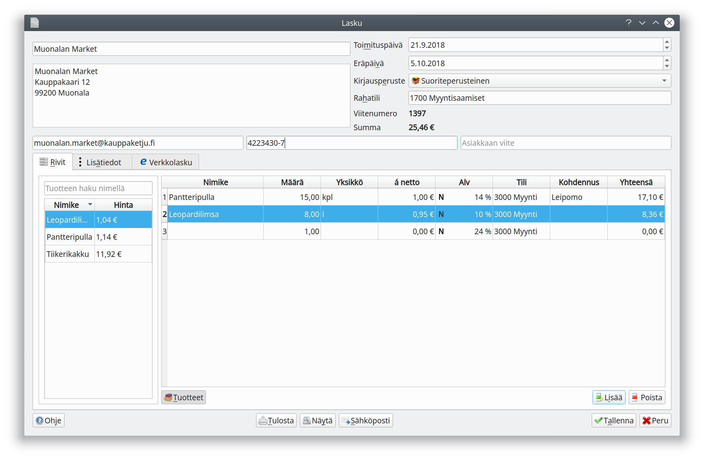
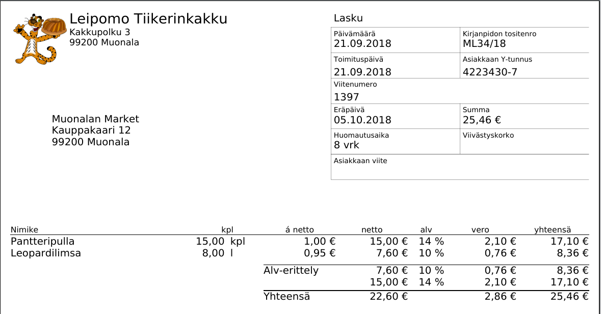
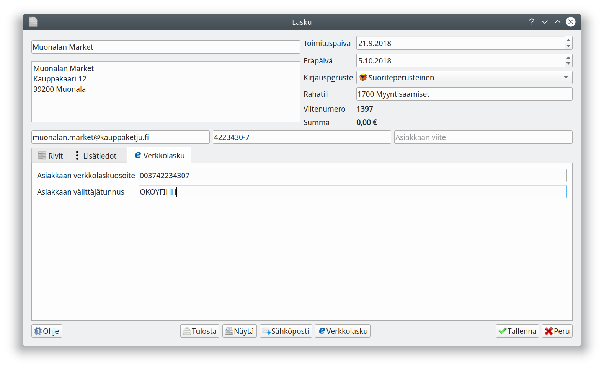
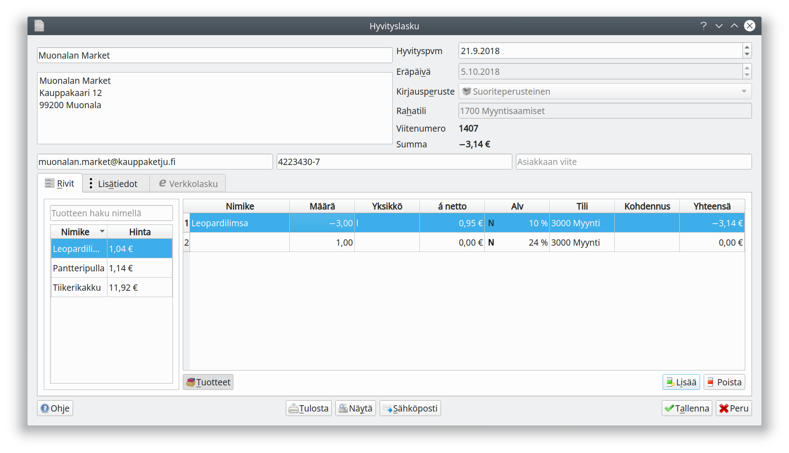

## Uusi lasku

Kitupiikki pyrkii täydentämään laskun saajan nimen ja osoitetiedot vanhojen laskujen perusteella.

Valitse laskun **kirjausperuste** sen mukaan, mille päivämäärälle lasku kirjataan kirjanpitoon, katso [kirjaamisperusteet](/kirjanpito/#kirjaamisperusteet). **Maksuperusteinen lasku** näkyy kirjanpidossa vasta, kun se on maksettu. **Käteiskuitti** laaditaan välittömästi käteisellä maksettaessa, jolloin tuloste toimii myös kuittina.

Syötä laskutettavat tuotteet **Rivit**-välilehdelle. Samalla valitset, miten myyntilasku kohdennetaan kirjanpidossa. **Arvonlisävero** kirjataan oletuksena nettokirjauksena, bruttokirjauksen voit tehdä **Muu alv**-valinnasta avautuvalla ikkunalla.

**Tuotteet**-napilla avautuu tuoteluettelo. Kun olet syöttänyt riveille tuotteen, paina rivin päällä hiiren oikeaa nappia ja pääset valitsemaan **Lisää tuoteluetteloon**. Tuotteesta tallennetaan nimi, yksikkö, yksikköhinta, verotus, tili ja kohdennus. Luettelossa olevan tuotteen lisäät laskulle napsauttamalla sitä tuoteluettelossa. Tuotteen voi poistaa valitsemalla tuoteluettelossa tuotteen nimen päällä hiiren oikealla napilla avautuvasta valikosta **Poista tuoteluettelosta** tai tuotteen tiedot voi päivittää valitsemalla tuotteen rivin päällä hiiren oikealla napilla avautuvasta valikosta **Päivitä tuoteluetteloon**.

**Lisätiedot**-välilehdelle syötetty teksti tulostuu laskulle.

Valmiin laskun voit **tulostaa**, voit avata pdf-tiedoston esikatseltavaksi **näytä**-valinnalla tai lähettää laskun suoraan **sähköpostilla**. **Tallenna**-valinnalla lasku tallentuu kirjanpitoon ja ikkuna sulkeutuu.

!!! warning "Muista tallettaa lasku"
    Pelkkä laskun esikatselu tai tulostaminen ei tallenna laskua kirjanpitoon. Muista aina tallentaa lasku - näin estät myös päällekkäiset viitenumerot eri laskuilla!

## Verkkolasku

Kun verkkolasku on [määritelty käyttöön](/maaritykset/verkkolasku) ja asiakkaalle on syötetty Y-tunnus, voidaan Verkkolasku-välilehdelle syöttää asiakkaan verkkolaskuosoite ja välittäjätunnus. Painamalla **Verkkolasku**-painiketta Kitupiikki muodostaa verkkolaskutiedoston.

!!! note "Verkkolaskun lähettäminen"
    Kitupiikki muodostaa Finvoice-verkkolaskuaineiston, mutta ei toimita sitä verkkolaskuvälittäjälle. Aineisto pitää toimittaa itse tai käyttää siihen operaattorin ohjelmaa.

## Hyvityslasku

Hyvityslasku laaditaan valitsemalla **Laskut**-välilehden luettelosta hyvitettävä lasku ja painamalla **Hyvityslasku**.

Kirjoita laskulle tehtävät hyvitykset/korjaukset **Rivit**-välilehden ruudukkoon.

