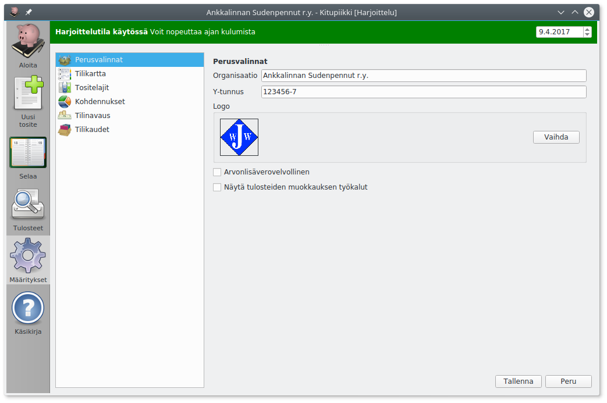
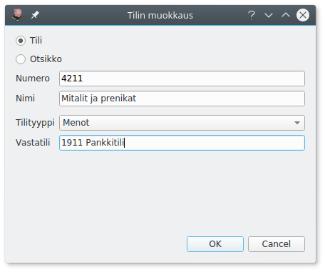
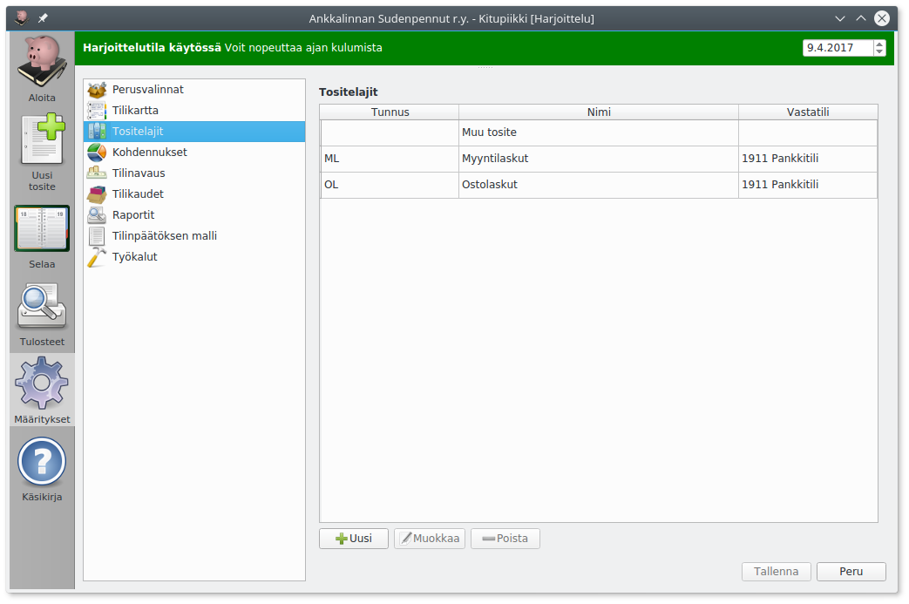
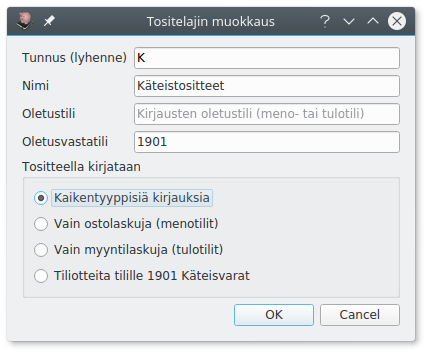
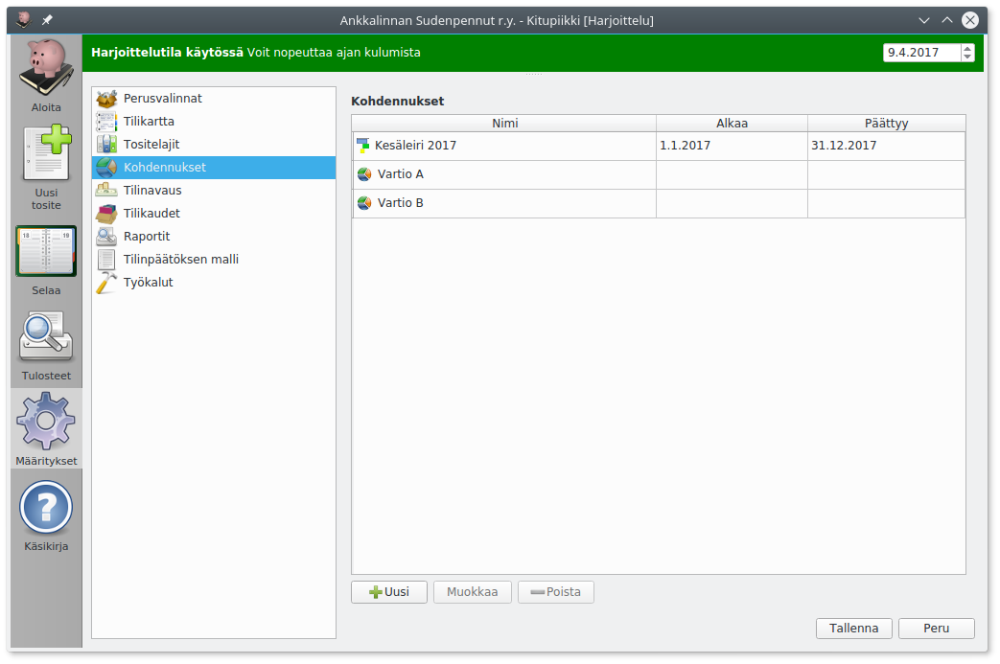
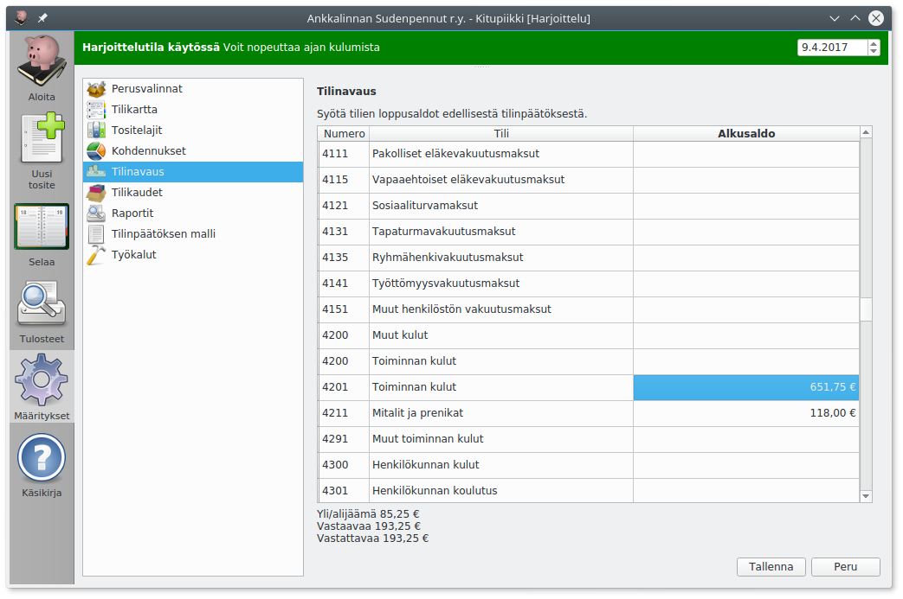

# Kirjanpidon määritykset

## Perusvalinnat

**Organisaation nimi**, **y-tunnus** ja **logo** näkyvät erilaisissa tulosteissa. Logoksi voi valita jpg- tai png-muotoisen kuvatiedoston.

Valitse **Arvonlisäverovelvollinen** jos olet rekisteröitynyt arvonlisäverovelvolliseksi, katso [Verohallinnon ohjeet arvonlisäverosta](https://www.vero.fi/fi-FI/Yritys_ja_yhteisoasiakkaat/Arvonlisaverotus). Arvonlisäveroon liittyvät toiminnat näytetään vain, kun **Arvonlisäverovelvollinen** on valittu. Katso Käsikirjan lukua [Arvonlisävero](alv).

!!! note "Ei vielä käytössä"
    Ensimmäisessä esiversiossa ei ole arvonlisäveroon liittyviä toimintoja, eikä tätä kohtaa voi valita.

!!! tip "Arvonlisäverovelvollisuus"
    Arvonlisäverovelvolliseksi on syytä hakeutua heti, jos tilikauden liikevaihto voi ylittää 10 000 euroa. Jos raja ylittyy kesken tilikauden, on arvonlisävero kuitenkin maksettava koko tilikaudelta. Huomaa, että yleishyödyllinen toiminta on arvonlisäverotonta, eli useimpien yhdistysten tarvitsee maksaa arvonlisäveroa vain, jos ne harjoittavat huomattavaa liiketoimintaa.

**Näytä tulosteiden muokkauksen työkalut** mahdollistaa tilinpäätösmallin ja eri raporttien mallipohjien muokkaamisen.

!!! warning "Tiedä mitä teet!"
    Mallit määrittelevät, miten tilinpäätöksen tase ja tuloslaskelma muodostetaan. Ole huolellinen muokatessasi raporttien malleja.

## Tilikartta

Muokkaa tilikarttaa lisäämällä uusia tilejä ja muokkaamalla tai piilottamalla vanhoja.

Jos tilikartassa oleva tili on tarpeeton, piilota se. Piilotettu tili ei näy luetteloissa tiliä valittaessa. Tilin voi myös kokonaan poistaa, mutta yleensä piilottaminen on parempi vaihtoehto.

!!! warning "Käytössä olevan tilin piilottaminen"
    Piilotettuja tilejä ei tulosteta tavalliseen tililuetteloon. Jos tilikauden vaihtuessa joku tili jää tarpeettomaksi, piilota se vasta kun tilinpäätös on tehty, jotta tili näkyy tilinpäätöksen tililuettelossa.

Voit merkitä paljon käytetyt tilit suosikkitileiksi. Tiliä valittaessa voit ottaa näkyviin pelkät suosikkitilit.

Tilit ja otsikot pitää **numeroida**. Vastaavaa-tasetilit alkavat numerolla 1 ja Vastattavaa-tasetilit numerolla 2. Tilinumerot järjestetään niin, että lyhyempi tilinumero vastaa pidempää numeroa, jonka loppu on täytetty nollilla (eli tilinumerot 491 ja 49100 tarkoittavat samaa tiliä). Otsikolla saa olla sama numero kuin sen alle tulevalla tilillä.

Tilin **tilityyppi** määrittelee, miten tiliä käsitellään kirjanpidossa.

**Vastatili** määrittelee sen, mikä tili valitaan oletuksena tehtäessä tälle tilille kirjaus. Meno- ja tulotileille kannattaa usein valita vastatiliksi pankki- tai käteistili.

## Tositelajit

Tositteet voi jakaa omiksi sarjoikseen eli tositelajeiksi, jotka numeroidaan erikseen. Kitupiikissä tositelajit tunnistetaan alussa olevasta yhden tai useamman kirjaimen tunnisteesta, esim. ML myyntilaskuille.

Omia tositelajeja voi tehdä esimerkiksi ostolaskuille, myyntilaskuille, pankkitilin tiliotteilla, muistiotositteille, käteistositteille jne.

Tositelajille voi määritellä **oletustilin** eli tilin, mihin kirjauksen pääosin kohdistuvat (esimerkiksi myyntilaskuille 3001 Myynnit). **Oletusvastatili** määrittää oletuksena olevat tasetilin (yleensä pankkitili, käteistili, myyntisaamistili tai ostovelkatili).

!!! tip "Tilin valitseminen"
    Voit valita tilin joko aloittamalla kirjoittamaan tilin numeroa, jolloin pääset selaamaan tililuetteloa, tai aloittamalla kirjoittamaan tilin nimeä tai osaa siitä. Painamalla tilinvalinnassa välilyöntiä pääset kaikkien tilien luetteloon.

Määrittämällä, että tosittella kirjataan **vain ostolaskuja** tai **vain myyntilaskuja** näytetään tilille kirjattaessa vain menotilit tai tulotilit. Valinnalla **Tiliotteita tilille** määritellään, että tällä tositelajilla tehdään kirjauksia vain tietyn tilin tiliotteen perusteella.

Määrittämällä eri käyttötarkoituksille omat tositelajinsa ja tekemällä niille oletusvalinnat, tulee kirjaamisesta huomattavasti nopeampaa ja tositeluetteloista selvempiä.

## Kohdennukset

Kohdennuksilla voidaan tuloja ja menoja kohdentaa yhdistyksen eri jaostoille tai toimintaryhmille, yrityksen eri osastoille tai projekteille jne. Koko kirjanpito voidaan toteuttaa myös ilman kohdennuksia.

Kohdennukset voivat olla kustannuspaikkoja tai projekteja: **Kustannuspaikan** tuloja ja menoja seurataan tilivuosittain, kun taas **projekti** voi jatkua tilikauden vaihtumisen yli.

Kitupiikin kohdennukset koskevat vain tuloja ja menoja, eivät taseessa olevaa varallisuutta.

!!! tip "Leiri projektina"
    Sudenpentulippukunta kirjaa leirin tuloiksi leirimaksut ja leiriä varten saadut avustukset ja kuluiksi leirin kustannukset. Näin leirin kustannuksia voidaan seurata ja kirjanpito osoittaa leiriä avustaneille, että kohdeavustukset ovat menneet juuri tämän leirin kuluihin.

!!! tip "Aktiviteettirahojen seurtanta"
    Lions-toiminnassa määritellään, että yleisöltä kerätyt hyväntekeväisyyteen tarkoitetut rahat (ns. aktiviteettitili) on pidettävä erillään klubin muusta toiminnassa kuten klubi-iltojen järjestämisestä (ns. hallintotili). Muodostamalla aktiviteeteistä projektin, jolle kirjataan lahjoitustulot ja toisaalta hyväntekeväisyysmenot voidaan osoittaa, ettei hyväntekeväisyyteen tarkoitettuja varoja ole käytetty muuhun toimintaan.

## Tilinavaus

Tilinavauksessa syötetään tilin avaavina saldoina tilien loppusummat edellisen tilinpäätöksen taseesta ja tuloslaskelman erittelystä.

Saldot syötetään ilman etumerkkiä (ellei sitten esimerkiksi edellisiltä tilikausilta ole jäänyt alijäämää).

Tuloslaskelmaan saldot syötetään tileittäin, koska uuden tilikauden tuloslaskelmaan on merkittävä vertailutiedot edelliseltä tilikaudelta.

Jos tilikarttaa on Kitupiikkiin siirryttäessä muutettu, pitäisi tilinavaukset vertailulukemat pyrkiä merkitsemään uuden tilikartan mukaisille tileille.

!!! tip "Tilinavaus ei ole valmis?"
    Voit aloittaa kirjaamisen, vaikka edellisen tilikauden tilinpäätös ei olisi valmis eikä tilinavausta olisi tehty. Taseesta tehtävät tulosteet ovat kuitenkin virheellisiä kunnes tilinavaus on tehty.

## Muut määritykset

Nyt Kitupiikki on valmis kirjausten tekemiseen!

Arvonlisäveroon liittyvät valinnat on selostettu [arvonlisävero-luvussa](alv), raporttien muokkaaminen [raportit-luvussa](raportti) ja tilinpäätösten pohjat [tilinpäätös-luvussa](tilinpaatos). Työkalut on esitelty luvussa [muita toimintoja](muut).
