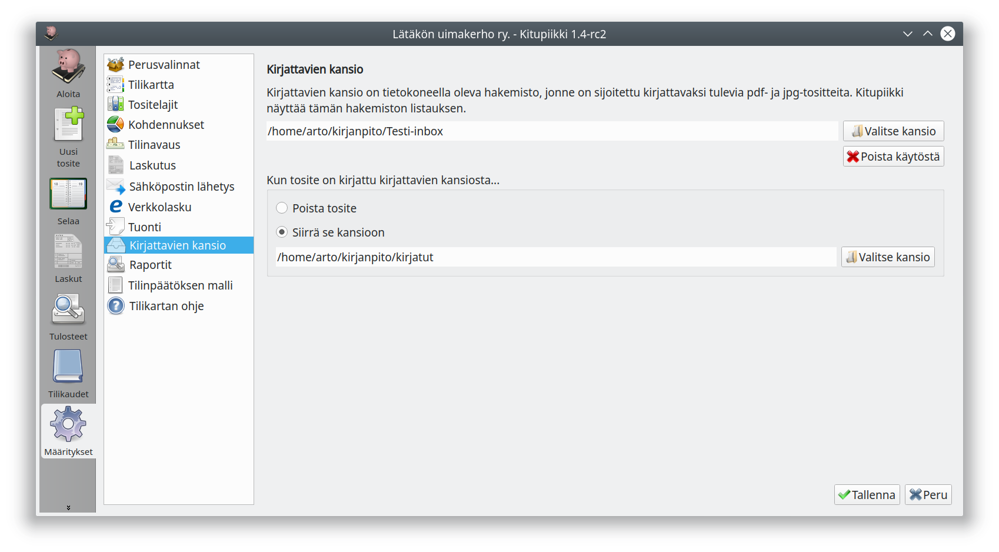
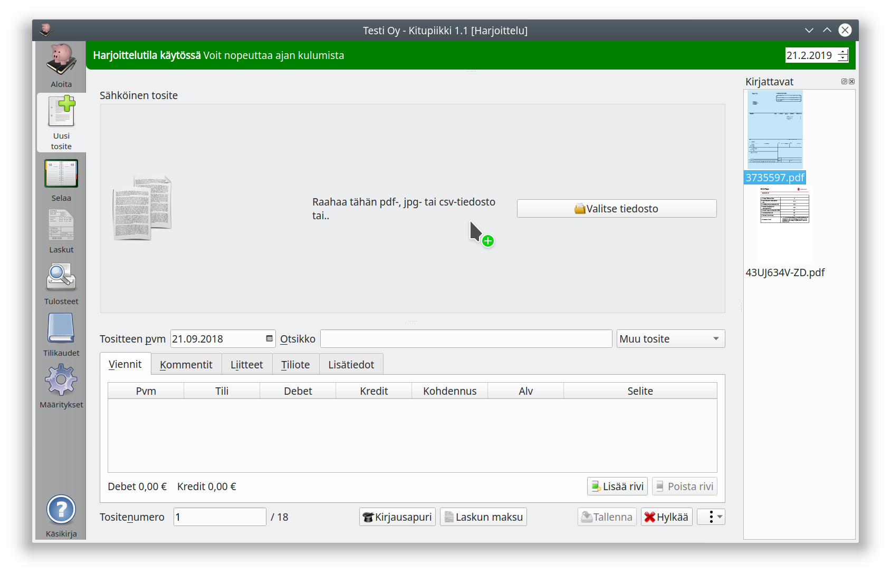

#Kirjattavien kansio  1.1Kitupiikin versiosta 1.1 lähtien

Toiminnalla määritellään tietokoneella oleva hakemisto, jonka sisältämät laskut (pdf- ja kuvatiedostot) näytetään ohjelman ikkunan oikeassa laidassa. Kun kirjattavien kansiossa oleva tiedosto on liitetty laskuun ja lasku tallennetaan, niin valintasi mukaan tiedosto

 - **poistetaan** tietokoneelta, tai
 - **siirretään** valitsemaasi hakemistoon 1.4Kitupiikin versiosta 1.4 lähtien

Kirjattavien ikkunasta lasku on helppo siirtää raahaamalla kirjattavaksi.

Voit kirjata listan ensimmäisen tositteen myös <kbd>F8</kbd>-näppäimellä. 1.3Kitupiikin versiosta 1.3 lähtien

Määrittelemällä sama hakemisto skannausohjelmaan skannattavien tiedostojen tallennushakemistoksi ja Kitupiikkiin kirjattavien kansioksi saat käsiteltyä nopeammin paperilla saamasi tositteet.
