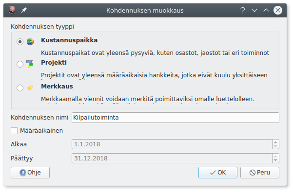

# Kohdennukset

Kohdennuksilla voidaan tuloja ja menoja kohdentaa yhdistyksen eri jaostoille tai toimintaryhmille, yrityksen eri osastoille tai projekteille jne. Koko kirjanpito voidaan toteuttaa myös ilman kohdennuksia.

Kohdennukset voivat olla kustannuspaikkoja tai projekteja: **Kustannuspaikka** on luonteeltaan pysyvät (osasto, jaosto, eri toiminto), kun taas **projektit** ovat vakituisen kustannuspaikkajaon ulkopuolisia hankkeita.

Kohdennukset ovat organisaation sisäistä laskentaa. Yhdistystoiminnassa kohdennuksia käytettäessä liitetään tilinpäätökseen yleensä eri toiminnanalojen erittelyt.

!!! note "Kohdennukset tasetileillä"
    Oletuksena vain tulo- ja menotileillä käytetään kohdennuksia. Jokaisella tasetilillä, jolla halutaan käyttää kohdennuksia, on kohdennukset otettava erikseen käyttöön [tilikartan](../tilikartta) muokkauksesta.

    Kun kohdennukset on otettu käyttöön, huomioidaan kohdennukset esimerkiksi poistolaskelmassa, mutta erilaisten velkojen ja saatavien kohdentaminen vaatii usein käsityötä.

## Esimerkkejä kohdennusten käyttämisestä

Yrityksen eri **osastojen** tuloja ja menoja seurataan määrittelemällä osastot kustannuspaikoiksi

*Yhdistyksen jaostot toimivat itsenäisesti ja saavat käyttää rahojansa itse. Jaostot merkitään kustannuspaikoiksi, ja myös raha- sekä käyttöomaisuustileillä otetaan kohdennukset käyttöön.*

**Tapahtuman** taloutta voidaan seurata muodostamalla se projektiksi.

*Partiolippukunta kirjaa järjestämänsä leirin tuloiksi leirimaksut ja leiriä varten saadut avustukset ja kuluiksi leirin kustannukset. Näin leirin kustannuksia voidaan seurata ja kirjanpito osoittaa leiriä avustaneille, että kohdeavustukset ovat menneet juuri tämän leirin kuluihin.*

*Jos alueen lippukunnat järjestävät leirin yhdessä ja sopivat, että leiristä koituvat kulut jaetaan lippukuntien kesken osallistujien suhteissa mutta yksi lippukunta huolehtii rahaliikenteen, voi tämä lippukunta tehdä leiristä projektin. Projektin tuloiksi kirjataan leirimaksut ja avustukset ja menoiksi kaikki kulut. Jäämä laskutetaan osallistujien kesken ja merkitään projektin tuloiksi. Järjestäjälippukunta tekee omasta osuudestaan sisäisen kirjauksen kredit leiritoiminta debet leiriprojekti.*
