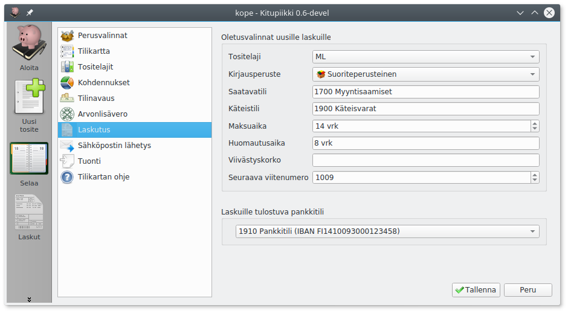

Määrittelee uusien laskujen oletusvalinnat

* **Tositelaji**, johon laskut kirjataan kirjanpidossa (yleensä myyntilaskut)
* **Kirjausperuste**, jolla lasku kirjataan kirjanpitoon <ul>
  <li>**Suoriteperusteinen**: kirjataan toimituspäivänä</li>
  <li>**Laskuperusteinen**: kirjataan laskutuspäivänä</li>
  <li>**Maksuperusteinen**: kirjataan, kun lasku maksettu</li>
  <li>**Käteiskuitti**: maksetaan käteisellä tavaraa luovutettaessa</li></ul>
* **Saatavatili** tili, jolle lasku kirjataan suorite- tai maksuperusteisesti (yleensä Myyntisaamiset)
* **Käteistili** tili, jos maksu kirjataan käteislaskuna (yleensä Käteisvarat)
* **Maksuaika** eräpäivän määrittelemiseen
* Laskulle tulostettava **huomautusaika** ja **viivästyskorko**
* **Seuraava viitenumero**. Jos olet laskuttanut saman tilivuoden aikana toisella ohjelmalla, valitse varmasti vapaaksi jäävä numeroalue. Kitupiikki huolehtii itse viimeisen numeron (tarkastusnumero) laskemisesta. Viitenumero toimii myös laskun numerona.

Voidaksesi valita **laskuille tulostuvan pankkitilin numeron**, pitää IBAN-tilinumero olla syötettynä
[tilin tiedoissa](/maaritykset/tilikartta).

Valitse myös, tulostetaanko pankkisiirtolomakkeeseen **pankkiviivakoodi** sekä vastaavat tiedot sisältävä **QR-koodi**.
