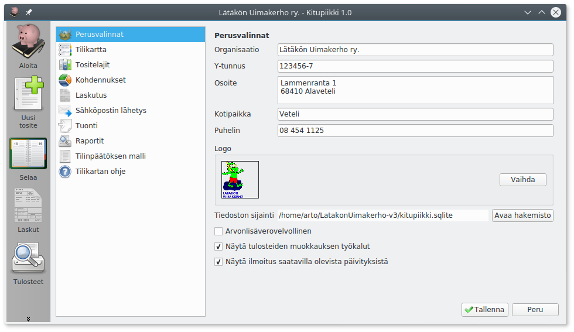

# Perusvalinnat

**Organisaation nimi**, **y-tunnus**, **osoite**, **kotipaikka**, **puhelin** ja **logo** näkyvät erilaisissa tulosteissa. Logoksi voi valita jpg- tai png-muotoisen kuvatiedoston.

Valitse **Arvonlisäverovelvollinen** jos olet rekisteröitynyt arvonlisäverovelvolliseksi, katso [Verohallinnon ohjeet arvonlisäverosta](https://www.vero.fi/fi-FI/Yritys_ja_yhteisoasiakkaat/Arvonlisaverotus). Arvonlisäveroon liittyvät toiminnat näytetään vain, kun Arvonlisäverovelvollinen on valittu. Katso Käsikirjan lukua [Arvonlisävero](alv).

!!! tip "Arvonlisäverovelvollisuus"
    Arvonlisäverovelvolliseksi on hakeuduttava, jos tilikauden liikevaihto voi ylittää 10 000 euroa. Alarajahuojennukset takia hakeutuminen kannattaa yleensä pienemmälläkin liikevaihdolla. Yleishyödyllinen toiminta on arvonlisäverotonta, eli useimpien yhdistysten tarvitsee maksaa arvonlisäveroa vain, jos ne harjoittavat huomattavaa liiketoimintaa.

**Näytä tulosteiden muokkauksen työkalut** mahdollistaa tilinpäätösmallin ja eri raporttien mallipohjien muokkaamisen.

!!! warning "Tiedä mitä teet!"
    Mallit määrittelevät, miten tilinpäätöksen tase ja tuloslaskelma muodostetaan. Ole huolellinen muokatessasi raporttien malleja.

**Näytä ilmoitus saatavilla olevista päivityksistä** näyttää ohjelman aloitussivulla ilmoituslaatikon, kun Kitupiikistä on saatavilla uudempi ohjelmaversio.
Tätä varten Kitupiikki ottaa internet-yhteyden ohjelman verkkosivulle.
