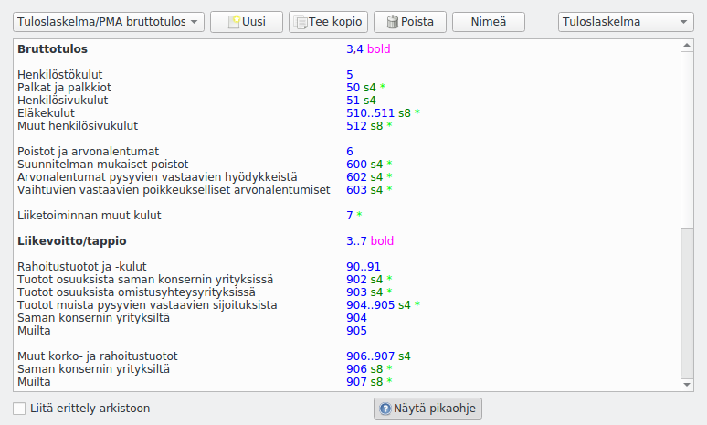

!!! note "Edistynyt toiminto"
    Sinun ei yleensä tarvitse muokata raportteja. Raporttien muokkaus on otettava erikseen käyttöön [perusvalintojen](../perusvalinnat) kohdasta **Näytä tulosteiden muokkauksen työkalut**.

    Raporttien muokkausta tarvitaan, jos olet muuttanut tilien numerointia tai lisännyt tilejä olemassa olevien otsikkoalueiden ulkopuolelle.

**Määritykset > Raportit** pääset muokkaamaan raportteja.

* Valitse ylhäällä vasemmalla olevasta luettelosta muokattava raportti tai aloita **uusi**-painikkeella uusi raportti
* Oikealla yläkulmassa valitaan raportin tyyppi <ul>
  <li> **Tuloslaskelma** kuvaa tilikauden tulosta (tulostilit) </li>
  <li> **Tase** kuvaa taloudellista tilannetta tilinpäätöspäivänä (tasetilit) </li>
  <li> **Kohdennuslaskelma** lasketaan erikseen jokaiselle käytössä olevalle kohdennukselle. Kohdennuslaskelmassa voi olla sekä tase- että tulostilejä samalla laskelmalla. </li></ul>
* **Liitä erittely arkistoon** määrittelee, liitetäänkö tämä raportti erittelynä sähköiseen arkistoon.

Raportin kaava muodostuu siten, että vasemmassa reunassa on tulostettavat tekstit ja tabulaattorin jälkeen tulostetta ohjaavat määritteet.

!!! warning "Tiedä, mitä teet"
    Ole huolellinen muokatessasi tulosteita. Taseen ja tuloslaskelmat muodot on määrätty kirjanpitoa koskevassa lainsäädännössä.

## Käytettävät määreet

Määreitä voi laittaa vapaassa järjestyksessä, välilyönnillä erotettuna.

### Riviin liittyvät tilit

Numerot määrittelevät tilivälejä niin, että pelkkä numero tarkoittaa kaikkia sillä alkavia tilejä (**4** tarkoittaa tilejä 4101, 4289, 498898 jne., **41** tilejä 4100, 4175, 4198 jne).

Numerovälit merkitään **3..7** (tarkoittaa kaikkia numeroilla 3, 4, 5, 6, 7 alkavia tilejä). Merkintä **410..412** tarkoittaa tilejä, jotka alkavat 410, 411 tai 412.

Numerot tai numerovälit voi erottaa välilyönnillä `4 5 61..66` tai pilkulla `4,5,61..66`.

Numeroon tai numeroväliin voi liittää **+** merkitsemään tuloja tai **-** merkitsemään menoja. `4+ 5-` tulostaa kaikki neljällä alkavat tulot ja viidellä alkavat menot.

### Riville tulostettavat luvut

* **S** tai **SUMMA** tulostaa riville summan, vaikka se olisi 0.
* **s** tai **summa** tulostaa rivin ja summan, jos se ei ole nolla. Tämä on myös oletusvalinta, ellei mitään määrettä ole kirjoitettu
* **h** tai **otsikko** ei tulosta summaa, vaan pelkän otsikon, ellei summa ole nolla
* **d** tai **erittely** tulostaa tilikohtaisen erittelyn
* **=** tulostaa summaluvun kaikesta tähän asti lasketusta
* **==** määrittää, ettei tätä riviä oteta mukaan summaa laskettaessa
* Jos mitään tilejä ei ole merkitty, tulostetaan pelkkä otsikko

Yllä oleviin tunnuksiin voi liittää numeron tyyliin **S4** joka määrittää rivin sisennyksen (tulostaa riville summan ja sisentää riviä neljä merkkiä).

***** tulostaa summarivin jälkeen tilikohtaisen erittelyn, jos raportista on valittuna erittely. Tähteen voi liittää numeron määrittelemään, kuinka monta merkkiä erittelyrivejä sisennetään (esim. `*4`).

### Rivin muotoilu

* **lihava** tai **bold** tulostaa rivin lihavoituna
* **viiva** tulostaa rivin yläpuolelle viivan
