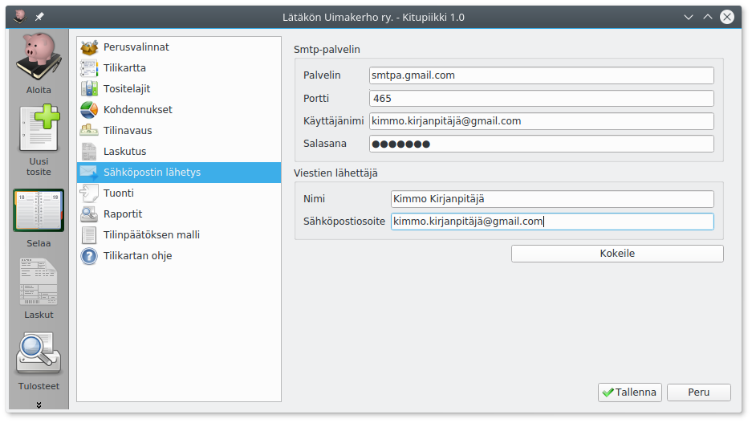

# Sähköpostin lähetys

Kitupiikillä on mahdollista lähettää laskut suoraan sähköpostiin. Jos tätä toimintoa haluaa käyttää, on ohjelmassa määritettävä sähköpostin asetukset.

* **Palvelin**: Lähtevän sähköpostin palvelimen osoite, löytyy sähköpostin tai internetyhteyden ohjeista. Sähköpostin lähetys on testattu toimivaksi ainakin Elisan ja Gmailin postipalvelimilla.
* **Portti**: Lähtevän sähköpostin portti palvelimella, suojatussa sähköpostissa yleensä 465 ja suojaamattomassa 25.
* **Käyttäjänimi**: Käyttäjänimi palvelimella palveluntarjoajan vaatimassa muodossa
* **Salasana**: Sähköpostin salasana. Gmailissa tähän syötetään [sovellussalasana](https://myaccount.google.com/apppasswords).
* **Viestin lähettäjän nimi ja osoite**: Viesteissä näkyvät tiedot. Jotkut sähköpostipalvelut vaativat kyseisen palvelun sähköpostiosoitteen käyttämistä.

!!! note "Suojattu sähköposti"
    Kitupiikki tukee suojattua sähköpostia, mutta tarvitsee sitä varten OpenSSL-kirjastoa. Jos oikeaa versiota kirjastosta ei ole saatavilla, näkyy siitä sähköpostiasetusten sivulla. Ilman OpenSSL-kirjastoa voit lähettää suojaamatonta sähköpostia (smtp-palvelin portissa 25).

Kun olet syöttänyt asetukset, paina **Kokeile**-painiketta, joka yrittää lähettää sähköpostin omaan osoitteeseesi. Jos lähetys epäonnistuu, saat siitä ilmoituksen

Tässä tapauksessa käyttäjätunnus tai salasana on väärin.

Jos lähetys onnistuu, tulee Kokeile-napin vasemmalle puolelle teksti **Sähköposti lähetetty**, ja löydät testiviestin postilaatikostasi

