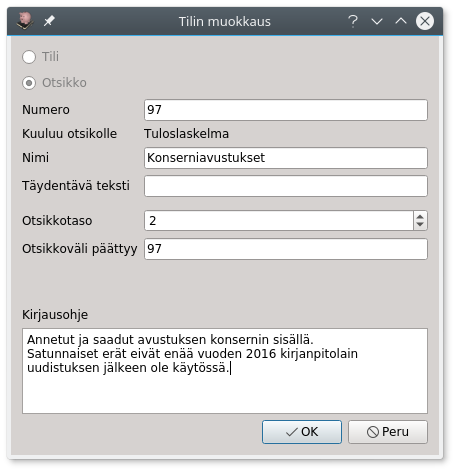
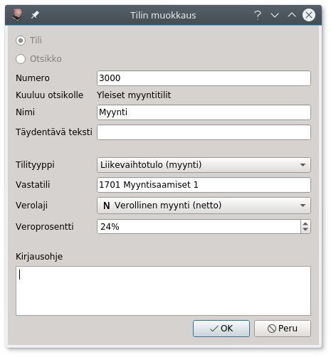
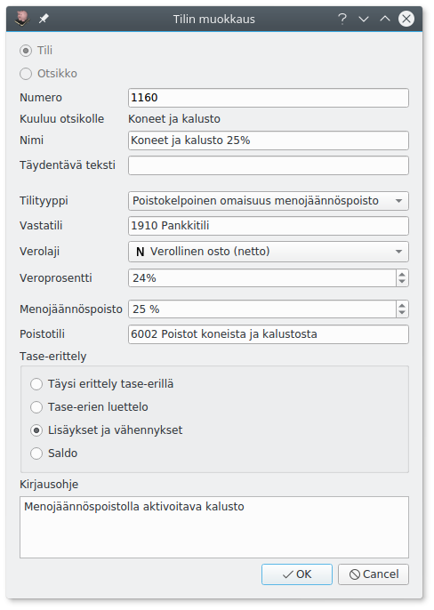
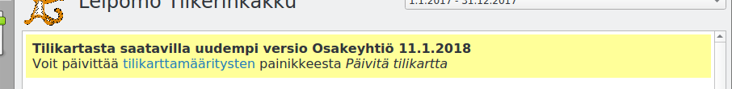
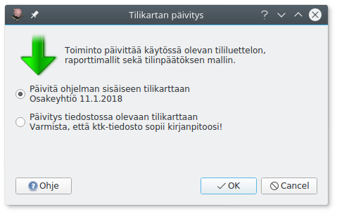

# Tilikartta

## Tilikartan muokkaaminen

Tilikarttaan voi lisätä uusia tilejä sekä muokata ja poistaa vanhoja.

!!! note "Valmiit tilikartat"
    Lähes kaikki tarvitsemasi tilit löytyvät valmiista tilikartoista, joissa tilien määritykset ovat valmiiksi kohdallaan. Jos lisäät itse tilejä, ole huolellinen numeroinnin ja määritysten kanssa, jotta kirjaukset tulevat käsitellyiksi oikein!

Jos tilikartassa oleva tili on tarpeeton **piilota** se. Piilotettu tili ei näy luetteloissa tiliä valittaessa. Tilin voi myös kokonaan poistaa, mutta yleensä piilottaminen on parempi vaihtoehto.

Voit merkitä paljon käytetyt tilit **suosikkitileiksi**. Tiliä valittaessa voit näyttää pelkät suosikkitilit.

Sininen info-kuvake luettelossa merkitsee, että tilille on annettu kirjausohje.

Tilit ja otsikot pitää **numeroida**. Taseen vastaavaa-tilit alkavat numerolla 1 ja vastattavaa-tilit numerolla 2. Numerosarjat 3..9 kuuluvat tuloslaskelmaan päätettäville tulo- ja menotileille.

Kitupiikissä tilinumeron pituus on enintään kahdeksan numeroa. Tilinumeron lopussa olevat nollat eivät ole merkityksellisiä, eli tilit 4910 ja 49100 tarkoittavat samaa tiliä. Otsikolla saa olla sama numero, kuin sen alle tulevalla tilillä.

Tilejä lisättäessä on tärkeää, että tili tulee oikealle numeroalueelle, jotta se näkyy raporteissa oikealla tavalla. Tilinmuokkauksen **kuuluu otsikolle**-kenttä kertoo, minkä otsikon alle tili kuuluu. Otsikon alle kuuluvat tilit, joiden numerot alkavat otsikon numerosta ja päättyvät viimeiseen **otsikkoväli päättyy**-alkuiseen tiliin eli esimerkissä Konserniavustuksiin kuuluvat kaikki 958-alkuiset tilit.

**Täydentävä teksti** tulostuu tase-erittelylle ja **kirjausohje** on luettavissa tiliä valittaessa.

**Tilityyppi** määrittelee, miten tiliä käsitellään kirjanpidossa ja missä luetteloissa tili näytetään, katso alempaa [Tilityypit](#tilityypit).

**Vastatili** määrittää sen, mikä tili valitaan oletuksena tehtäessä tälle tilille kirjaus. Meno- ja tulotileille kannattaa usein valita vastatiliksi pankki- tai käteistili.

**Verolaji** ja **veroprosentti** ovat tilin kirjauksen oletusvalintoja, verolajin ja -prosentin voi aina valita joka viennille erikseen, katso [arvonlisävero](/alv). Valinnat eivät ole näkyvissä, jos yritystä ei ole merkitty [perusvalinnoissa](../perusvalinnat) arvonlisävelvolliseksi.

## Tase-erittely ja tase-erät

Tasetilien (vastaavaa ja vastattavaa) kohdalla valitaan, miten tili esitetään **tase-erittelyssä**.

* **Täysi erittely tase-erillä**: Tilin kirjaukset jaetaan eri tase-eriin, joiden kaikkia muutoksia seurataan. Käytetään esimerkiksi tasaeräpoistettavan omaisuuden kirjanpitoarvon seurantaan.
* **Tase-erien luettelo**: Kirjaukset jaetaan tase-eriksi, ja erittelyssä seurataan eri erien saldoja. Käytetään esimerkiksi myyntisaamisissa ja ostoveloissa, jolloin erittelyistä selviää, mitkä saatavat ovat vielä maksamatta.
* **Lisäykset ja vähennykset**: Kirjauksia ei eritellä, mutta tase-erittelyyn tulostuvat tilikauden aikaiset tapahtumat. Käytetään esimerkiksi menojäännöspoistettavissa tileissä.
* **Saldo**: Tase-erittelyyn tulostetaan vain tilien saldot.

## Poistettava omaisuus

Kitupiikki tukee suunnitelman mukaisten poistojen tekemistä tasaeräpoistoina tai menojäännöspoistoina.

**Tasaeräpoistoissa** jokaista tase-erää (hankintaa) seurataan erikseen, ja hankintahinta jaetaan poistoajalle (euromäärä kuukautta kohti). Tilin asetuksissa määritellän poistoajan oletus, mutta poistoaika on määriteltävissä erikseen jokaiselle erälle (hankinnalle).

**Menojäännöspoistossa** aina tilikauden lopussa poistetaan määritelty prosenttiosuus tilin senhetkisestä saldosta. Prosentti on tilikohtainen ja määritellään kohdassa **menojäännöspoisto**.

**Poistotili** määrittää, mille menotilille vuotuiset poistot kirjataan.

## Tilityypit

**Vastaavaa-tilityypit**

Nämä tilit alkavat aina numerolla 1.

* Vastaavaa (ei tarkempaa erittelyä)
* Poistokelpoinen omaisuus, menojäännöspoisto
* Poistokelpoinen omaisuus, tasapoisto
* Saatavaa
* Arvonlisäverosaatava (yksi tili)
* Käteisvarat
* Pankkitili

**Vastattavaa-tilityypit**

Nämä tilit alkavat aina numerolla 2.

* Vastattavaa (ei tarkempaa erittelyä)
* Edellisen tilikausien voitto/tappio (yksi tili)
* Tämän tilikauden tulos (yksi tili)
* Velat
* Arvonlisäverovelka (yksi tili)
* Verovelka (OmaVero-ilmoitetut) (yksi tili)

**Tuloslaskelman tilityypit**

Nämä tilit alkavat numeroilla 3..9

* Tulot (ei lasketa mukaan liikevaihtoon)
* Liikevaihtotulo (liikevaihtoon laskettava myynti)
* Menot
* Poistot

## Tilikartan vieminen

**Vie tilikartta**-painikkeellä pääset viemään tilikartan tilit, tositelajit, raportit, tilinpäätöspohjan ja joukon muita valintoja ktk-tiedostoksi, jonka pohjalta voi aloittaa uuden kirjanpidon.

Näin siirtää kirjanpitosi valinnat toiseen kirjanpitoon tai jakaa tilikarttasi muiden Kitupiikin käyttäjien kanssa.

Painike käynnistää sarjan valintaikkunoita, joissa valitset tilikartalle nimen ja kirjoitat tilikartan ohjeet. Valinta **yksityinen elinkeinonharjoittaja** vaikuttaa tilinpäätökseen: pienten elinkeinonharjoittajien ei tarvitse laatia ollenkaan tilinpäätöstä, ja isommat laativat sen mikroyrityssäännösten mukaisesti.

## Tilikartan päivittäminen

Kun ohjelman päivityksen myötä myös käytössäsi oleva tilikartta on päivittynyt, saat siitä aloitusnäyttöön ilmoituksen

Tilikarttamääritysten **Päivitä tilikartta**-valinnasta pääset päivittämään tilikartan uudempaan.

Päivitystoiminto
* Lisää tilikarttaan uudet tilit
* Päivittää niiden tilien tiedot (nimi, kirjausohje yms.), joita käyttäjä ei ole itse muokannut. Käyttäjän muokkaamien tilien tietoja ei päivitetä
* Päivittää raportit ja tilinpäätöksen pohjan

Ylempi valinta päivittää ohjelman mukana tulleeseen tilikarttaan. **Päivitys tiedostossa olevaan tilikarttaan** mahdollistaa tilikartan lataamisen ktk-tiedostosta.

!!! warning "Varmista tiedoston sopivuus"
    Ohjelman sisäisissä päivityksissä on varmistettu, että päivitys sopii käytössä olevaan tilikarttaan. Jos päivität erilliseen tiedostoon, varmista tiedostot sopivuus (ettet esimerkiksi päivitä osakeyhtiölle yhdistyksen tilikarttaa.)

Jos olet muokannut itse raportteja tai tilinpäätöksen pohjaa, joudut valitsemaan, korvataanko muokatut raportit/pohjat päivitetyillä vai säästetäänkö muokkaamasi versiot.

!!! tip "Muokattujen raporttien säilyttäminen"
    Voit säilyttää muokkatut raporttisi nimeämällä ne uudelleen ennen päivitystä
