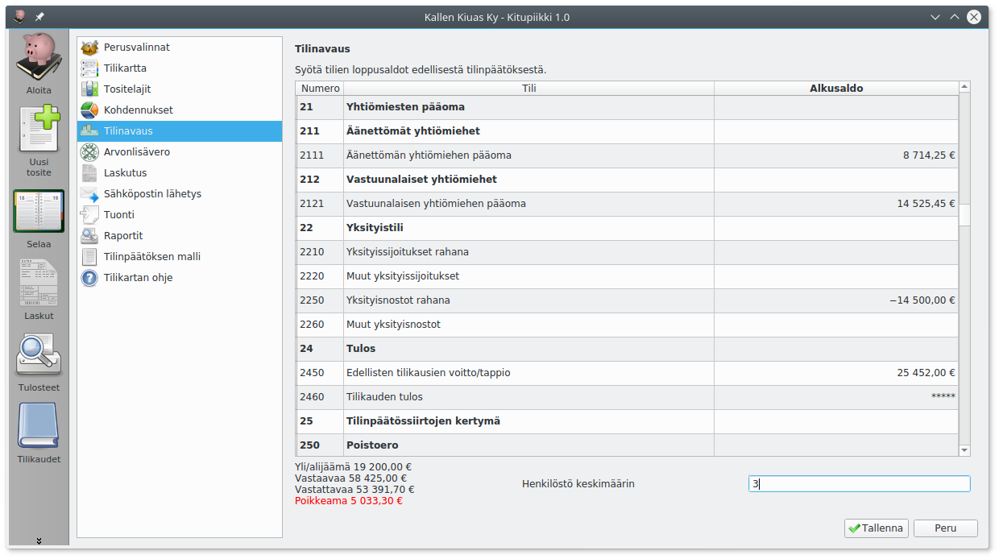
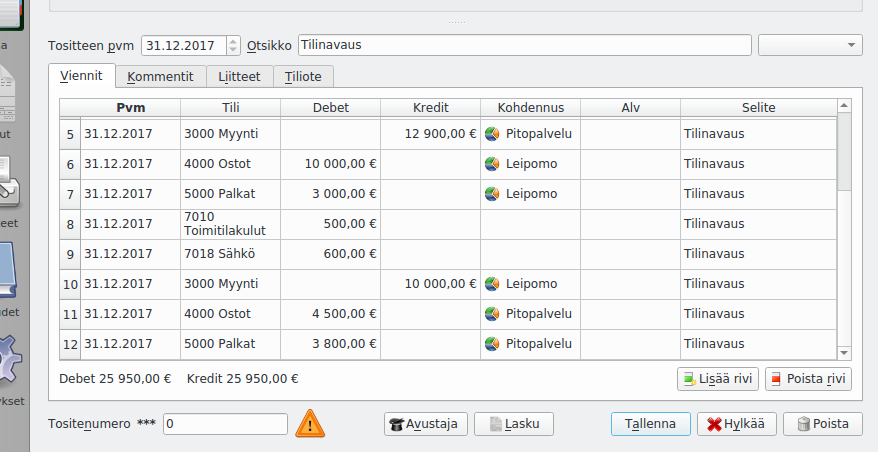

# Tilinavaus

Tilinavauksessa syötetään tilin avaavina saldoina tilien loppusummat edellisen tilinpäätöksen taseesta ja tuloslaskelman erittelystä.

!!! note "Vain ensimmäiselle tilikaudelle"
    Tilinavaus tehdään vain ensimmäiselle tilikaudelle, joka pidetään Kitupiikillä. Jatkossa ohjelma huolehtii automaattisesti uusien tilikausien tilinavauksista.

Saldot syötetään ilman etumerkkiä (ellei sitten esimerkiksi edellisiltä tilikausilta ole jäänyt alijäämää).

Tuloslaskelmaan saldot syötetään tileittäin, koska uuden tilikauden tuloslaskelmaan on merkittävä vertailutiedot edelliseltä tilikaudelta.

Jos tilikarttaa on Kitupiikkiin siirryttäessä muutettu, pitäisi tilinavaukset vertailulukemat pyrkiä merkitsemään uuden tilikartan mukaisille tileille.

Samalla näytöllä syötetään myös **henkilöstön keskimäärä** edellisen tilikauden aikana. Tämä lukumäärä tulostuu vertailutietona tilinpäätöksen liitetietoihin sekä vaikuttaa siihen, voiko tilinpäätöksessä soveltaa mikro- tai pienyrityssääntöjä.

!!! tip "Tilinavaus ei ole valmis?"
    Voit aloittaa kirjaamisen, vaikka edellisen tilikauden tilinpäätös ei olisi valmis eikä tilinavausta olisi tehty. Taseesta tehtävät tulosteet ovat kuitenkin virheellisiä kunnes tilinavaus on tehty.

## Kohdennukset ja tase-erät

Jos tilinavauksessa on tarpeen tehdä erittelyä eri kohdennuksille tai tase-erille, muokkaa tilinavaustositetta. Tilinavaustosite aukeaa **Näytä tosite** -painikkeesta.

* Voit jakaa tilinavauksen eri kohdennuksille, jolloin kustannuspaikkakohtaisille raporteille voidaan tulostaa oikein vertailutiedot edelliseltä tilikaudelta.
* Voit merkitä seurattavat tase-erät (ostovelat, myyntisaamiset, poistettava omaisuus) jolloin ne tulostuvat oikein tase-erittelylle
* Ellei tällaisia muokkauksia ole tarpeen tehdä, älä muokkaa tilinavaustositetta.

!!! note "Tilinavaussivu nollaa tilinavaustositteen"
    Älä muokkaa Määritysten Tilinavaus-sivua enää sen jälkeen kun olet muokannut suoraan tilinavaustositetta

## Kirjanpidon aloittaminen kesken tilikauden

Jos aloitat kirjanpidon Kitupiikissä kesken tilikauden, syötä Tilinavaus-toiminnolla edellisen tilikauden loppusummat ja muodosta tavallinen tosite (**Uusi tosite**), jolla kirjaat jokaiselle käytössä olevalle tilille ennen Kitupiikin käyttöönottoa kirjatut kokonaissummat (debet-summa ja kredit-summa)

Jos olet arvonlisäverovelvollinen, on kirjanpito helpointa aloittaa verokauden vaihtuessa. Kirjaa maksuun menevä arvonlisäverovelka Verovelat-tilille niin, että uuden verokauden alkaessa alv-velassa ja alv-saatavissa ei ole avointa saldoa.

!!! example "Esimerkki"
    Tilikautena on vuosi, ja yritys siirtyy 1.6.2018 toisesta kirjanpito-ohjelmasta käyttämään Kitupiikkiä. Tilinavaukseen kirjataan tilien päättävät saldot 31.12.2017. Lisäksi luodaan tosite päivämäärälle 31.5.2018, johon kirjataan jokaiselle tilille erikseen debet- ja kredit-summa niistä kirjauksista, jotka on tehty aiemmalla kirjanpito-ohjelmalla 1.1.–31.5.2018.
