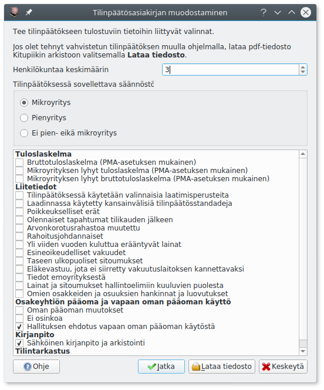

# Tilinpäätöksen malli

!!! note "Edistynyt toiminto"
    Sinun ei yleensä tarvitse muokata tilinpäätöksen mallia. Muokkaus on otettava erikseen käyttöön [perusvalintojen](../perusvalinnat) kohdasta **Näytä tulosteiden muokkauksen työkalut**.


Tässä määritellään tilinpäätökseen tulostuvat raportit sekä liitetietojen kaava.

Erikoismerkeillä alkavat värilliset rivit määrittelevät ehtoja ja tulosteita, ja kaikki muu html-muotoinen teksti tulostuu tilinpäätöksen liitetietoihin.

**?**-alkuiset rivit määrittelevät, että niiden jälkeen tulostuu vain tietyllä Kitupiikin asetuksella aina seuraavaan **?**-ehtoon saakka (Pelkkä **?** lopettaa ehdon). Niinpä seuraavan esimerkin osuus on käytettävissä vain osakeyhtiöille

```
?Muoto=Osakeyhtiö
##Osakeyhtiön pääoma ja vapaan oman pääoman käyttö
#oypaaoma Oman pääoman muutokset
<h2>Oman pääoman muutokset</h2>
<p> ... </p>
#oyeiosinko -oykaytto Ei osinkoa
<h2>Hallituksen ehdotus jakokelpoisen vapaan oman pääoman käytöstä</h2>
<p>Hallitus ehdottaa, että osinkoa ei jaeta.</p>
#oykaytto -oyeiosinko Hallituksen ehdotus vapaan oman pääoman käytöstä
<h2>Hallituksen ehdotus jakokelpoisen vapaan oman pääoman käytöstä</h2>
<p>Jakokelpoinen vapaa oma pääoma on ...</p>
<p>Hallitus ehdottaa, että osinkoa jaetaan XX euroa per osake, eli yhteensä XXX euroa. Osinko on nostettavissa yhtiökokousta seuraavana päivänä.</p>
?
```

Seuraavat rivit määrittelevät, että niiden jälkeen tulostuu vain tietyn kokoluokan yrityksille

* **#MIKRO** Mikroyrityksille
* **#PIEN** Pienyrityksille
* **#ISO** Yrityksille, jotka eivät ole mikro- eivätkä pienyrityksiä
* **#HENKILOSTO** Yrityksille, joilla on henkilöstöä

**##** tarkoittaa, että rivi on tilinpäätöksen muodostamisen valintaikkunaan tulostuva otsikko

```
##Tuloslaskelma
#brutto -I -mikrolv -mikrobrutto Bruttotuloslaskelma (PMA-asetuksen mukainen)
@Tuloslaskelma PMA bruttotulos!TULOSLASKELMA (TILINPÄÄTÖS)@
#mikrolv -I -P -brutto -mikrobrutto Mikroyrityksen lyhyt tuloslaskelma (PMA-asetuksen mukainen)
@Tuloslaskelma mikroyritys!TULOSLASKELMA (TILINPÄÄTÖS)@
#mikrobrutto -I -P -brutto -mikrolv Mikroyrityksen lyhyt bruttotuloslaskelma (PMA-asetuksen mukainen)
@Tuloslaskelma mikro bruttotulos!TULOSLASKELMA (TILINPÄÄTÖS)@
#-brutto -mikrobrutto -mikrolv
@Tuloslaskelma!TULOSLASKELMA (TILINPÄÄTÖS)@
#
<h2>Tilinpäätöksen laatimisperusteet</h2>
#MIKRO
<p>Tilinpäätöksen laatimisessa on noudatettu pien- ja mikroyrityksen tilinpäätöksessä esitettävistä tiedoista
annetun asetuksen (PMA) mikroyrityssäänöstöä.</p>
#PIEN
<p>Tilinpäätöksen laatimisessa on noudatettu pien- ja mikroyrityksen tilinpäätöksessä esitettävistä tiedoista
annetun asetuksen (PMA) pienyrityssäänöstöä.</p>
```



**#**-alkuiset rivit määrittelevät tulostusehtoja. Ne ovat muotoa

`#nimi -pois -P Valintaikkunaan tulostuva teksti`

* `nimi` on valinnan tunnus
* `pois` on sellaisen valinnan tunnus, joka ei voi olla samanaikaisesti valittuna
* `-P` tarkoittaa, ettei tätä valintaa edes näytetä pienyrityksille (vastaavasti `-M` ei näytetä mikroyrityksille eikä `-I` pienyritystä isommille yrityksille)
* Loppurivillä on valintaikkunaan tulostuvaa tekstiä

Rivi voi olla myös ilman tulostuvaa tekstiä, jos valinnan tunnus on määritelty jo aiemmin. Jos rivillä on pelkästään **-**-merkillä alkavia poissulkevia tunnuksia, tulee rivi valituksi, ellei yksikään mainittu tunnus ole valittu.

Pelkkä **#** lopettaa ehdon, ja sen jälkeen rivit tulostuvat jälleen kaikilla valinnoilla.

**@**-alkuiset rivit määrittelevät erityisen tulostettavan

* `@Raportin nimi!Otsikko@` määrittelee, että mainittu raportti liitetään tilinpäätökseen, `@Raportin nimi$!Otsikko@` budjettivertailun liittämisen tilinpäätökseen ja `@Raportin nimi*Otsikko@` vastaavasti raportin erittelylle (nämä voi liittää helpommin **Lisää raportti**-napilla)
* `@henkilosto@` lisää taulukon henkilöstön määrästä tällä ja edellisellä tilikaudella
* `@sha@` lisää arkiston sha256-tiivisteen

```
#HENKILOSTO
<h2>Henkilöstön määrä</h2>
@henkilosto@
```
