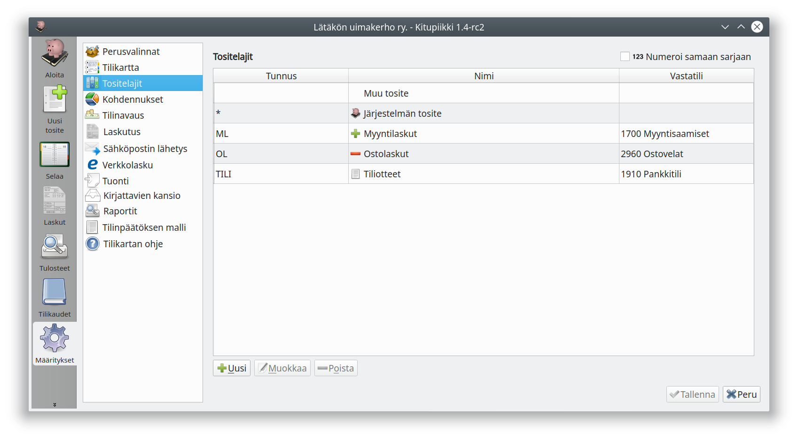

# Tositelajit

Tositteet voi jakaa omiksi sarjoikseen eli tositelajeiksi. Kitupiikissä tositelajit tunnistetaan alussa olevasta yhden tai useamman kirjaimen tunnisteesta, esim. ML myyntilaskuille.

Omia tositelajeja voi tehdä esimerkiksi ostolaskuille, myyntilaskuille, pankkitilin tiliotteille, muistiotositteille, käteistositteille jne.

Valinnalla **numeroi samaan sarjaan** määritellään, että tilivuoden kaikki tositteet numeroidaan samaan juoksevaan sarjaan (esimerkiksi ML1, OL2, ML3, OL4 ...). Oletuksena jokainen tositelaji numeroidaan erikseen (esimerkiksi ML1, ML2, OL1, OL2 ...).

Tositelajille voi määritellä **oletustilin** eli tilin, mihin kirjauksen pääosin kohdistuvat (esimerkiksi myyntilaskuille 3001 Myynnit). **Oletusvastatili** määrittää oletuksena olevat tasetilin (yleensä pankkitili, käteistili, myyntisaamistili tai ostovelkatili).

!!! tip "Tilin valitseminen"
    Voit valita tilin joko alkamalla kirjoittaa tilin numeroa, jolloin pääset selaamaan tililuetteloa, tai alkamalla kirjoittaa tilin nimeä tai osaa siitä. Painamalla tilinvalinnassa välilyöntiä pääset kaikkien tilien luetteloon.

Määrittämällä, että tositelajille kirjataan **vain ostolaskuja** tai **vain myyntilaskuja** näytetään tilille kirjattaessa vain menotilit tai tulotilit. Valinnalla **Tiliotteita tilille** määritellään, että tällä tositelajilla tehdään kirjauksia vain tietyn tilin tiliotteen perusteella.

!!! success "Tositelajeilla nopeammat kirjaukset"
    Määrittämällä eri käyttötarkoituksille omat tositelajinsa ja tekemällä niille oletusvalinnat, tulee kirjaamisesta huomattavasti nopeampaa ja tositeluetteloista selvempiä. Kitupiikin kirjaustoiminto toimii parhaiten silloin, kun mahdollisimman paljon valintoja on yhdistetty tositelajeihin.
