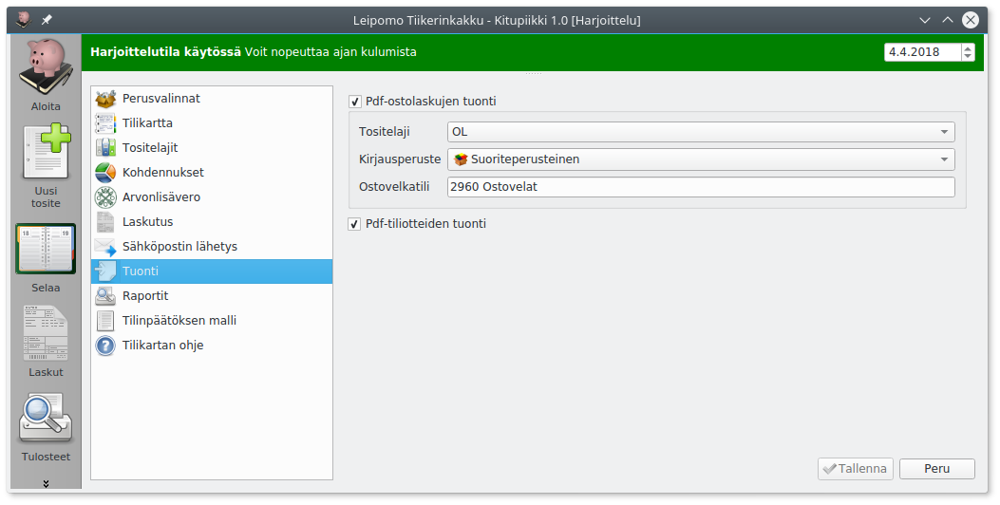

# Tuonti

!!! info "Uusi toiminto"
    Tuontitoiminto on vasta lisätty Kitupiikkiin, eikä sitä ole ollut mahdollista kokeilla kovin monipuolisella aineistolla. Lähetä mieluusti [palautetta](https://form.jotformeu.com/73283959099374) tuonnin toimivuudesta.

Kitupiikki pyrkii automaattisesti poimimaan tietoja tositteeseen lisätystä tiedostosta.

## Ostolaskujen tuonti

Määrittele tuotavien ostolaskujen **tositetyyppi** sekä oletusarvoinen **ostovelkatili**. Lisäksi valitaan, tehdäänkö kirjaukset **suoriteperusteisesti**  (toimituspäivämäärän mukaan, jos mainittu laskulla) vai **laskuperusteisesti** (laskun päivämäärän mukaan).

## Pdf-tiliotteiden tuonti

Määrittele, yritetäänkö pdf-tiliotteilta tuoda tilitapahtumat.
