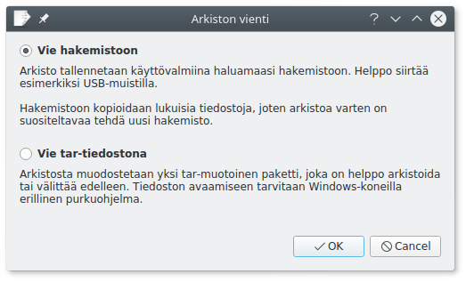

## Arkisto

Kitupiikki muodostaa kirjanpidosta html-muotoisen sähköisen arkiston. Arkisto muodostetaan ja siihen pääsee Kitupiikistä **Tilikaudet**-välilehden **Arkisto**-painikkeella.


Arkisto sisältää kirjanpidon ([pääkirja](/tulosteet#paakirja), [päiväkirja](/tulosteet#paivakirja), [tositeluettelo](/tulosteet#tositeluettelo) ja -päiväkirja sekä [tililuettelo](/tulosteet#tililuettelo) tositteineen), [taseen](/tulosteet#tase) ja [tuloslaskelman](/tulosteet#tuloslaskelma), [tase-erittelyn](/tulosteet#tase-erittely) sekä mahdollisesti myös muita tilikarttakohtaisia raportteja. Raportti sisällytetään sähköiseen arkistoon [raportin muokkaamisen](/maaritykset/raportit) **Liitä erittely arkistoon**-valinnalla.


Tilinumerot ovat linkkejä, joista pääsee tilin pääkirjanäkymään. Tositteiden numerot ovat puolestaan linkkejä tositteisiin.


## Arkiston vieminen

Tilikausittaiset arkistot voit viedä *Tilikaudet*-välilehden **Vie arkisto**-painikkeella.



**Vie hakemistoon** kopioi koko arkiston valitsemaasi hakemistoon. Arkistoon pääset avaamalla hakemistoon kopioidun **index.html**-tiedoston selaimellasi. Huomaa, että arkistohakemistossa voi olla todella paljon tiedostoja, joten sitä varten kannattaa ehkä luoda uusi hakemistonsa.

Tällä toiminnolla voit siirtää yhden vuoden arkiston esim. suoraan USB-muistitikulle.

**Vie tar-tiedostona** muodostaa vuoden arkistosta yhden [tar-tiedoston](https://fi.wikipedia.org/wiki/Tar_(Unix)). Tällainen tiedosto on helppo arkistoida tai lähettää edelleen.

Tar-tiedoston avaamiseen tarvitaan Windowsissa erillinen ohjelma, esimerkiksi [7-zip](http://www.7-zip.org/).

!!! info "Tar-tiedostot"
    Tar-tiedostomuoto on tehty alunperin nauha-asemalle tallentamista varten: se ei tiivistä eikä salaa tiedostoja. Kitupiikin arkistoinnissa käytetään laajasti vakiintuneita ja yleisiä tiedostomuotoja, joiden voi olettaa olevan luettavissa vielä kaukana tulevaisuudessa: html, pdf ja yli 30 vuotta käytössä säilynyt tar.


## Arkiston muuttumattomuuden varmistaminen

Voit varmistaa Kitupiikin luomalla [sha256-tiivisteellä](https://fi.wikipedia.org/wiki/SHA), ettei arkistossa olevia tiedostoja (esimerkiksi tositteita) ole muokattu arkiston muodostamisen jälkeen. Tämä edellyttää kuitenkin, että valvonnassa käytetty tiiviste  on säilytetty turvassa muutoksilta esimerkiksi niin, että tiiviste on tulostettu paperiseen ja allekirjoitettuun tilinpäätösasiakirjaan.

!!! danger "Muuttumattomuus varmistetaan tiivistettä vastaan"
    Muuttumattomuuden varmistus perustuu siihen, että tiiviste on turvassa muutokselta, eikä tiivistettä voi väärentää esimerkiksi muuttamalla jälkikäteen tiivisteen sisältävää tilinpäätöksen sivua.

Muuttumattomuuden voi tarkistaa **sha256sum**-ohjelmalla (löytyy sekä Windowsille että Linuxille). Arkistossa olevan valvontatiedoston tiiviste tulostetaan komennolla **sha256sum arkisto.sha256**.

```
~/LatakonUimakerho/arkisto/2018 $ sha256sum arkisto.sha256
b3fb35a6e113b98e4eb68a133b575463b05d6a39a9c78fb584ade9e9ef6a7b78  arkisto.sha256
```
Ohjelma tulostaa valvontatiedoston tiivisteen, jota pitää verrata tiedossa olevaan, esimerkiksi tilinpäätökseen tulostettuun tiivisteeseen (katso sivun ensimmäinen kuva).

Valvontatiedosto sisältää kaikkien arkistoon kuuluvien tositteiden ja raporttien - ei kuitenkaan tilinpäätöksen - tiivisteet. Tiivisteet pitää vielä takastaa komennolla **sha256sum -c arkisto.sha256**.

```
arto@pantteri ~/LatakonUimakerho/arkisto/2018 $ sha256sum -c arkisto.sha256
00000097-01.pdf: OK
00000097.html: OK
00000018-01.pdf: OK
00000018.html: OK
00000020.html: OK
00000022.html: OK
00000042.html: OK
...
```

Jos jotain tiedostoa olisi muutettu, antaisi sha256sum seuraavan kaltaisen ilmoituksen

```
...
00000011.html: OK
00000012-01.pdf: EI TÄSMÄÄ
00000012.html: OK
...
sha256sum: WARNING: 1 computed checksum did NOT match
```
