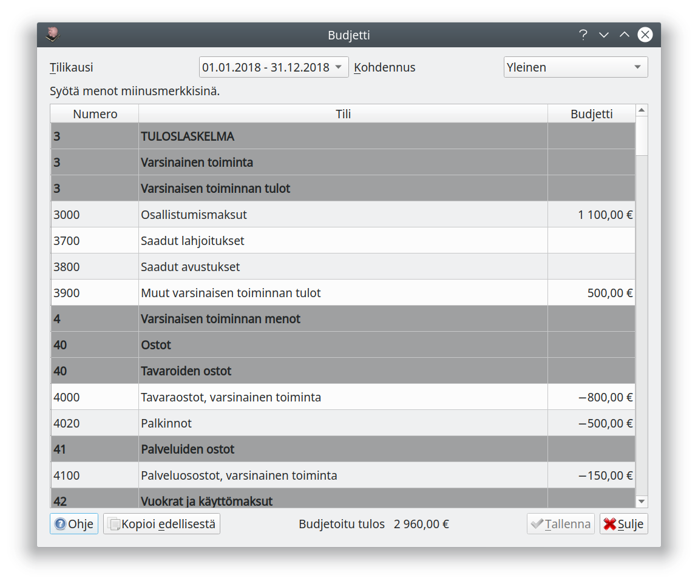
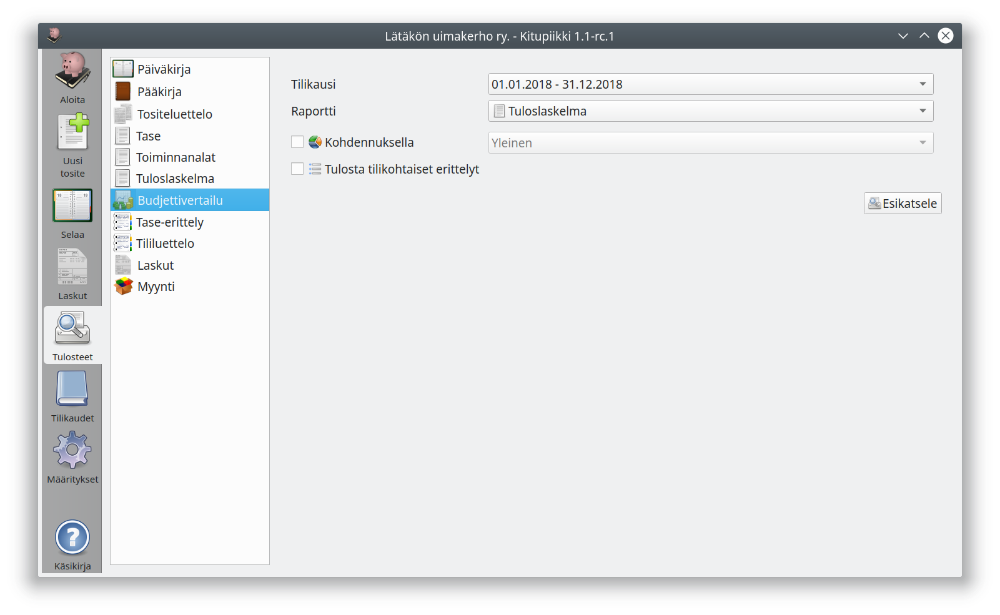
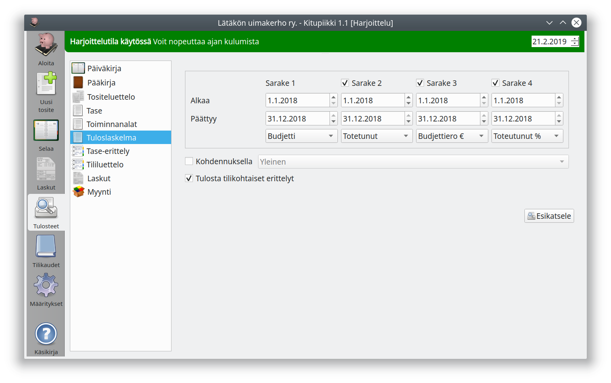
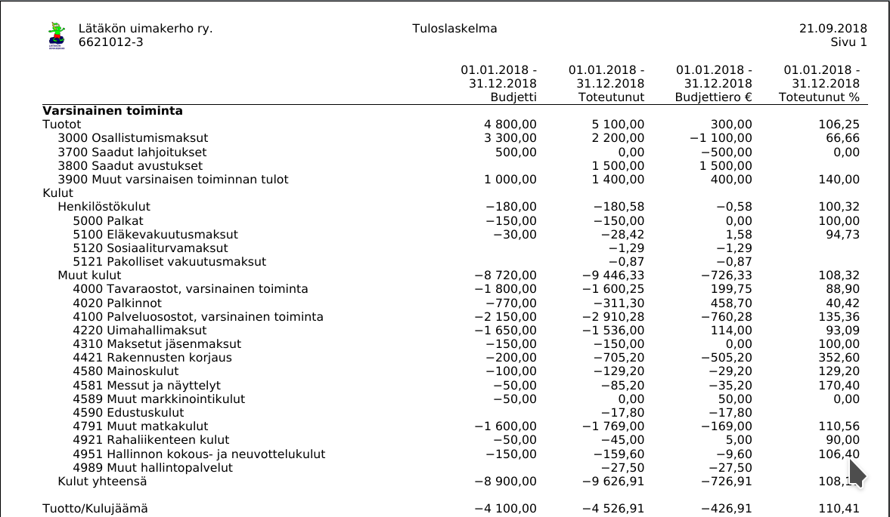
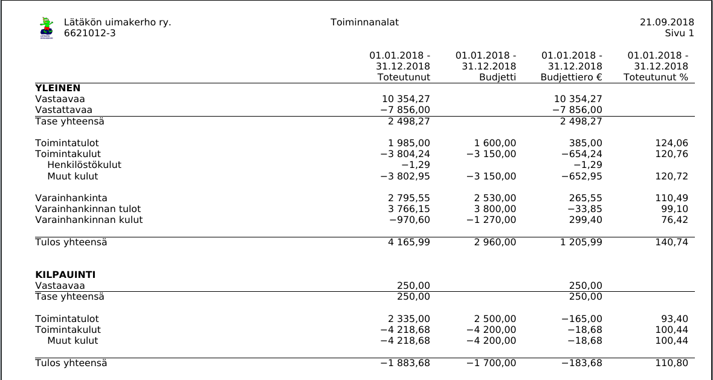

# Budjetti 1.1Kitupiikin versiosta 1.1 lähtien

Kitupiikillä voit määritellä tilikauden bubjetin ja seurata sen toteutumista.

Budjetin pääset syöttämään **Tilikaudet**-välilehden **Budjetti**-painikkeesta. Syötä tulot ilman etumerkkiä ja menot miinusmerkkisinä. Budjetin voi jakaa eri kohdennuksille syöttämällä jokaisen kohdennuksen budjetin erikseen: kokonaisbudjetti on kaikkien kohdennusten yhteenlaskettu budjetti.

**Kopioi edellisestä**-painike kopioi edellisen tilikauden budjetin uuden budjetin pohjaksi.

## Budjetin seuranta

Budjetin toteutumista voit seurata **Budjettivertailu**-raportilla.

Jos haluat muuttaa budjettivertailun sarakkeita, valitse **Tuloslaskelma** tai **Toiminnanalat**-raporttiin tulostettavat sarakkeet:

* **Toteutunut** seuraa toteutuneita tapahtumia
* **Budjetti** näyttää määritellyn bubjetin
* **Budjettiero €** näyttää toteutuneiden tapahtumien eron budjettiin
* **Toteutunut %** näyttää, kuinka suuri osa budjetista on käytetty

!!! note "Kokonaiset tilikaudet"
    Budjetin voi määritellä vain kokonaisille tilikausille. Raporteissa budjetoidut summat näkyvät tilikauden alkupäivämäärän mukaan (voit siis tulostaa toteumaraportin vaikka vuoden ensimmäiselle puoliskolle, mutta se vertaa kuitenkin toteumaa aina koko vuoden budjettiin.)

### Esimerkki tuloslaskelman budjettiseurannasta

## Esimerkki toiminnanalojen budjettiseurannasta

Huomaa, että tasetileillä ei ole budjettia!
