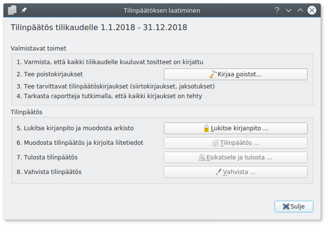
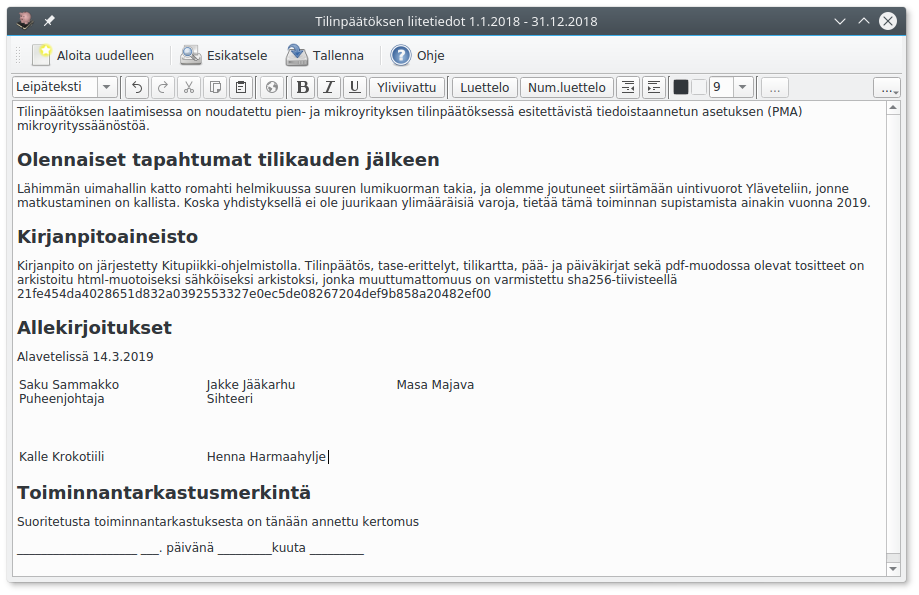
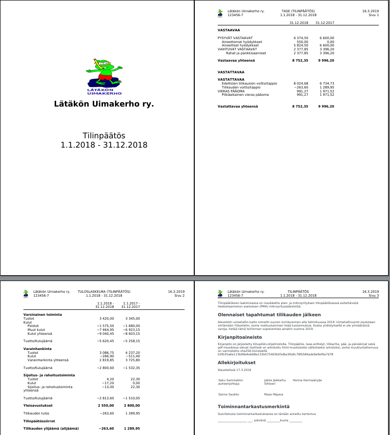

Tilinpäätös on laadittava neljän kuukauden kuluessa tilikauden päättymisestä. Kitupiikki muistuttaa tästä aloitusnäytössä. Kun kaikki tilikaudelle kuuluvat tositteet on kirjattu, aloitetaan tilinpäätöksen laatiminen **Tilikaudet**-välilehden **Tilinpäätös**-painikkeesta.

!!! info "Ammatin- ja liikkeenharjoittajan vapautus tilinpäätöksen laatimisesta"
    Ammatin- ja liikkeenharjoittaja on velvollinen laatimaan tilinpäätöksen vain, mikäli sekä päättyneellä että edellisellä tilikaudella on täyttynyt kaksi seuraavista ehdoista

    * Taseen loppusumma ylittää 100 000 euroa
    * Liikevaihto ylittää 200 000 euroa
    * Palveluksessa on keskimäärin yli kolme henkilöä

## Poistojen kirjaaminen

Varmista ensimmäisenä, että kaikki tilikaudelle kuuluvat tositteet on kirjattu. Vertaa tilien tiliotteita **Pääkirja**-raporttiin ja täsmäytä kirjanpito ja tilit.

Sen jälkeen kirjaa suunnitelman mukaiset poistot **Kirjaa poistot**-painikkeella. Painike ei ole näkyvissä, mikäli tilikaudelle ei ole tulossa kirjattavia poistoja.

Kitupiikki näyttää poistolaskelman, jonka voit vahvistaa **Ok**-painikkeella.

!!! tip "Poistojen kohdentaminen"
    Kitupiikki tekee poistoista järjestelmätositteen. Jos poistoja on esimerkiksi tarpeen kohdentaa eri kohdennuksille, etsi **Selaa**-välilehdeltä poistotosite ja muokkaa sitä.

## Tilinpäätöskirjaukset

Tee tämän jälkeen tarvittavat siirtokirjaukset ja mahdolliset muut tilinpäätöskirjaukset.

!!! info "Siirtosaamiset ja -velat"
    Siirtosaamisia ovat tilikaudella suoritetut maksut tulevina tilikausina suoriteperusteisina toteutuvista menoista (ellei niitä ole merkitty ennakkomaksuiksi) tai sellaiset toteutuneet tulot, joista ei vielä ole saatu maksua (ellei merkitty myyntisaataviin).

    Siirtovelkoja ovat saadut maksut sellaisista tuloista, jotka toteutuvat myöhemmin; menot, joista ei ole suoritettu maksua (ellei merkitty ostovelkoihin) sekä vastaiset menot ja menetykset.

    Siirtokirjauksia ja jaksotuksia tehtäessä voidaan ottaa huomioon olennaisuusperiaate.

Varmista vielä, että kaikki kirjaukset on tehty. Tutki tilinpäätöksen ja taseen erittelyjä sekä tase-erittelyjä.

## Kirjanpidon lukitseminen

Kun kirjanpito on valmis, lukitse tilikauden kirjanpito (**Lukitse kirjanpito**-painike).

!!! warning "Lukittua kirjanpitoa ei voi enää muokata"
    Tässä vaiheessa kirjanpito lukitaan, eikä sitä voi enää muokata. Samalla muodostetaan kirjanpidosta sähköinen arkisto. Huolehdi siksi, että kaikki tilikaudelle kuuluvat kirjaukset on tehty!

## Tilinpäätösasiakirjan muodostaminen

Kitupiikin tilikartat sisältävät tilinpäätöksen ja liitetietojen rungon. **Tilinpäätös**-painikkeella pääset tekemään tilinpäätökseen liittyvät valinnat. Tehtyäsi valinnat paina **Jatka**.

Kitupiikki pystyy pääsääntöisesti päättelemään liikevaihdon, taseen ja henkilökuntamäärän perusteella, voidaanko tilinpäätös laatia mikro- tai pienyrityssäänösten mukaisesti.

Jos laadit tilinpäätöksen jolloin muulla ohjelmalla (kuten tekstinkäsittelyohjelma), voit tallentaa pdf-muotoisen tilinpäätöksen Kitupiikin sähköiseen arkistoon valitsemalla **Lataa tiedosto**.

Täydennä liitetiedot ohjelman laatimista pohjateksteistä.

Jos valitset **Aloita uudelleen**, pääset tekemään uudestaan tilinpäätökseen liittyvät valinnat. **Esikatsele** ja **tallenna** tilinpäätös.

## Tilinpäätöksen vahvistaminen

Kun tilinpäätös on vahvistettu (hyväksytty yhdistyksen vuosikokouksessa, yhtiökokouksessa tms. taikka yhtiömiesten allekirjoittama), merkitse se vahvistetuksi tilinpäätösikkunan **Vahvista**-painikkeella.

Vahvistettua tilinpäätöstä ei enää pääse muokkaamaan, ja **Tilikaudet**-välilehden **Tilinpäätös**-painike ei enää avaa valintaikkunaa vaan tilinpäätöksen pdf-tiedoston.

!!! success "Suositus tilinpäätöksen tulostamisesta"
    Kitupiikin sähköistä arkistointia käytettäessäkin on suositeltavaa tulostaa tilinpäätös ja säilyttää allekirjoitettu tilinpäätös kymmenen vuoden ajan.
