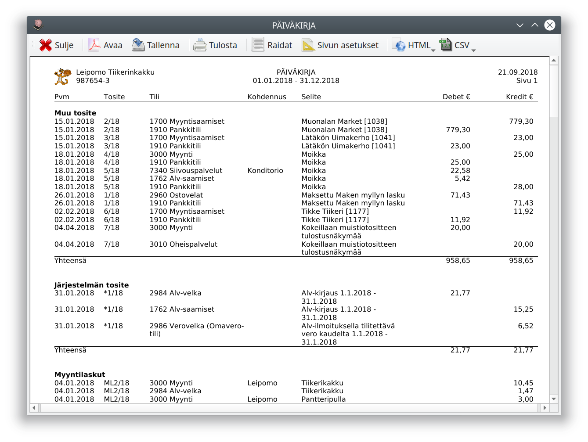
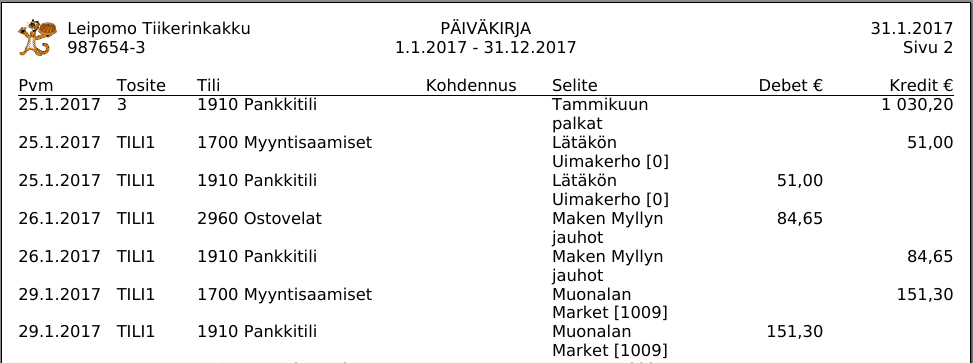
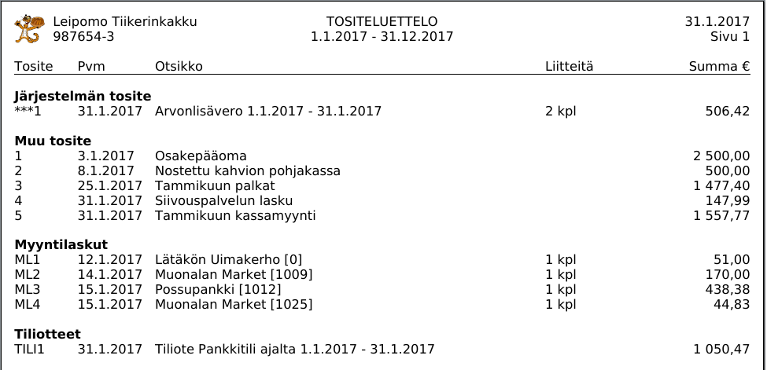
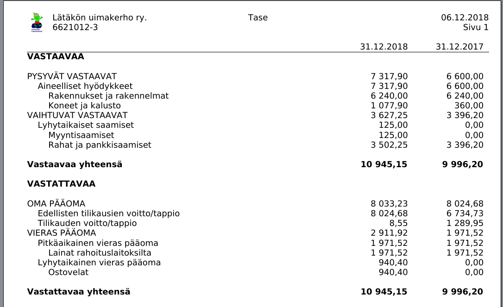
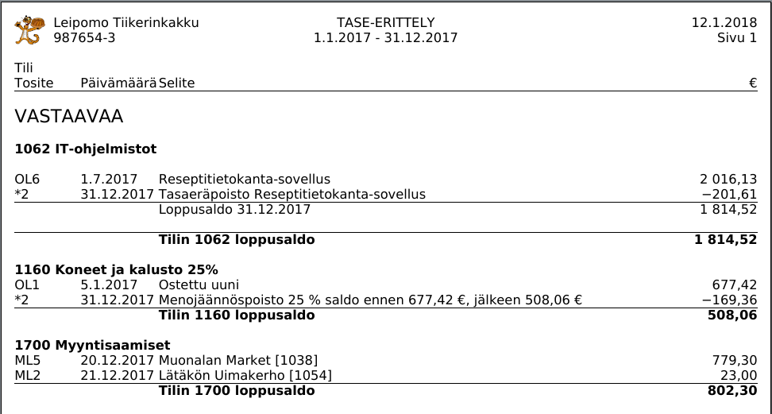
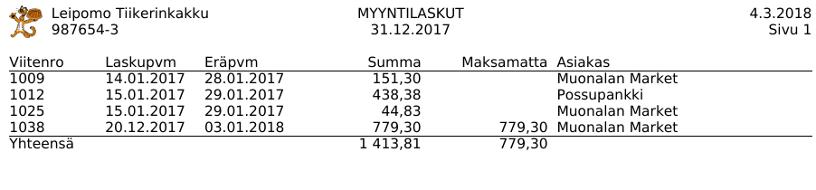

# Tulosteet

Tulosteet-välilehdellä voit katsella ja tulostaa erilaisia raportteja kirjanpidostasi. Tulosteet ovat erilaisia eri tilikartoilla.

Tehtyäsi haluamasi valinnat paina **Esikatsele** ja näe raportin:

Esikatseluikkunassa

* **Avaa** avaa raportin pdf-katseluohjelmassa
* **Tallenna** tallentaa raportin pdf-muodossa
* **Tulosta** tulostaa raportin
* **Raidat** lisää raportin taustalle taustaraitoja rivien seuraamista helpottamaan
* **Sivun asetukset** antaa mahdollisuuden vaihtaa paperin kokoa, suuntaa ja marginaaleja
* **HTML**-painikkeesta avautuu valikko, jossa voit avata raporin selaimessa, kopioida raportin leikepöydälle tai tallentaa tiedostoon html-muodossa.
* **CSV**-painikkeesta avautuu valikko, jolla voit kopioida raportin leikepöydälle tai tiedostoon csv-muodossa tai määritellä csv-tiedoston muodon (kuten merkistökoodaus ja sarakkeiden erotin.)

!!! tip "Kirjausten vienti CSV-muotoon"
    *Päiväkirja*-näkymä soveltuu erityisen hyvin kirjausten siirtämiseen csv-muodossa toisiin ohjelmiin.
    CSV-tiedosto on tekstitiedosto, jossa sarakkeet on erotettu toisistaan pilkulla. Se soveltuu tiedon siirtämiseen ohjelmasta toiseen.

## Päiväkirja

Päiväkirja esittää kirjanpidon viennit aikajärjestyksessä. Halutessasi voit järjestää viennit tositenumeron mukaan tai ryhmitellä ne tositelajeittain.

## Pääkirja

Pääkirjassa viennit on esitetty tileittäin aikajärjestyksessä. Tilin saldo on koko ajan näkyvissä, joten pääkirjaa voi hyvin käyttää pääkirjan ja tiliotteiden vertaamiseen eli tilien täsmäyttämiseen.

## Tositeluettelo

Tositeluettelossa on tositteet luetteloitu lajeittain numerojärjestyksessä. Voit halutessasi tulostaa myös tositteiden viennit niiden alle.

## Tase

Tase kuvaa taloudellista tilannetta tilinpäätöspäivänä. Monessa tilikartassa on lisäksi lyhennetty tasekaava, jota saavat käyttää PMA-asetuksen mukaiset yritykset. Myös taseen voi tulostaa tileittäin eriteltynä

## Tuloslaskelma

Tuloslaskelma kuvaa tilikauden tulosta niin, että viimeiselle riville jää tilikauden voitto tai tappio. Tässä kuvassa on esitetty yhdistyksen tuloslaskelma: elinkeinotoiminnalla ja kiinteistön hallinnalla on erilaiset tuloslaskelmakaavat.
Joissain tilikartoissa on eri tuloslaskelmavaihtoehtoja. Myös tuloslaskelman voi eritellä tileittäin.

Tuloslaskelmalle voi valita tulostettavaksi toteutuman lisäksi myös tilikauden [budjetin](/tilikaudet/budjetti/#budjetin-seuranta) tai budjetin toteutuman.

## Tase-erittely

Tase-erittely laaditaan varmentamaan taseen summat. Yllä olevan erittelyn ensimmäisellä tilillä 1062 IT-ohjelmistot on täysi tase-eräkohtainen erittely, keskimmäisellä luetellaan tilikauden aikaiset muutokset ja alimmalla tilin saldon muodostavat summat tilikauden päätöspäivänä.

## Tililuettelo

Tililuettelossa on numerojärjestyksessä ja otsikoittain lueteltu kirjanpidon tilit. Voit valita tulostettaviksi vain ne tilit, joilla on kirjauksia. Voit tulostaa tililuetteloon myös tilien kirjausohjeet.

## Laskuluettelo

Voit tulostaa laskuluettelon myyntilaskuista (Kitupiikillä laaditut laskut) tai ostolaskuista (Ostovelat-tileille kirjatut laskut). Laskuluettelon saa myös haluttuna päivänä avoinna olleista laskuista saldoineen.

## Myyyntiraportti

Myyntiraportissa luetellaan Kitupiikin myyntilaskutuksella laskutetut tuotteet, niiden määrä, keskimääräinen kappalehinta ja myynti yhteensä.

## Arvonlisäveron erittely

Voit tulostaa [arvonlisäverolaskelman erittelyn](/alv/tilitys/#arvonlisaveron-erittely) myös kesken verokauden.

## Muut raportit

Tilikarttaan voi kuulua muitakin raportteja, kuten tulojen ja menojen kohdennusraportit.

Voit myös tehdä itse uusia raportteja ja muokata olemassa olevia, katso [Raporttien muokkaaminen](/maaritykset/raportit)
