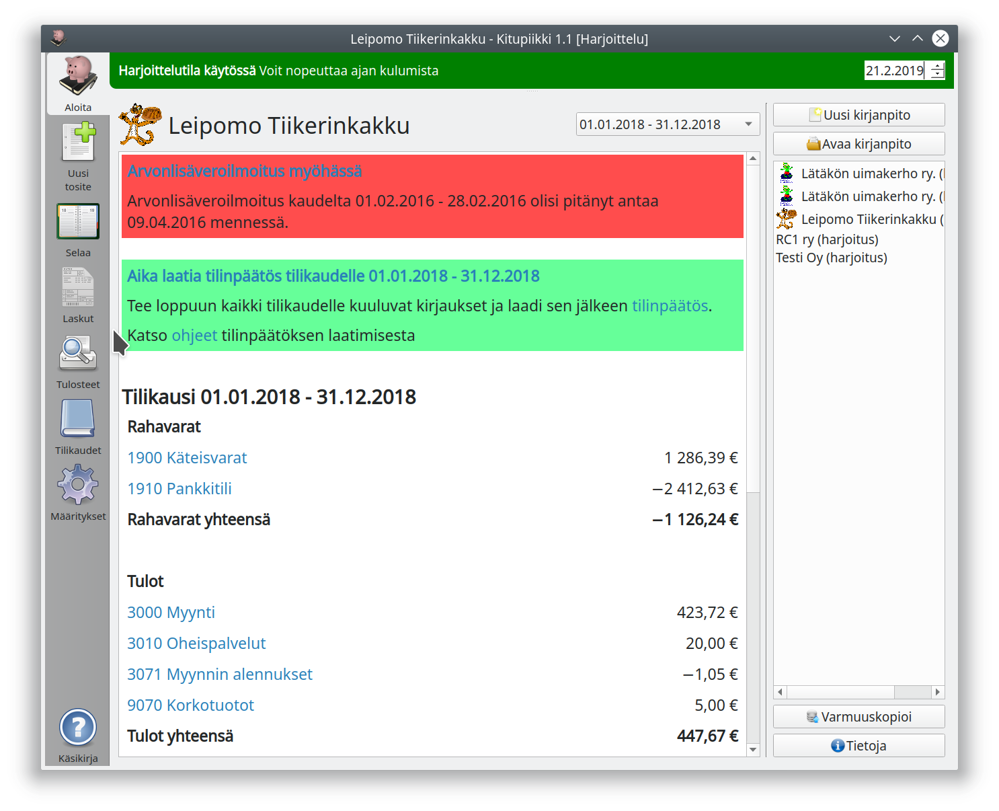

 

Kitupiikin käyttöliittymä muodostuu seitsemästä välilehdestä.

**Aloituksessa** näet vinkkejä ajankohtaisista tehtävistä sekä tilien saldot. Tilien numerot ovat linkkejä, joista pääset suoraan selaamaan kirjauksia. Välilehdeltä pääset myös avaamaan toisen kirjanpidon tai aloittamaan uuden.

**Uusi tosite**-välilehdellä kirjataan tositteita.

**Selauksessa** pääset selaamaan jo tehtyjä kirjauksia.

**Laskut**-välilehdellä näet myyntilaskut ja laskutat myynnistä.

**Tulosteet**-välilehdellä pääset katselemaan ja tulostamaan mm. pääkirjan, päiväkirjan, tositeluettelot, tililuettelon, tuloslaskelman ja taseen. Kaikki tulosteet voi tallentaa myös tiedostoksi.

**Tilikaudet**-välilehdellä tehdään tilinpäätös, aloitetaan uusi tilikausi sekä muodostetaan tilikauden sähköinen arkisto.

**Käsikirja**-painike käynnistää internet-selaimella tämän ohjesivuston.

## Pikanäppäimet

Näppäin   |  Toiminto
----------|----------
<kbd>Home</kbd> | Aloitus-välilehdelle
<kbd>F1</kbd> | Näyttää internet-selaimessa ohjeen
<kbd>F2</kdb> | Uuden tositteen kirjaus
<kbd>Shift</kbd>+<kbd>F2</kdb> | Avaa uuden tositteen kirjauksen uudessa ikkunassa
<kbd>F3</kdb> | Tositteiden ja kirjausten selaus
<kbd>Shift</kbd>+<kbd>F3</kdb> | Avaa selauksen uudessa ikkunassa
<kbd>F4</kdb> | Laskutus
<kbd>Shift</kbd>+<kbd>F4</kdb> | Uusi lasku
<kbd>F5</kdb> | Tulosteet
<kbd>F6</kdb> | Tilikaudet
<kbd>F7</kdb> | Määritykset
<kbd>Ctrl</kbd>+<kbd>G</kdb> | Siirry tositteeseen tositenumerolla

### Tositteen kirjaamisessa
Näppäin   |  Toiminto
----------|----------
<kbd>F9</kbd> | Käynnistä Kirjausapuri
<kbd>F10</kbd> | Laskujen maksu
<kbd>F11</kbd> | Uusi vienti (rivi)
<kbd>F12</kbd> | Tallenna
<kbd>Ctrl</kbd>+<kbd>O</kdb> | Lisää liite
<kbd>Ctrl</kbd>+<kbd>P</kdb> | Tulosta tosite
<kbd>Ctrl</kbd>+<kbd>T</kdb> | Uusi tosite tämän tositteen pohjalta

## Laskua luotaessa
Näppäin   |  Toiminto
----------|----------
<kbd>F9</kbd> | Näytä/Piilota tuotteet
<kbd>F10</kbd> | Esikatsele
<kbd>F11</kbd> | Uusi rivi
<kbd>F12</kbd> | Tallenna
<kbd>Ctrl</kbd>+<kbd>P</kdb> | Tulosta
<kbd>Ctrl</kbd>+<kbd>E</kdb> | Lähetä sähköpostilla
