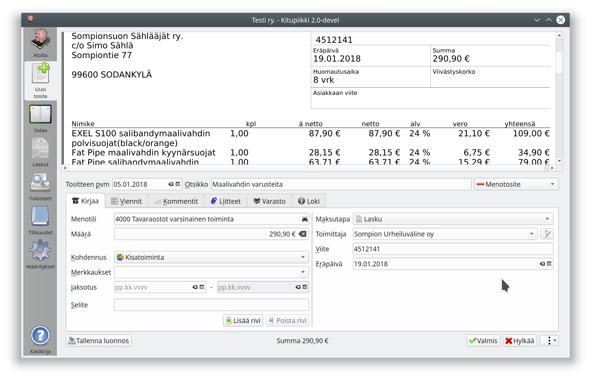
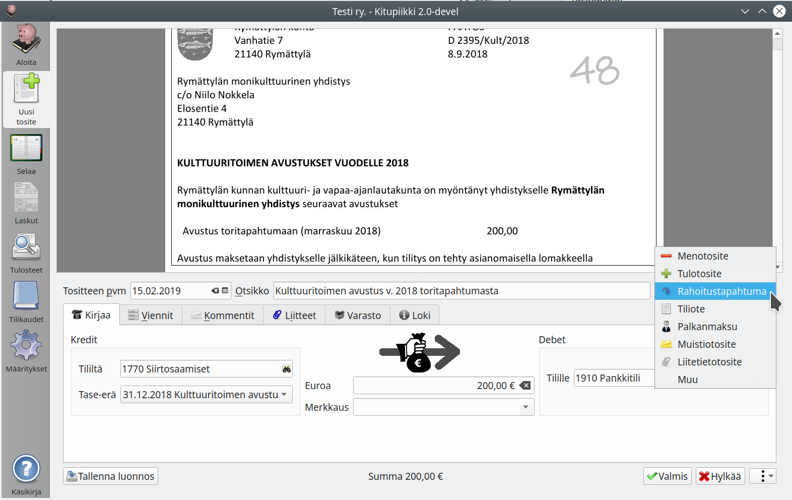
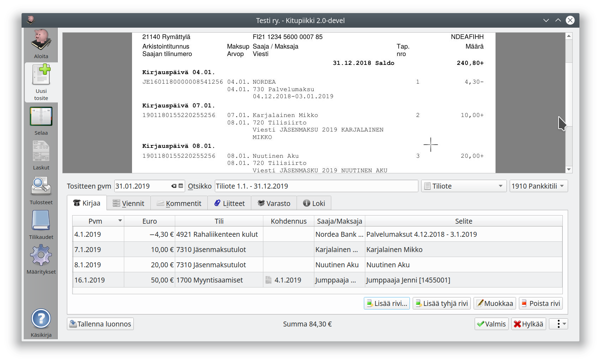
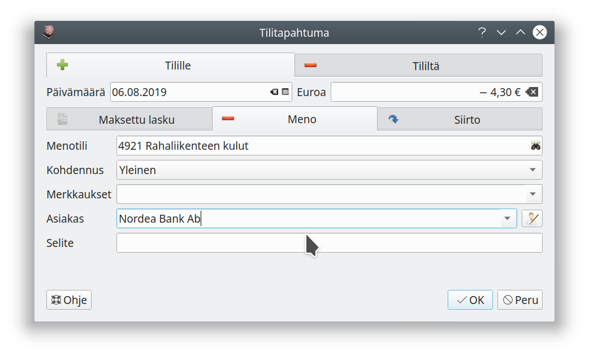

# Tulossa ...

Nyt työn alla on ohjelman tähän mennessä suurin uudistus. Yhdistyksille uudistus tarkoittaa entistä helpompaa ja nopeampaa kirjanpitoa ja yrityksille entistä monipuolisempia toimintoja.

## Kirjaaminen uudistuu

Nykymuotoinen Kirjausapuri pääsee eläkkeelle, ja
tilalle tulee eri tositetyypeille muokatut *Kirjaa*-välilehdet. Näin kirjausta pääsee myös muokkaamaan samalla tavalla.

Kuvasta näkyy myös, että ohjelmaan tulee **Asiakas- ja toimittajarekisteri**. Tositteen pääsee tallentamaan myös luonnoksena. **Jaksotuksella** hallitaan meno- ja tuloeriä, jotka vaikuttavat vielä seuraavallekin tilikaudelle.

Useamman samanaikaisen käyttäjän tuki tarkoittaa toisaalta sitä, että jatkossa tositenumero tulee näkyviin vasta, kun tosite on tallennettu.

**Siirtojen** (rahoitustapahtumien) kirjausikkuna on simppeli. Tässä kirjataan siirtosaamisissa ollut erä maksetuksi:

Oikealla näkyvät valittavissa olevat tositetyypit. Valinnalla **Muu** pääsee vanhaan malliin tekemään kirjausta suoraan vientinäkymään.

## Yksinkertaisemmin kahdenkertaista

Tiliotteiden kirjaamisnäkymä muistuttaa jatkossa entistä enemmän itse tiliotetta:

Tilitapahtumia csv-muodossa tuotaessa päästään jatkossa vielä suurempaan automaatioon, kun ohjelma tekee aiempien kirjausten perusteella valmiita tiliöintiehdotuksia.

Tilitapahtumien kirjaamisessa käytettävä ikkuna tosin taitaa kaivata vielä pientä hiomista selkeyden ja käytettävyyden osalta...

## Pilvessä ja paikallisesti

Ohjelman lähdekoodi säilyy avoimena ja ohjelman käyttö ilmaisena.

Suunnitteilla on kuitenkin mahdollisuus yhdistää ohjelmaan palveluita, jotka edellyttävät palvelinkapasiteettia ja ovat siten maksullisia. Tällaisia voisivat olla kirjanpidon tallentaminen kotimaisessa konesalissa olevaan pilvipalvelimeen (GPDR-yhteensopiva), skannattujen tositteiden tekstintunnistus sekä arvonlisäveroilmoituksen sähköinen toimittaminen Verohallintoon. Tekeillä on myös mobiilisovellus kuittien skannaamiseen tien päällä - totta kai OCR-tekstintunnistuksella niin, että iso osa tiedoista siirtyy kirjanpitoon ilman käyttäjän omaa näpyttelyä.

Automaatiota on lisätty: esimerkiksi ostolaskuissa myyjän tiedot esihaetaan Yritystietojärjestelmän avoimesta rajapinnasta, jos ohjelma pystyy tunnistamaan laskusta myyjän Y-tunnuksen.

## Osallistu keskusteluun

Otan kiitollisena vastaan kommentteja ja ehdotuksia ohjelman kehittämisestä. Tavoitteena on päästä loppusyksystä uudistuksen testausvaiheeseen, jolloin uudistunut ohjelma kaipaa myös testikäyttäjiä.

Osallistu keskusteluun sivun alalaidassa tai lähetä sähköposti palaute@kitupiikki.info
